## Welcome to Quantitative Methods II
<!-- slide 2 -->

- In this course, we’re going to learn how to use data to make sense of the world.
- Your teaching team is as follows:
    - Me!
    - Matthias Loidolt (PGTA)
    - Dhimas Bayu Anindito (PGTA)

## Outline
<!-- slide 3 -->

1. About Me
1. Why Study Data Science?
1. Course Content

## About Me
<!-- slide 4 -->

::: {.columns}
:::: {.column width="74%"}
- PhD: Oxford Department for International Development
    - Assessing the impact of a large agricultural development programme on the insurgency in Turkey’s southeastern provinces
- Now
    - Lecturer in Geocomputation at the Centre for Advanced Spatial Analysis (CASA), UCL
        - Research Areas:
            - Conflict/Disaster response
            - Computer vision + Satellite imagery
            - Statistical methods
    - Data Scientist at Global Fishing Watch
    - Freelance investigative journalism
::::
:::: {.column width="26%"}
{.pic style="max-height:427px"}

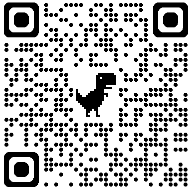{.pic style="max-height:273px"}
::::
:::

## {background-image="img/w01/slide_005.jpg" background-size="contain" .fallback}
<!-- slide 5 -->

::: notes
2023

Abstract: 
China has long dominated the world’s supply of heavy rare earths, minerals needed to build electric vehicles and wind turbines. Demand for these products is skyrocketing as we rush to meet climate goals, but there is a problem at the root of the supply chain.
The processes used to extract heavy rare earths are highly polluting, ravaging landscapes and poisoning waterways. As concerns over the environmental toll of extraction have grown in China over the past decade, more and more domestic mines have been shut down. Yet global demand is growing rapidly, and China remains the world’s largest processor. But with many of its own mines closed, China has turned to neighbouring Myanmar to fulfill demand. 

Understanding the spatial distribution of these mines is a prerequisite for
ultimately conducting cleanup efforts and gauging which populations might
be affected by pollution. As such, the main objectives of this project are as
follows:

1. Automate the identification of illicit rare earth mines in Myanmar
using satellite imagery.
2. Train a model to identify individual pools within each mine.

The first objective is important for the purposes of monitoring the spread of
these mines, which continue to propagate across Northern Myanmar. The
second objective can help yield mine-level insights including estimating the
potential productive capacity of each mine and its level of activity.

Slide text: Identifying Unregulated Rare Earth Mining  in Myanmar Sites using Historical Satellite Data · Distribution of Rare Earth Mines in Kachin, Myanmar · YOLOv8 Rare Earth Precipitation Pool Detection · Timelapse of Precipitation Reactions in an Active Mine
:::

## {background-image="img/w01/slide_006.jpg" background-size="contain" .fallback}
<!-- slide 6 -->

::: notes
2022- present

Abstract: 

In the context of recent, highly destructive conflicts in Gaza and Ukraine, reliable estimates of building damage are essential for an informed public discourse, human rights monitoring, and humanitarian aid provision. Given the contentious nature of conflict damage assessment, these estimates must be fully reproducible, explainable, and derived from open access data. This paper introduces a new method for building damage detection-- the Pixel-Wise T-Test (PWTT)-- that satisfies these conditions. Using a combination of freely-available synthetic aperture radar imagery and statistical change detection, the PWTT generates accurate conflict damage estimates across a wide area at regular time intervals. Accuracy is assessed using an original dataset of over half a million labeled building footprints spanning 12 cities across Ukraine, Palestine, Syria, and Iraq. Despite being simple and lightweight, the algorithm achieves building-level accuracy statistics (AUC=0.88 across Ukraine, 0.81 in Gaza) rivalling state of the art methods that use deep learning and high resolution imagery. The workflow is open source and deployed entirely within the Google Earth Engine environment, allowing for the generation of interactive Battle Damage Dashboards for Ukraine and Gaza that update in near-real time, allowing the public and humanitarian practitioners to immediately get estimates of damaged buildings in a given area.
:::

## {background-image="img/w01/b2c3b9ebe4.png" background-size="contain"}
<!-- slide 7 -->

## {background-image="img/w01/0371e6394b.png" background-size="contain"}
<!-- slide 8 -->

## {background-image="img/w01/slide_009.jpg" background-size="contain" .fallback}
<!-- slide 9 -->

::: notes
2022- present

Abstract: 

Despite extensive research into ship detection via remote sensing, no studies identify ship-to-ship transfers in satellite imagery. Given the importance of transshipment in illicit shipping practices, this is a significant gap. In what follows, I train a convolutional neural network to accurately detect 4 different types of cargo vessel and two different types of Ship-to-Ship transfer in PlanetScope satellite imagery. I then elaborate a pipeline for the automatic detection of suspected illicit ship-to-ship transfers by cross-referencing satellite detections with vessel borne GPS data. Finally, I apply this method to the Kerch Strait between Ukraine and Russia to identify over 400 dark transshipment events since 2022.

Slide text: Automatic Detection of Dark Ship-to-Ship Transfers using Deep Learning and Satellite Imagery
:::

## {.notitle}
<!-- slide 10 -->

::: {.columns}
:::: {.column width="47%"}
{.pic style="max-height:62px"}

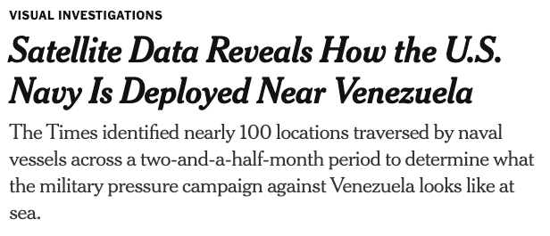{.pic style="max-height:307px"}

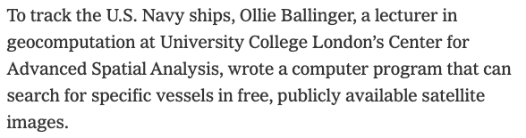{.pic style="max-height:188px"}

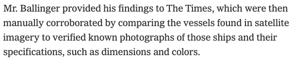{.pic style="max-height:144px"}
::::
:::: {.column width="53%"}
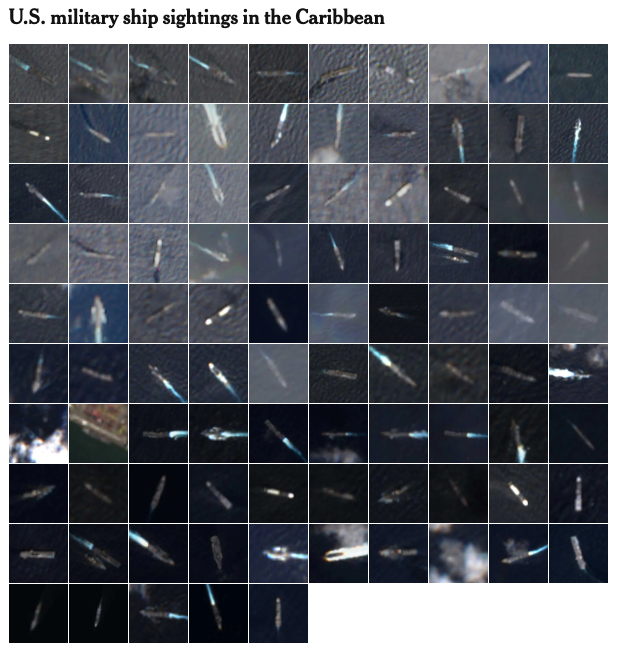{.pic style="max-height:700px"}
::::
:::

## {.notitle}
<!-- slide 11 -->

::: {.columns}
:::: {.column width="47%"}
{.pic style="max-height:67px"}

{.pic style="max-height:235px"}

{.pic style="max-height:235px"}

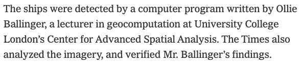{.pic style="max-height:163px"}
::::
:::: {.column width="53%"}
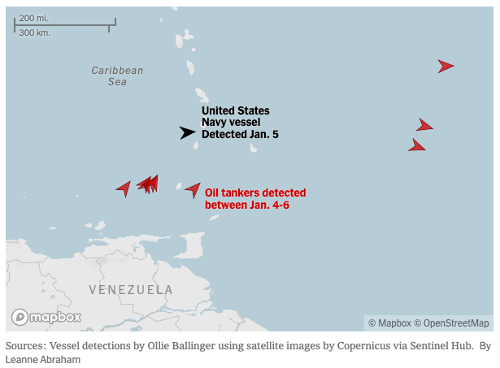{.pic style="max-height:700px"}
::::
:::

## {.notitle}
<!-- slide 12 -->

::: {.columns}
:::: {.column width="46%"}
{.pic style="max-height:67px"}

{.pic style="max-height:233px"}

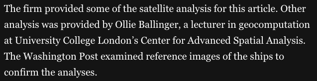{.pic style="max-height:146px"}

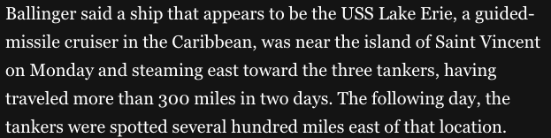{.pic style="max-height:142px"}

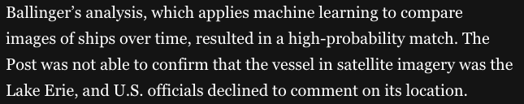{.pic style="max-height:113px"}
::::
:::: {.column width="54%"}
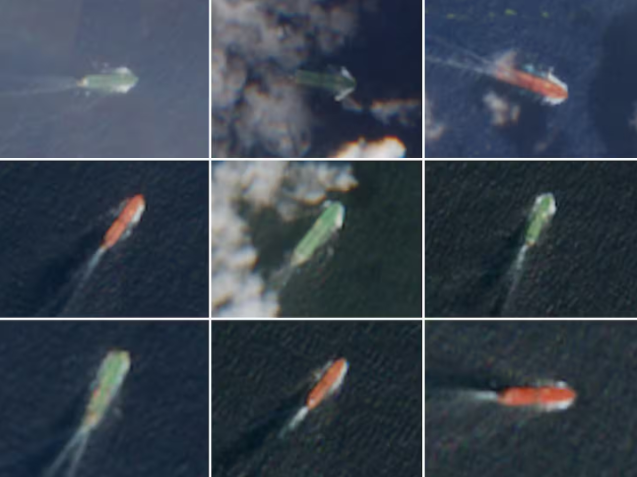{.pic style="max-height:700px"}
::::
:::

## {.notitle}
<!-- slide 13 -->

::: {.columns}
:::: {.column width="46%"}
{.pic style="max-height:72px"}

{.pic style="max-height:173px"}

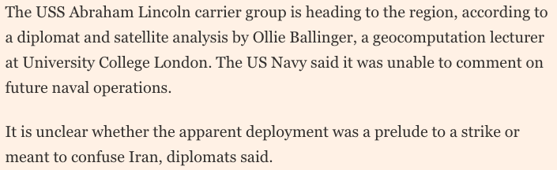{.pic style="max-height:240px"}

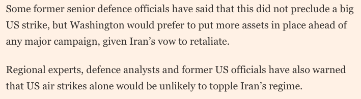{.pic style="max-height:215px"}
::::
:::: {.column width="54%"}
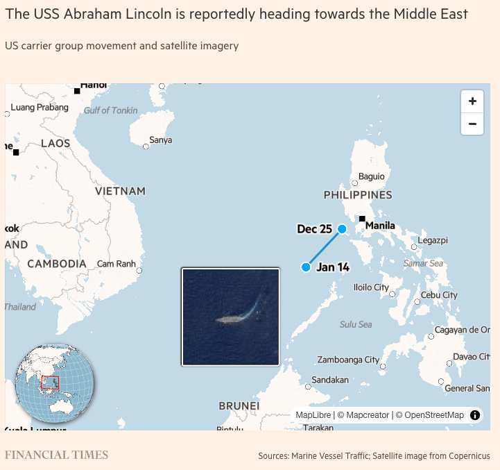{.pic style="max-height:700px"}
::::
:::

## {.notitle}
<!-- slide 14 -->

::: {.columns}
:::: {.column width="61%"}
{.pic style="max-height:700px"}
::::
:::: {.column width="39%"}
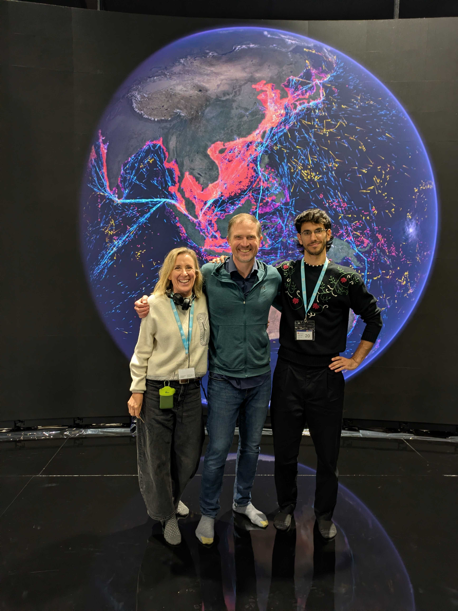{.pic style="max-height:700px"}
::::
:::

## 1. Why Study Data Science? {.center}
<!-- slide 15 -->

## {background-image="img/w01/slide_016.jpg" background-size="contain" .fallback}
<!-- slide 16 -->

::: notes
Slide text: The Pace of Discovery · Years
:::

## {background-image="img/w01/slide_017.jpg" background-size="contain" .fallback}
<!-- slide 17 -->

::: notes
It took 4000 years between the adoption of agriculture (10,000 BC) and the first documented use of irrigation (6000 BC)
It took 72 years (1880) between the invention of the lightbulb and the first Artificial Intelligence program (1952)

Slide text: The Pace of Discovery · 10,000 BC · 6,000 BC · 1880 · 1952
:::

## Why study data science?
<!-- slide 18 -->

- Empirical evidence is the bedrock of human progress
- Through trial and error, our species has gone from hunting and gathering to space flight
- The speed of innovation increases exponentially
- This is due to many things, including the increasing availability of information.

## {background-image="img/w01/6126a38821.jpg" background-size="contain"}
<!-- slide 19 -->

## Harnessing Data: Private Sector
<!-- slide 20 -->

- More information is available to us than ever before
- The companies that can harness this data for profit are the largest in the world
    - Facebook, Apple, Amazon, Netflix, Google, Microsoft
- The people who can harness this data are some of the highest paid workers in the world

## Harnessing Data: Private Sector
<!-- slide 21 -->

- Things mostly happen if their happening is profitable.
    - Research by UPS found that turning left is less efficient than turning right.
    - UPS trucks almost never turn left.
    - Doing so saves around 10m gallons of fuel per year, roughly £65m.
- Many of the most intelligent people on this planet are applying their skills to figure out how to make you click on ads

## Harnessing Data: for Research
<!-- slide 22 -->

- There are many activities that are **important, but unprofitable**
    - Humanitarian aid
    - Investigative journalism
    - Policy planning
    - Academic research

## {background-image="img/w01/3794b3fe74.png" background-size="contain"}
<!-- slide 23 -->

::: notes
The ability to accurately predict protein structures from their amino-acid sequence would be a huge boon to life sciences and medicine. It would vastly accelerate efforts to understand the building blocks of cells and enable quicker and more advanced drug discovery.

AlphaFold has already helped him find the structure of a protein that has vexed his lab for a decade, and he expects it will alter how he works and the questions he tackles. “This will change medicine. It will change research. It will change bioengineering. It will change everything,” Lupas adds.
:::

## Deep Mind’s Alpha Fold
<!-- slide 24 -->

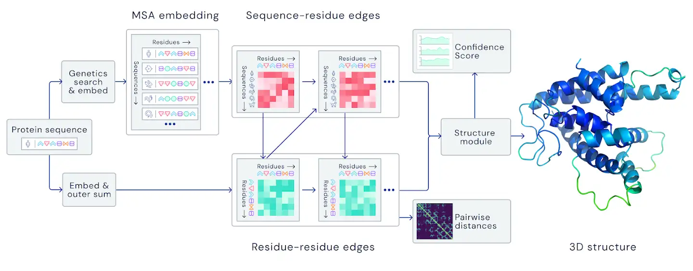{.r-stretch fig-align="center"}

::: notes
Protein structures are currently determined experimentally by means of techniques such as X-ray crystallography, cryo-electron microscopy and nuclear magnetic resonance, techniques which are both expensive and time-consuming.[13] Such efforts have identified the structures of about 170,000 proteins over the last 60 years, while there are over 200 million known proteins across all life forms.[5

trained the program on over 170,000 proteins from a public repository of protein sequences and structures.
:::

## Harnessing Data: Public Sector
<!-- slide 25 -->

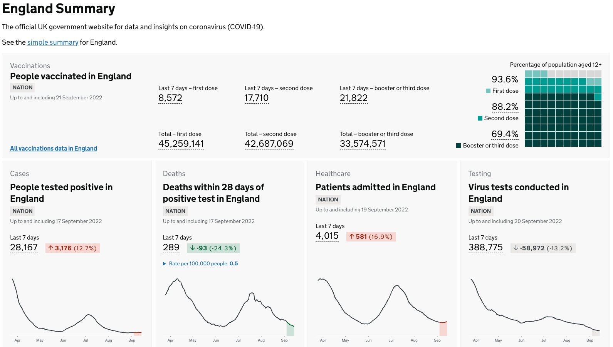{.r-stretch fig-align="center"}

::: notes
Covid dashboards really important 
Infrastructure/transport planning
:::

## {background-image="img/w01/slide_026.jpg" background-size="contain" .fallback}
<!-- slide 26 -->

::: notes
Covid dashboards really important 
Infrastructure/transport planning
:::

## {background-image="img/w01/030a21e1d3.png" background-size="contain"}
<!-- slide 27 -->

## {background-image="img/w01/a970680d68.jpg" background-size="contain"}
<!-- slide 28 -->

## {.notitle}
<!-- slide 29 -->

::: {.columns}
:::: {.column width="51%"}
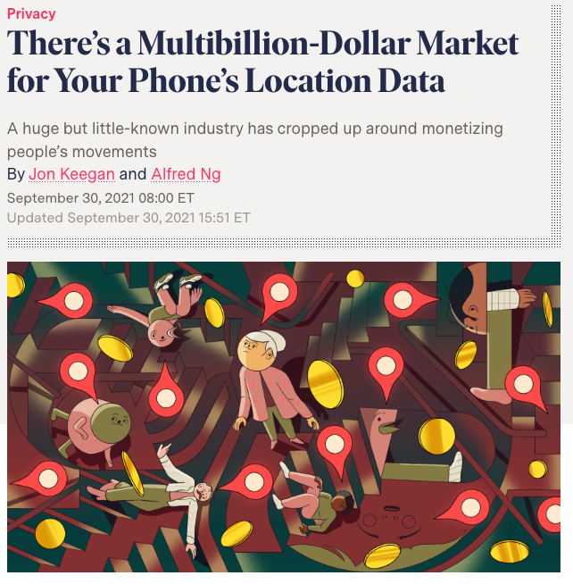{.pic style="max-height:700px"}
::::
:::: {.column width="49%"}
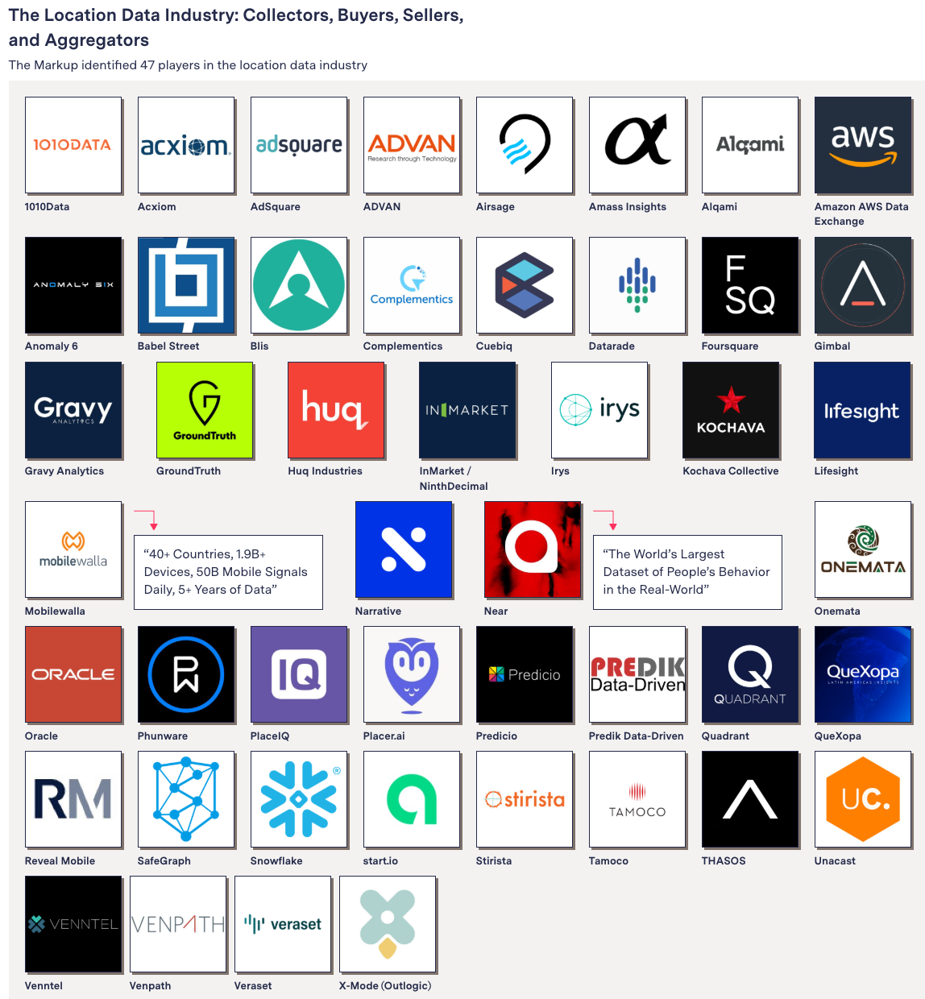{.pic style="max-height:700px"}
::::
:::

::: notes
Foot Traffic Data | Europe | Real-Time GPS Movement & Historical Visitation Insights | Datarade 
https://themarkup.org/privacy/2021/09/30/theres-a-multibillion-dollar-market-for-your-phones-location-data
:::

## {background-image="img/w01/slide_030.jpg" background-size="contain" .fallback}
<!-- slide 30 -->

::: notes
Slide text: Surveillance, public and private · Producer(app developer) · Broker · Consumer (business)
:::

## Geofencing: a simple algorithm
<!-- slide 31 -->

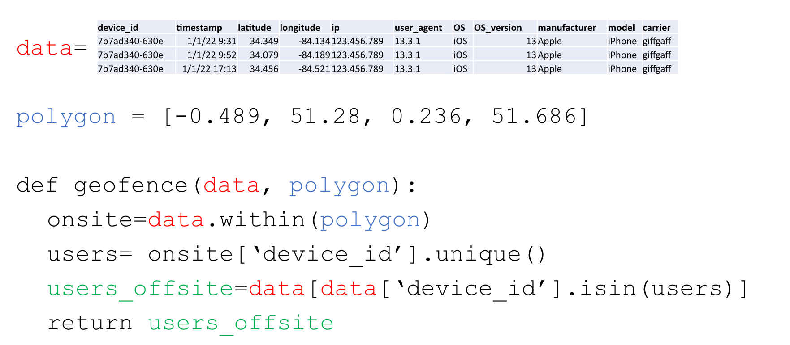{.r-stretch fig-align="center"}

## Surveillance, public and private
<!-- slide 32 -->

::: {.columns}
:::: {.column width="50%"}
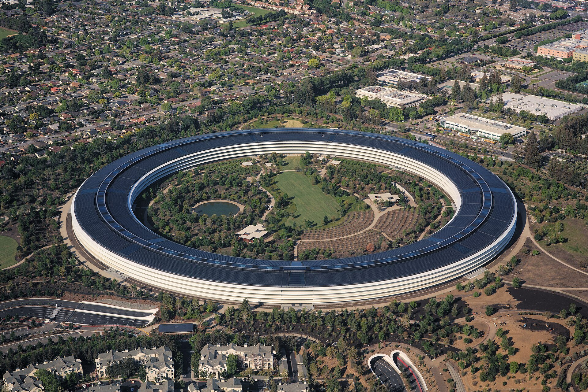{.pic style="max-height:700px"}
::::
:::: {.column width="50%"}
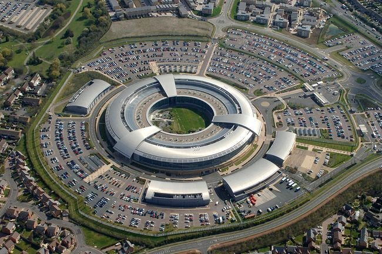{.pic style="max-height:700px"}
::::
:::

## Surveillance Capitalism
<!-- slide 33 -->

::: {.columns}
:::: {.column width="30%"}
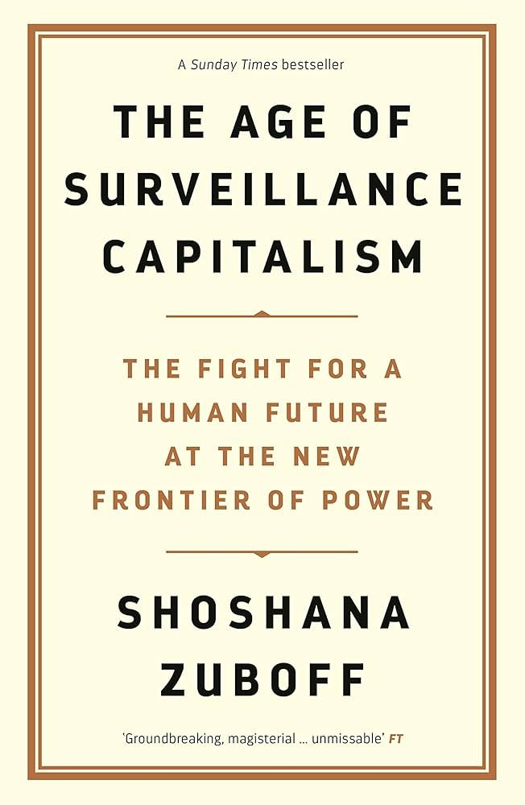{.pic style="max-height:700px"}
::::
:::: {.column width="70%"}
The headline story is that it’s not so much about the nature of digital technology as about a new mutant form of capitalism that has found a way to use tech for its purposes. The name Zuboff has given to the new variant is “surveillance capitalism”. It works by providing free services that billions of people cheerfully use, enabling the providers of those services to monitor the behaviour of those users in astonishing detail – often without their explicit consent.
::::
:::

## Surveillance Capitalism
<!-- slide 34 -->

::: {.columns}
:::: {.column width="29%"}
{.pic style="max-height:700px"}
::::
:::: {.column width="71%"}
“Surveillance capitalism unilaterally **claims human experience as free raw material for translation into behavioural data**. Although some of these data are applied to service improvement, the rest are declared as a proprietary **behavioural surplus**, fed into advanced manufacturing processes known as ‘machine intelligence’, and fabricated into prediction products that anticipate what you will do now, soon, and later. Finally, these prediction products are traded in a new kind of marketplace that I call **behavioural futures markets**. Surveillance capitalists have grown immensely wealthy from these trading operations, for many companies are willing to lay bets on our future behaviour.”
::::
:::

## Harnessing Data: You
<!-- slide 36 -->

- Are multinational corporations, intelligence services, and research institutions the only ones who can harness the vast streams of data being produced?
- No.
- With the proper skills and an internet connection, anyone can.

## {background-image="img/w01/slide_037.jpg" background-size="contain" .fallback}
<!-- slide 37 -->

::: notes
All four panels do the same job: the mean of a list. The machine code and assembly are real: I compiled the C version with clang -O1 on an arm64 Mac (13 instructions). Python's `sum(x) / len(x)` gets turned into something like the left-hand panel before it runs. The point: each rung did more of the translating for us, so we could think about the problem rather than the machine.

Slide text: Humans speaking computer
:::

## Computers speaking human
<!-- slide 38 -->

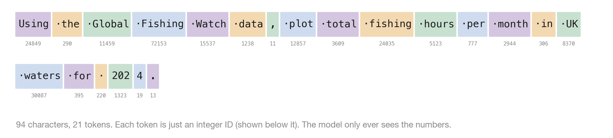{.r-stretch fig-align="center"}

- LLMs flip it round: now **the computer learns to speak human**
- *"The hottest new programming language is English."* (Andrej Karpathy, 2023)
- It doesn't read English: it reads numbers, predicts the next one, and hands you back Python

::: notes
Tokenised with tiktoken's o200k_base encoding (the GPT-4o tokenizer). 94 characters become 21 tokens. Note "2024" is split into "202" + "4": the model has no built-in idea of numbers. English is the newest rung on the ladder, but what comes out the other end is still Python. Someone has to read it.
:::

## Everyone moved up a rung
<!-- slide 39 -->

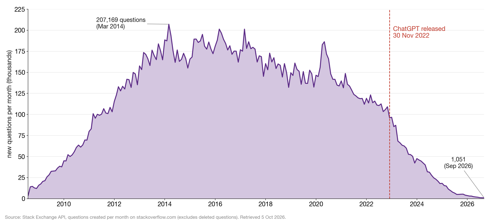{.r-stretch fig-align="center"}

::: notes
Stack Overflow was where programmers asked each other questions. Monthly new questions peaked at ~207k (Mar 2014), were already falling slowly, then fell off a cliff after ChatGPT (Nov 2022). Sep 2026: ~1,000. Data: Stack Exchange API, filter=total, pulled 5 Oct 2026; it counts only non-deleted questions. People haven't stopped coding. They've stopped asking humans.
:::

## So why learn to code?
<!-- slide 40 -->

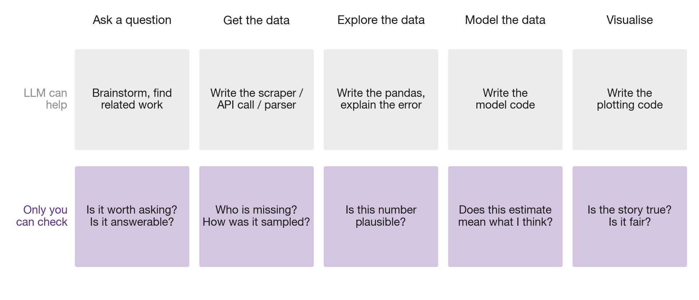{.r-stretch fig-align="center"}

Use LLMs to **write** code. This course teaches you to **read** it, **question** it, and know when the number is wrong.

::: notes
The five stages are the data science process, which the next section walks through one stage at a time. The top row is the typing, which LLMs are now good at. The bottom row is the judgement, which is what the rest of this module is about. Add the module's AI-use policy here if you want it on this slide.
:::

## 2. Course Content {.center}
<!-- slide 41 -->

## Course Content
<!-- slide 42 -->

The material of the course will integrate the five key facets of an investigation using data:

1. **Data collection**: data wrangling, cleaning, and sampling to get a suitable data set.
1. **Data management**: accessing data quickly and reliably.
1. **Exploratory data analysis**; generating hypotheses and building intuition.
1. **Prediction** or statistical learning.
1. **Communication**: summarizing results through visualization, stories, and interpretable summaries.

## {background-image="img/w01/slide_043.jpg" background-size="contain" .fallback}
<!-- slide 43 -->

::: notes
Slide text: The Data Science Process: · Ask a Question · Get the Data · Explore the Data · Model the Data · Visualize the Results · What do you want to estimate or predict? · What is the relationship between X and Y;  · what is the effect of X on Y? · What would you do if you had all the data?
:::

## {background-image="img/w01/slide_044.jpg" background-size="contain" .fallback}
<!-- slide 44 -->

::: notes
Slide text: The Data Science Process: · Ask a Question · Get the Data · Explore the Data · Model the Data · Visualize the Results · What is the population of interest? · How were the data sampled? · Which data are relevant? · What are the ethical implications of using this data?
:::

## {background-image="img/w01/slide_045.jpg" background-size="contain" .fallback}
<!-- slide 45 -->

::: notes
Slide text: The Data Science Process: · Ask a Question · Get the Data · Explore the Data · Model the Data · Visualize the Results · Generate summary statistics	 · Mean, variance, range etc.  · Plot the data · Are there missing values?  · Are there egregious issues? · Are there patterns?
:::

## {background-image="img/w01/slide_046.jpg" background-size="contain" .fallback}
<!-- slide 46 -->

::: notes
Slide text: The Data Science Process: · Ask a Question · Get the Data · Explore the Data · Model the Data · Visualize the Results · Build a model · Fit the model  · Validate the model
:::

## {background-image="img/w01/slide_047.jpg" background-size="contain" .fallback}
<!-- slide 47 -->

::: notes
Slide text: The Data Science Process: · Ask a Question · Get the Data · Explore the Data · Model the Data · Visualize the Results · What did we learn? · Do the results make sense? · Can we effectively tell a story?
:::

## Lecture Outline
<!-- slide 48 -->

| Week | Lecture | Theme |
|---|---|---|
| 1 | Introduction | Question |
| 2 | Data | Data Acquisition |
| 3 | Spatial & Network Data | Data Acquisition |
| 4 | Text Data | Data Acquisition |
| 5 | Sampling  + Distributions | Exploration |
| 6 | Hypothesis Testing | Exploration |
| 7 | Regression | Modeling |
| 8 | Causal Inference I | Modeling |
| 9 | Embeddings | Modeling |
| 10 | Machine Learning | Modeling |

## Course Structure
<!-- slide 49 -->

- Tuesday Lecture
    - 1pm-2pm
    - Harrie Massey Lecture Theatre, [25 Gordon Street](https://www.google.com/maps/search/?api=1&query=25+Gordon+Street+London+WC1H+0AY) (E28)
- Friday Workshops
    - 2pm-4pm
    - [Bedford Way (26)](https://www.google.com/maps/search/?api=1&query=26+Bedford+Way+London+WC1H+0AP) LG04

::: notes
Attendance is mandatory and will be recorded, tap in with your card
:::

## Workshops
<!-- slide 50 -->

- We’ll be working in Python, putting into practice what we’ve learned in the lectures
- We’ll be using Google Colab, which allows us to write and execute python in the browser
- [https://colab.research.google.com/](https://colab.research.google.com/)
- You’ll be given a worksheet, and work together in groups to get through it.
- We’ll be around to answer any questions and to walk you through if you get stuck

## Assessments
<!-- slide 51 -->

- Project Idea Pitch (10%)
    - A research proposal for your main project
    - Due: **17th November 5pm**
- Problem Set Submission (30%)
    - Each problem set will have one Assessed Question. During the final workshop of term, you will submit the answers to these questions into a Moodle Quiz.
    - Due: **18th December 5pm**
- Website and Report Hand in. (60%)
    - Website link
    - Due: **11th January 5pm**

## {.notitle}
<!-- slide 52 -->

::: {.columns}
:::: {.column width="54%"}
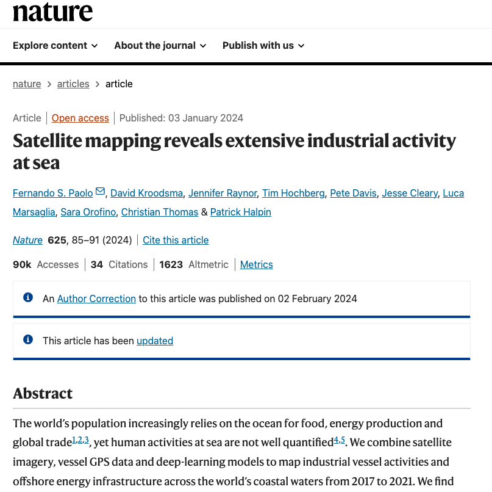{.pic style="max-height:700px"}
::::
:::: {.column width="46%"}
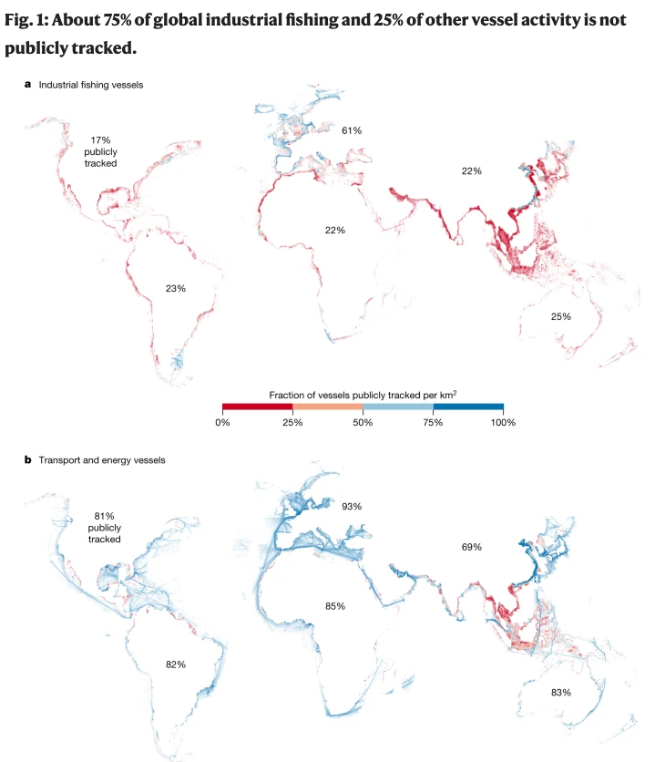{.pic style="max-height:700px"}
::::
:::

## Why group work?
<!-- slide 53 -->

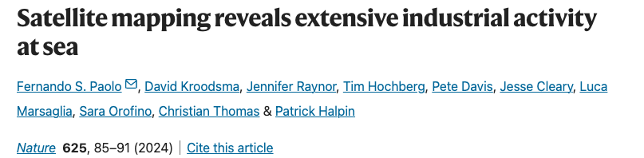{.pic style="max-height:177px"}

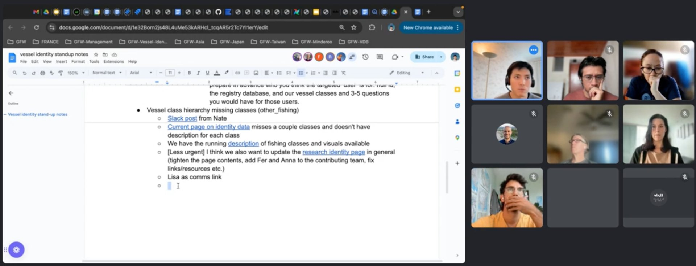{.pic style="max-height:523px"}

## Assessment: Group Website
<!-- slide 54 -->

- A website put together as a group
- Describe / explain / analyse / visualise a chosen data set
- [https://github.com/awesomedata/awesome-public-datasets](https://github.com/awesomedata/awesome-public-datasets)
- Depending on the data chosen, different sorts of visualization will be appropriate
- The website should be treated like other academic work
- Claims should be backed by evidence
- All data used should have proper attribution
- Relevant research should be cited

## IPAC Weighting
<!-- slide 55 -->

1. The group of students complete the project, which is assessed by the tutor generating a **group mark.**
1. After the students submit their group assignment, **they give anonymous scores and anonymous feedback** to each other based on their level of contribution and professional conduct during the project. **These scores are used to calculate the IPAC scores per individual**, that gets moderated or corroborated by the tutors.
1. **These two marks will then be combined to give each student their own grade**, reflecting not only the final piece of assessed work but also how she or he functioned in the group over the whole project

## Assessment: Problem Sets
<!-- slide 56 -->

- During the course, we will have weekly workshops that are designed to develop your coding skills and data science knowledge.
- Collaboration is welcome, and the Module Leader and PGTAs will provide solutions for the main body of the problem sets during the workshops.
- However, each problem set will contain one Assessed Question, which students must answer themselves and will not receive tutorial guidance on. At the end of term, the answers to these Assessed Questions will be entered into a Moodle quiz and validated.

## Any Questions?
<!-- slide 57 -->

[[o.ballinger@ucl.ac.uk](mailto:o.ballinger@ucl.ac.uk)]{style="display:block;text-align:center"}
