## {background-image="img/w03/slide_002.jpg" background-size="contain" .fallback}
<!-- slide 2 -->

::: notes
Slide text: The Data Science Process: · Ask a Question · Get the Data · Explore the Data · Model the Data · Visualize the Results · What is the population of interest? · How were the data sampled? · Which data are relevant? · What are the ethical implications of using this data?
:::

## Outline
<!-- slide 3 -->

1. Case Study: Grain Theft in Ukraine
1. Vector Data
1. Raster Data
1. Analysing Spatial Data
1. Networks

## {background-image="img/w03/slide_004.jpg" background-size="contain" .fallback}
<!-- slide 4 -->

::: notes
Slide text: Grain Theft in Ukraine · "They take grain to the annexed Crimea first, where they transport it to Kerch or Sevastopol [ports], then they load Ukrainian grain on Russian ships and go to the Kerch Strait. There, in the Kerch Strait [between Crimea and Russia], they transfer Ukrainian grain from small ships on to bulk carriers, where it is mixed with grain from Russia - or in some cases, they sail to this area just to give the appearance they are loading up with Russian grain."
:::

## Questions
<!-- slide 5 -->

- How does grain laundering work?
- Which ships are involved?
- Which companies are involved?
- Can we follow the grain?
- Where does it go?

## {background-image="img/w03/slide_006.jpg" background-size="contain" .fallback}
<!-- slide 6 -->

::: notes
Slide text: Kapitan Korchin · On June 2nd, 2022, Kaptian Korchin heads south from the Kerch strait but the AIS signal is lost. · On June 4th, a ship matching KK’s characteristics is visible in high-res satellite imagery of the Avlita Grain Terminal in occupied Sevastopol. No AIS detectable in the area  · On June 6th, Kapital Korchin re-appears in the Kerch strait, and conducts a ship-to-ship transfer
:::

## {background-image="img/w03/slide_007.jpg" background-size="contain" .fallback}
<!-- slide 7 -->

::: notes
Slide text: Step 1: Load Grain · Smaller feeder vessels turn off AIS and sail to the Avlita Grain Terminal in Sevastopol.  · Using optical and radar satellite imagery, we identified 180 ships with AIS turned off at this terminal in the first year of the war.
:::

## {background-image="img/w03/slide_008.jpg" background-size="contain" .fallback}
<!-- slide 8 -->

::: notes
Slide text: Step 2:  · Ship-to-Ship  · Transfer
:::

## Automatic Identification System (AIS)
<!-- slide 9 -->

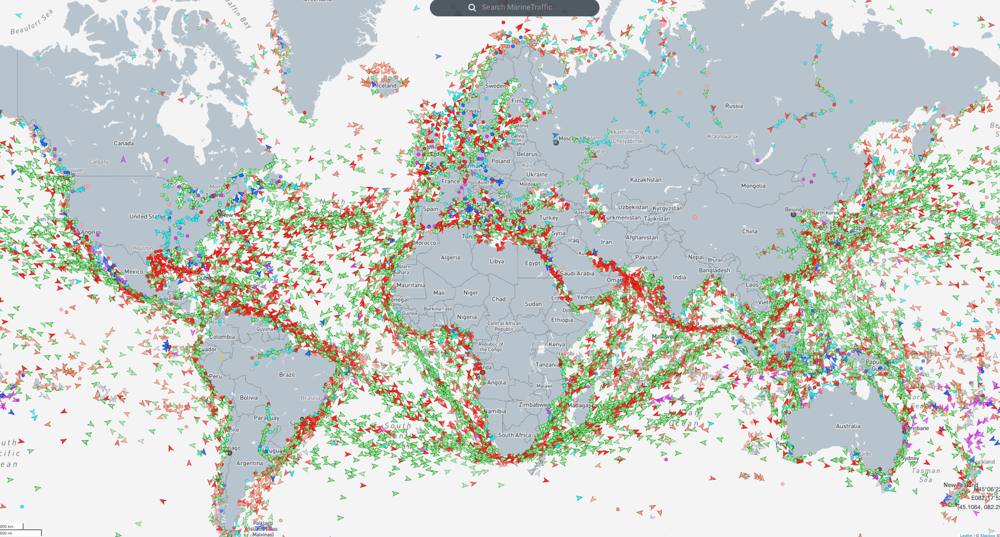{.r-stretch fig-align="center"}

## Identifying STS in AIS data
<!-- slide 10 -->

::: {.columns}
:::: {.column width="29%"}
A simple algorithm:

- **If** two or more ships
- **Spend** two or more hours
- **Within** 500m of each other
- **Then** link them together
::::
:::: {.column width="71%"}
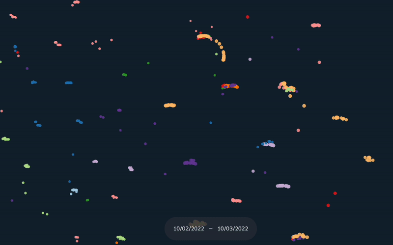{.pic style="max-height:700px"}
::::
:::

## Satellite detections + AIS
<!-- slide 11 -->

::: {.columns}
:::: {.column width="58%"}
- 33,273 satellite detections since 2021
- Cross-referencing the satellite detections with AIS data shows close agreement.
    - Satellite image metadata used to filter AIS data ± 24h of the time when the image was taken, within 500m of the center of the detection.
    - Draught data from AIS used to infer direction of cargo transfer
- However, instances of *disagreement* between AIS + RS data are interesting…
::::
:::: {.column width="42%"}
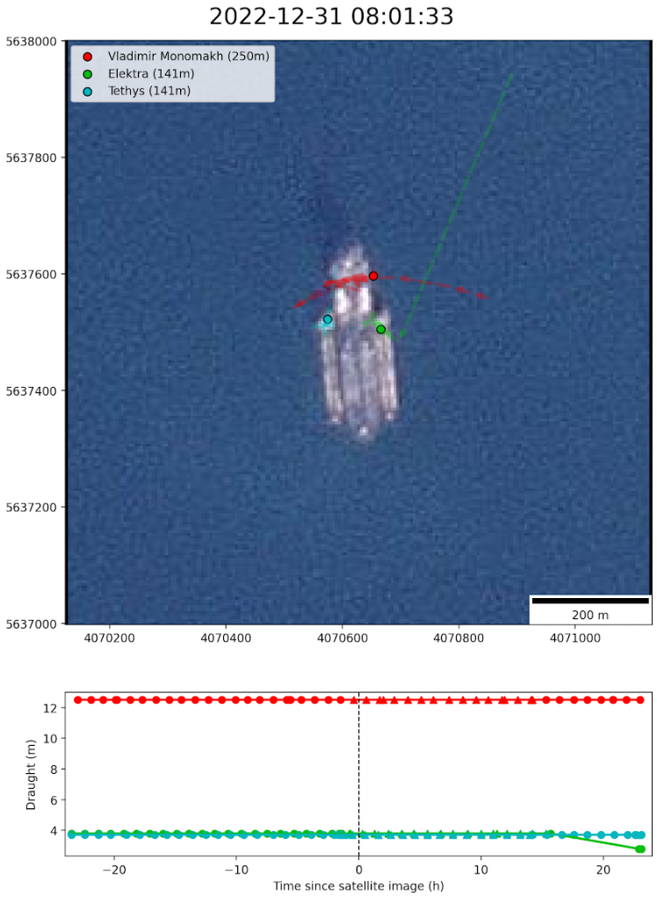{.pic style="max-height:700px"}
::::
:::

## {background-image="img/w03/slide_012.jpg" background-size="contain" .fallback}
<!-- slide 12 -->

::: notes
Slide text: Spatial Data · There are two main types of spatial data: · Vector · Tabular data with a geometry column · Raster · A digital image, i.e. a matrix of values · Vectors · Rasters
:::

# Vector Data
<!-- slide 13 -->

## {background-image="img/w03/slide_014.jpg" background-size="contain" .fallback}
<!-- slide 14 -->

::: notes
Slide text: Vector Data Types · CSV · points · Shapefile  · Lines/polygons · GeoJSON · Points/lines/polygons · KML/GPX · Lines/points
:::

## {background-image="img/w03/slide_015.jpg" background-size="contain" .fallback}
<!-- slide 15 -->

::: notes
Slide text: Point Data · e.g. ballot box level election results · Each point can have many attributes including vote share for different parties, etc.
:::

## Polygon Data {.smaller}
<!-- slide 16 -->

::: {.columns}
:::: {.column width="46%"}
Each row is an area; the **geometry** column holds its boundary:

| Borough | Population | Pubs | geometry |
|---|---|---|---|
| Hackney | 280,000 | 2,300 | POLYGON(…) |
| Camden | 279,000 | 1,943 | POLYGON(…) |
| Westminster | 261,000 | 532 | POLYGON(…) |
::::
:::: {.column width="54%"}
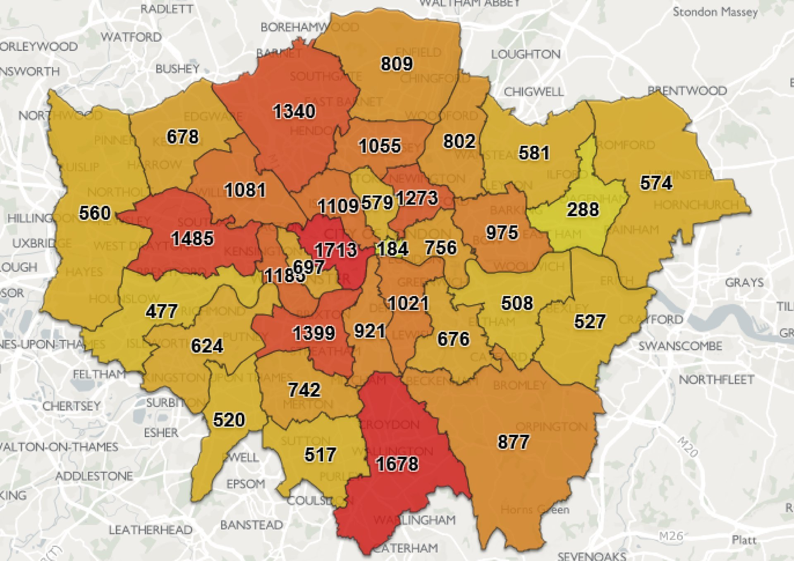{.pic style="max-height:700px"}
::::
:::

# Raster Data
<!-- slide 17 -->

## Raster Data: Definition
<!-- slide 18 -->

- Similar to a digital photograph. The entire area of the map is subdivided into a grid of tiny cells, or pixels. A value is stored in each of these cells to represent the nature of whatever is present at the corresponding location on the ground.
- The major use of raster data involves storing map information as digital images, in which the cell values relate to the pixel colors of the image. To reproduce the image the computer reads each of these cell values one by one and applies them to the pixels on the screen.

## {background-image="img/w03/slide_019.jpg" background-size="contain" .fallback}
<!-- slide 19 -->

::: notes
Slide text: Optical (RGB) · NDVI
:::

## Medium Resolution (Landsat 8, 30m/px)
<!-- slide 20 -->

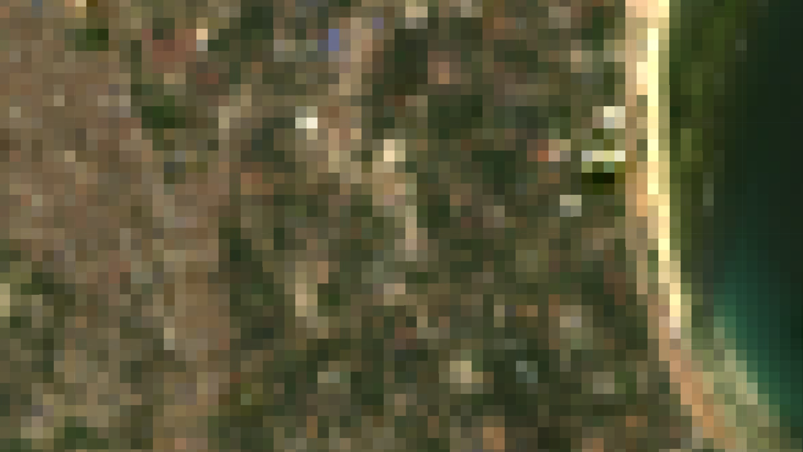{.r-stretch fig-align="center"}

## High Resolution (Maxar, 50cm/px)
<!-- slide 21 -->

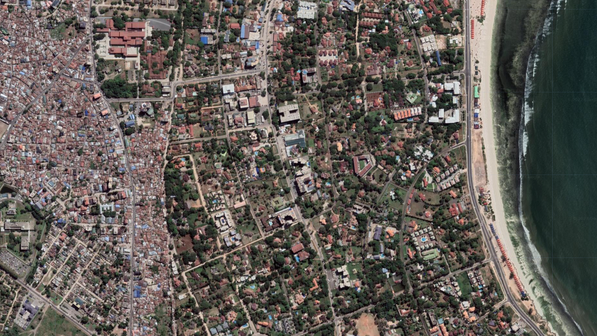{.r-stretch fig-align="center"}

## Extremely High Resolution (KH-11, 10cm/px)
<!-- slide 22 -->

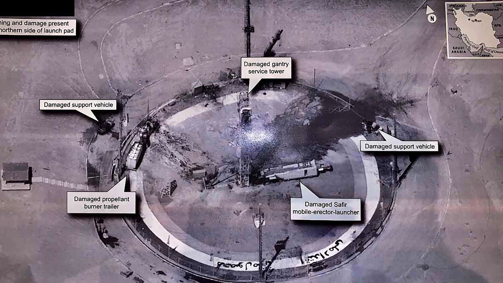{.r-stretch fig-align="center"}

# Analytical Approaches
<!-- slide 23 -->

## Arithmetic
<!-- slide 24 -->

- Zonal Statistics
    - Vector-Vector
        - Calculate the number of vectors within another vector
            - e.g. count the number of tube stations (points) within each borough (polygon)
        - We can add attribute information;
            - E.g. calculate the average vote share in a 10km grid cell
    - Vector-Raster
        - Calculate the value of a raster within each polygon
            - e.g.  Calculate the average pixel value of nighttime lights within each 10km grid cell
- Raster math
    - Add/subtract/divide/multiply one raster by another
        - E.g. subtract nighttime lights imagery taken in 1992 from imagery taken in 2012 to see which areas have become more luminous
- Algorithms

## Broad Street Pump
<!-- slide 25 -->

::: {.columns}
:::: {.column width="46%"}
- During the **1854** cholera outbreak in London, Dr John Snow noticed a pattern in the spatial distribution of cases
- Infections were concentrated around a single water pump on Broad Street, in Soho
::::
:::: {.column width="54%"}
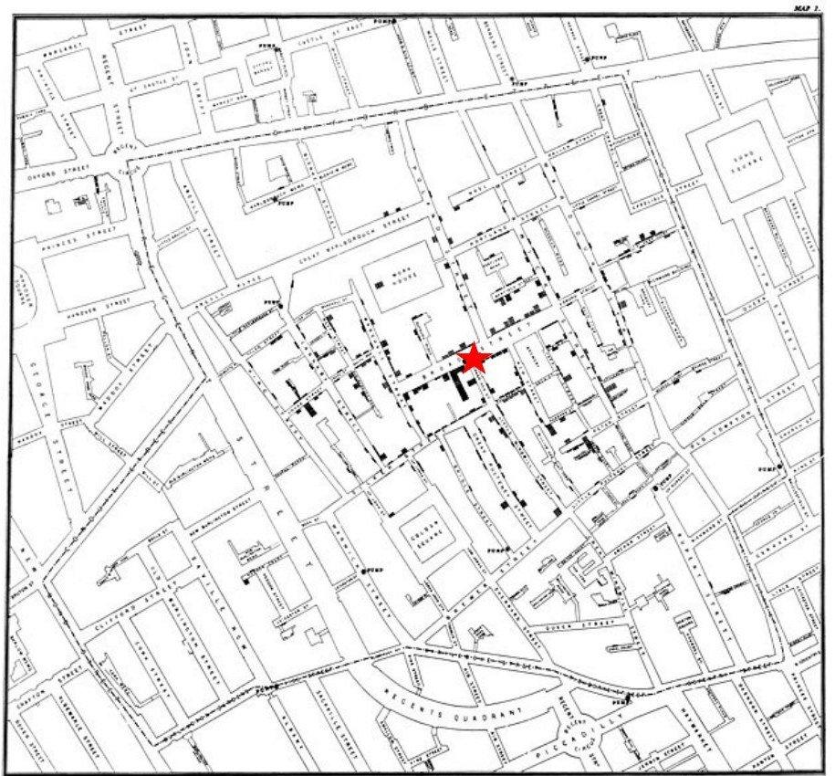{.pic style="max-height:700px"}
::::
:::

## Raster Math
<!-- slide 26 -->

- E.g. Nighttime Lights data
- Satellite images of the earth at night
    - Highly correlated with development indicators
- Applications:
    - Assessing economic development
    - Gauging the extent of destruction during war
    - Identifying refugee camps
    - Tracking methane flaring from oil production
- [Demo](https://worldview.earthdata.nasa.gov/?v=33.66968063480002,35.29300939693471,42.39486992011477,39.832834446950045&t=2012-01-01-T00%3A00%3A00Z&t1=2016-12-11-T00%3A00%3A00Z&l=VIIRS_Black_Marble,VIIRS_SNPP_CorrectedReflectance_TrueColor,MODIS_Aqua_CorrectedReflectance_TrueColor(hidden),MODIS_Terra_CorrectedReflectance_TrueColor(hidden)&l1=Reference_Labels(hidden),Reference_Features(hidden),Coastlines,VIIRS_Black_Marble,VIIRS_SNPP_CorrectedReflectance_TrueColor(hidden),MODIS_Aqua_CorrectedReflectance_TrueColor(hidden),MODIS_Terra_CorrectedReflectance_TrueColor(hidden)&ca=true&cm=spy)

## {background-image="img/w03/d302cc7fccc00e9.png" background-size="contain"}
<!-- slide 27 -->

## Regression
<!-- slide 28 -->

- You can use spatial data to generate your own data for use in a regression
- Using zonal statistics, you can generate a table in which each row is an areal unit (e.g. province, grid-cell, etc.)
- But, beware of **AUTOCORRELATION**
    - **Things that are closer together (both in space and time) have more in common than things that are farther away.**
    - Statistical approaches generally assume that observations are *independent.*

# What Is a Network?
<!-- slide 29 -->

## {background-image="img/w03/slide_030.jpg" background-size="contain" .fallback}
<!-- slide 30 -->

::: notes
Slide text: Networks Are Everywhere · Transport · Stations linked by track · Shipping · Vessels linked by cargo transfers · Friendship · People linked on Facebook, mapped by county · Neighbourhoods · Cross-class friendships in London · Every network is a set of nodes (things) and edges (relationships between them)
:::

## The Vocabulary
<!-- slide 31 -->

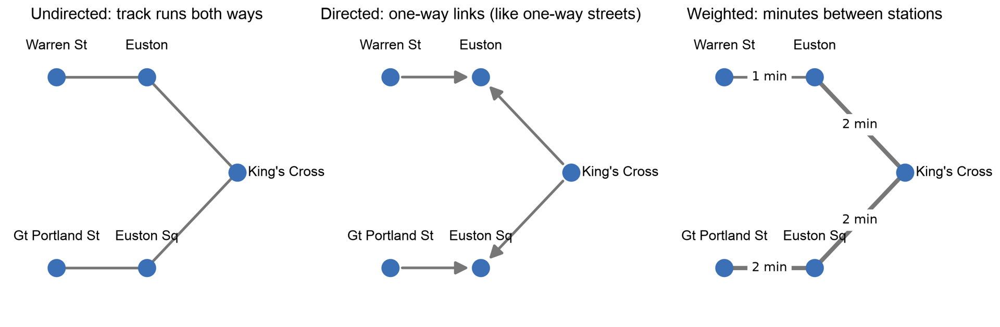{.r-stretch fig-align="center"}

- **Node** (or vertex): a thing.   **Edge** (or link): a relationship.   **Degree**: how many edges a node has.
- **Directed**: A → B isn't B → A.   **Weighted**: edges have a strength or cost.

## Networks as Data
<!-- slide 32 -->

::: {.columns}
:::: {.column width="66%"}
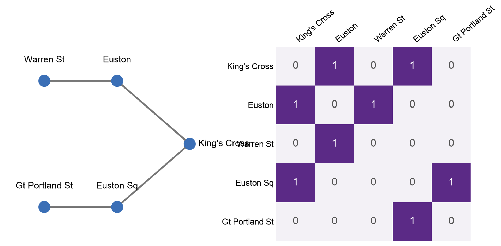{.pic style="max-height:453px"}

- **Adjacency matrix**: a 1 where two nodes are connected. Good for maths, wasteful for big sparse networks.
- **Edge list**: one row per edge. This is what you'll usually load with pandas.
::::
:::: {.column width="34%"}

| **source** | **target** | **min** |
|---|---|---|
| **Gt Portland St** | Euston Sq | 2 |
| **King's Cross** | Euston Sq | 2 |
| **King's Cross** | Euston | 2 |
| **Warren St** | Euston | 1 |
::::
:::

## A Few Hubs, Many Ordinary Nodes
<!-- slide 33 -->

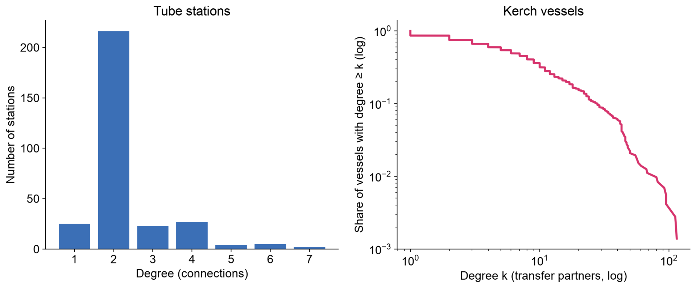{.r-stretch fig-align="center"}

The London Underground is **regular**: every station has 1–7 neighbours. Kerch is **heavy-tailed**: the median vessel has 6 transfer partners, the top 1% over 67, the busiest 115. Big bulk carriers act as **hubs** that many small ships load into

## It's a Small World
<!-- slide 34 -->

::: {.columns}
:::: {.column width="60%"}
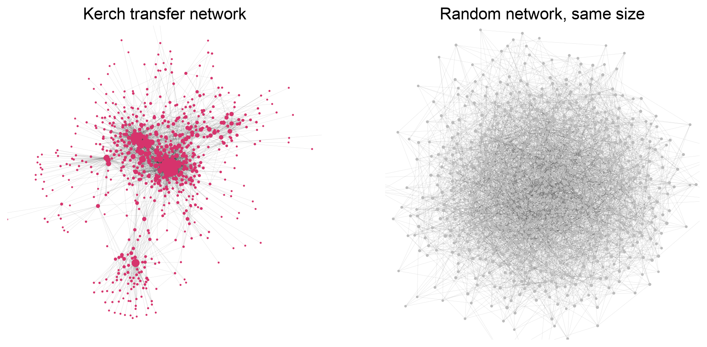{.pic style="max-height:484px"}

|  | **Kerch** | **Random network** |
|---|---|---|
| **Average path length** | 3.3 | 2.95 |
| **Clustering coefficient** | 0.324 | 0.015 |
::::
:::: {.column width="40%"}
- Compare with a **random network** with the same number of nodes and edges.
- Paths are about as short, but **clustering** is ~20× higher: a ship's partners also trade with each other.
- Short paths + high clustering = a **small world**. Milgram (1967): 'six degrees of separation'. Facebook (2016): 3.6.
::::
:::

::: notes
Largest connected component of the Kerch network vs one Erdos-Renyi G(n,m) draw (seed 1). Milgram (1967) Psychology Today; Bhagat et al. (2016) Facebook Research, 3.57.
:::

# Who Matters? Centrality
<!-- slide 35 -->

## {background-image="img/w03/slide_036.jpg" background-size="contain" .fallback}
<!-- slide 36 -->

::: notes
Slide text: Three Ways to Be Central · Degree · How many connections? The popular one. · Betweenness · Share of shortest paths that pass through you. The broker. · Eigenvector · Connected to other central nodes. The insider. (Google's PageRank is a version.)
:::

## Which Ships Are Central?
<!-- slide 37 -->

::: {.columns}
:::: {.column width="43%"}
- Top 25 by **degree**: half bulk carriers, half general cargo. The busy loaders
- Top 25 by **betweenness**: **40% tankers**, vs 24% of all ships. Tankers are the **brokers** linking otherwise separate groups
- Top 25 by **eigenvector**: 72% small general-cargo ships in the dense core
- Different measures pick out different **roles**
::::
:::: {.column width="57%"}
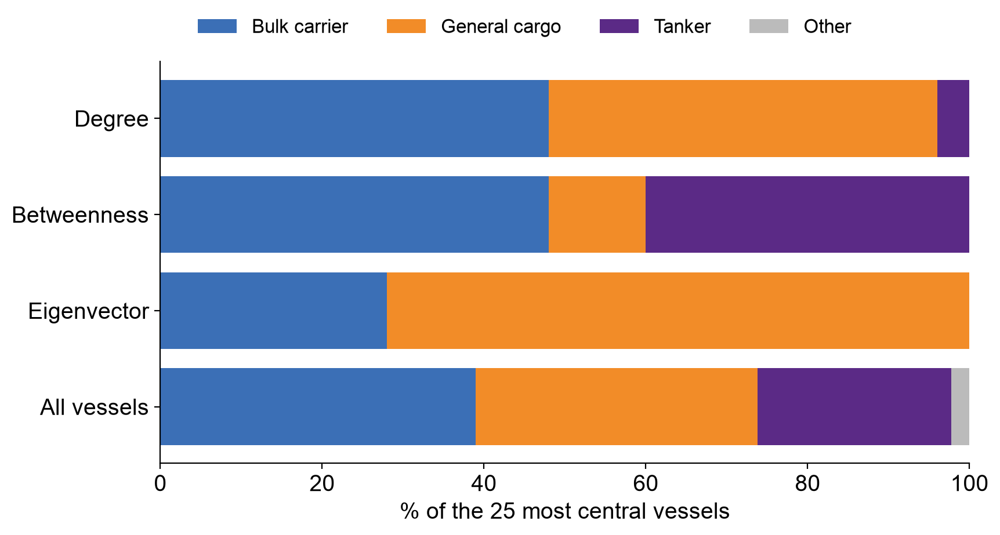{.pic style="max-height:700px"}
::::
:::

::: notes
Top 5 by betweenness: Vladimir Monomakh, Kavkaz II, Horasan, Barla, Avior. Top 5 by degree: Venera, Barla, Horasan, Vladimir Monomakh, Kavkaz II.
:::

## The Broker in the Dark
<!-- slide 38 -->

::: {.columns}
:::: {.column width="57%"}
- The **highest-betweenness** vessel is a Russian crude tanker, the \*Vladimir Monomakh\*
- Here it sits alongside another tanker that **isn't broadcasting AIS**
- Its draught drops (bottom): it has **unloaded**. The partner is invisible in the network
- The network only contains what AIS can see
::::
:::: {.column width="43%"}
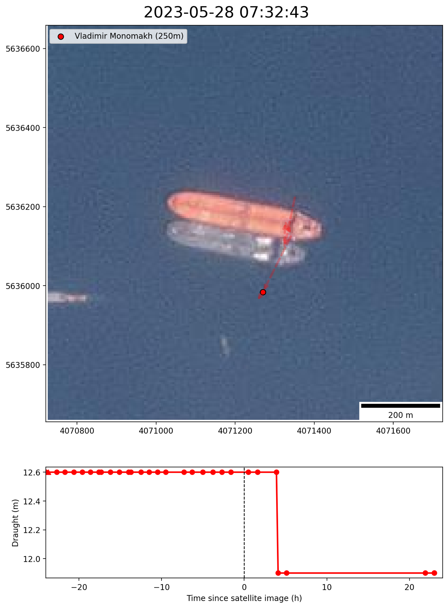{.pic style="max-height:700px"}
::::
:::

## Does Centrality Flag Grain Ships?
<!-- slide 39 -->

::: {.columns}
:::: {.column width="43%"}
- The 15 vessels named in media reports: median at the **90th percentile** by degree, 91th by eigenvector
- **7 of 15** are in the top 10% by degree
- Sanctioned vessels (purple) are mostly **below** the median: they transfer less, or less visibly
- Centrality can **prioritise** investigation. It can't prove anything
::::
:::: {.column width="57%"}
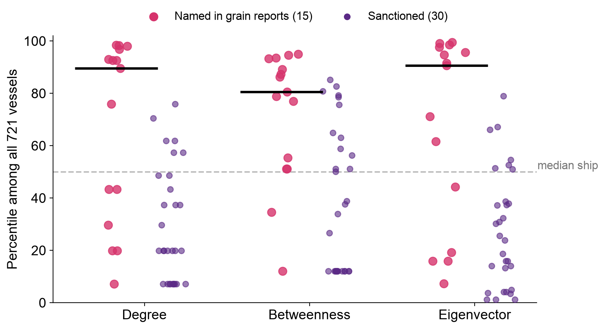{.pic style="max-height:700px"}
::::
:::

# Finding Communities
<!-- slide 40 -->

## Communities: Clustering for Networks
<!-- slide 41 -->

::: {.columns}
:::: {.column width="43%"}
- A **community**: many edges **inside**, few **between**
- Groups nodes by their **connections**, not their features (feature-based clustering comes in Week 10)
- **Modularity**: how much denser than chance (above ~0.3 is notable)
- **Louvain** (2008): merge whatever raises modularity most
- London Underground: **9** communities (Q = 0.76). No coordinates used, yet they're **geographic**
::::
:::: {.column width="57%"}
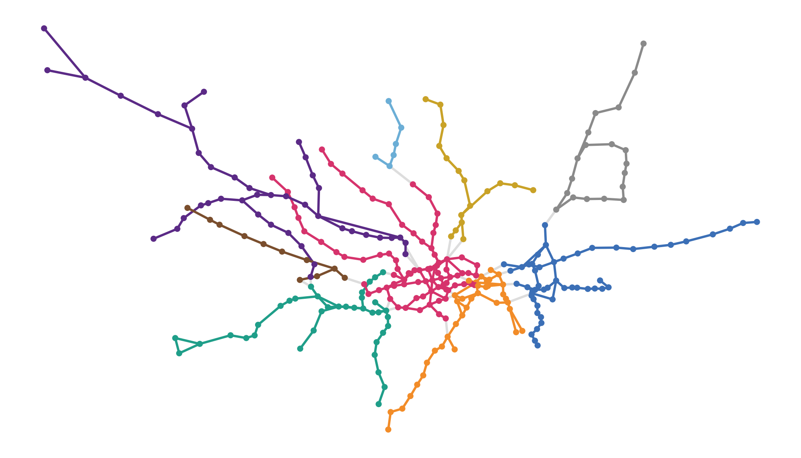{.pic style="max-height:700px"}
::::
:::

## Kerch Transfers Over Time
<!-- slide 42 -->

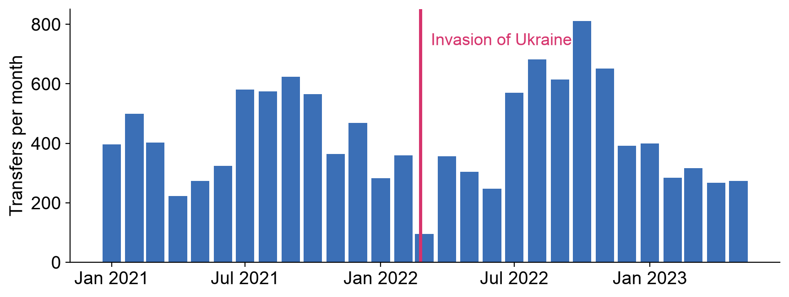{.r-stretch fig-align="center"}

- Transfers collapsed in March 2022, then rebounded to a record **811 in October 2022**.
- Next: which ships trade with which? **Communities** in the transfer network

::: notes
Monthly counts from the event table on oballinger.github.io/STS (Jan 2021-May 2023).
:::

## Communities Are Cargo Markets {.smaller}
<!-- slide 43 -->

::: {.columns}
:::: {.column width="47%"}
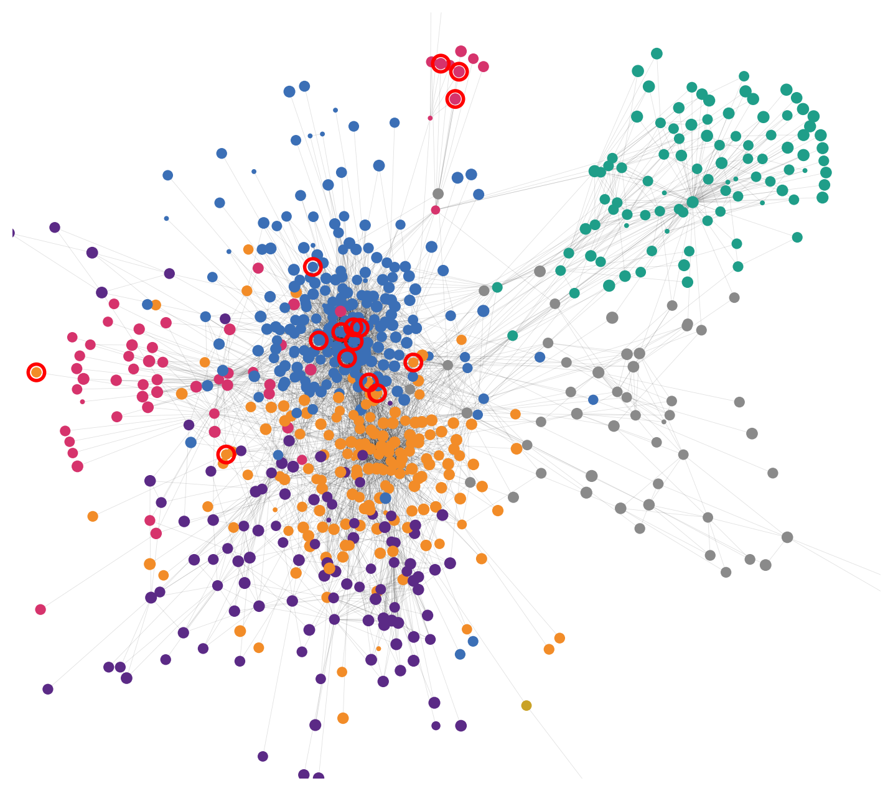{.pic style="max-height:634px"}

Colour = community; red rings = vessels named in grain reports
::::
:::: {.column width="53%"}
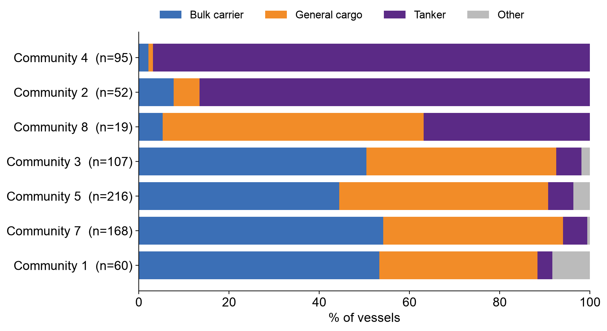{.pic style="max-height:451px"}

- 721 vessels, 4,008 transfer pairs (2022-02 to 2023-08). Louvain: 7 communities, modularity 0.59.
- The algorithm never saw vessel type, yet two communities are **almost all tankers** (97%, 87%)
::::
:::

::: notes
Communities are the stored Louvain labels from the Bokeh page (modularity recomputed here on the largest component). Dry-cargo communities mix small general-cargo/river-sea ships with larger bulk carriers.
:::

## Any Questions?
<!-- slide 44 -->

[o.ballinger@ucl.ac.uk](mailto:o.ballinger@ucl.ac.uk)
