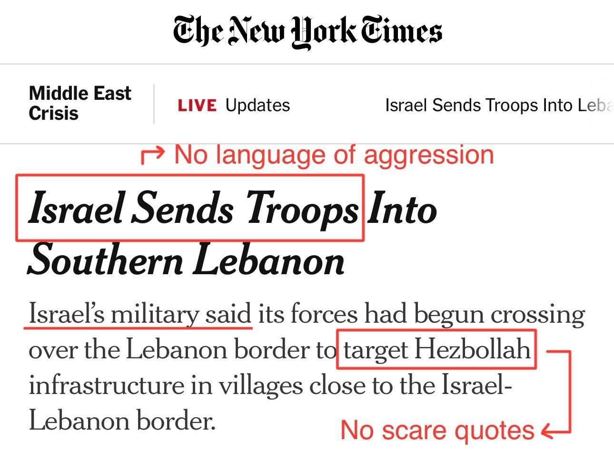
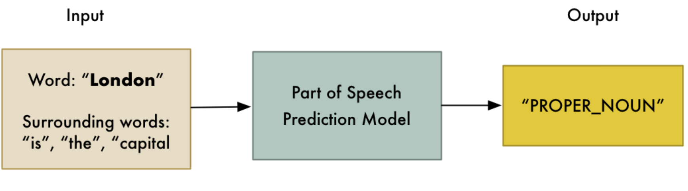
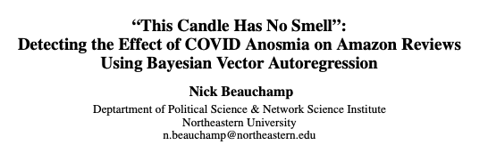

## {background-image="img/w04/slide_002.jpg" background-size="contain" .fallback}
<!-- slide 2 -->

::: notes
Slide text: The Data Science Process: · Ask a Question · Get the Data · Explore the Data · Model the Data · Visualize the Results · What is the population of interest? · How were the data sampled? · Which data are relevant? · What are the ethical implications of using this data?
:::

## Outline
<!-- slide 3 -->

1. Case Study: The Grammar of Police Shootings
1. Natural Language Processing
1. Analysing Text

## {.notitle}
<!-- slide 4 -->

::: {.columns}
:::: {.column width="49%"}
{.pic style="max-height:700px"}
::::
:::: {.column width="51%"}
{.pic style="max-height:700px"}
::::
:::

## {.notitle}
<!-- slide 5 -->

::: {.columns}
:::: {.column width="50%"}
{.pic style="max-height:700px"}
::::
:::: {.column width="50%"}
{.pic style="max-height:700px"}
::::
:::

# The Curious Grammar of Police Shootings
<!-- slide 6 -->

## Civilian shoots Civilian
<!-- slide 7 -->

On February 10, 2014, around 6:10 p.m., the victim was in the parking lot in the 13640 block of Burbank Boulevard, to the rear, when he was confronted by the suspect. **The suspect produced a semi-automatic handgun and fired numerous times striking the victim in the torso.**

Source: [Washington Post](https://www.washingtonpost.com/news/the-watch/wp/2014/07/14/the-curious-grammar-of-police-shootings/)

## Officer Shoots Civilian
<!-- slide 8 -->

When the officers arrived they were confronted by a Hispanic male armed with a sword. The officers attempted to take the suspect into custody by using a taser but it was ineffective. **The suspect then ran towards the officers still armed with the sword and an officer-involved-shooting occurred.**

## {background-image="img/w04/slide_009.jpg" background-size="contain" .fallback}
<!-- slide 9 -->

::: notes
Slide text: Grammar Matters · nsubj · The nominal subject is the more agentive, the do-er, or the proto-agent of the clause.  · dobj · The direct object is the noun phrase which is the (accusative) object of the verb.
:::

## The Grammar of a Police Shooting
<!-- slide 10 -->

{.r-stretch fig-align="center"}

## Text is data, bias can be measured
<!-- slide 11 -->

- Moreno-Medina, Jonathan, et al. [*Officer-Involved: The Media Language of Police Killings*](https://www.nber.org/system/files/working_papers/w30209/w30209.pdf). No. w30209. National Bureau of Economic Research, 2022.
- This paper studies the language used in television news broadcasts to describe police killings in the United States from 2013-19
- Data on: 6,000 police killings, 8,000 non-police homicides, 200,000 stories, and 470,000 sentences that describe the killings.
- **Four dimensions** of potential obfuscation relative to an active sentence in which a police officer is the subject
    - (‘**police officer killed man**’)

## {background-image="img/w04/slide_012.jpg" background-size="contain" .fallback}
<!-- slide 12 -->

::: notes
Slide text: 1. Passive Voice · “man was killed by police officer” · pushes the role of the police officer to the background of the sentence, potentially decreasing its salience to the reader. · Active Voice · Passive Voice
:::

## {background-image="img/w04/slide_013.jpg" background-size="contain" .fallback}
<!-- slide 13 -->

::: notes
Slide text: 2. No Agent · “man was killed” · A further transformation of the sentence to remove any reference to the police as the cause of the killing · Active Voice · No Agent
:::

## {background-image="img/w04/slide_014.jpg" background-size="contain" .fallback}
<!-- slide 14 -->

::: notes
Slide text: 3. Nominalization · “deadly officer-involved shooting” · transforming the action of the police killing into a noun · Active Voice · Nominalization
:::

## {background-image="img/w04/slide_015.jpg" background-size="contain" .fallback}
<!-- slide 15 -->

::: notes
Slide text: 4. Intransitive · “man dies [in shooting]” · Transforming the transitive verb ‘kill’, which requires an agent who generates the action, into the intransitive ‘die’, which does not require a cause · Active Voice · Intransitive
:::

## Main Findings
<!-- slide 16 -->

1. The media is significantly more likely to use several language structures - e.g., passive voice, nominalization, intransitive verbs - that obfuscate responsibility for police killings compared to civilian homicides
    1. There is some obfuscation in **35.6%** of stories about police killings, compared to **28.8%** for civilian homicides
1. News broadcasts are especially likely to use obfuscatory language structures when the decedent was unarmed or when body camera video is available.
1. **Survey participants (n=2,402) are less likely to hold a police officer morally responsible for a killing and to demand penalties after reading a story that uses obfuscatory language.**

# Natural Language Processing
<!-- slide 17 -->

## Natural Language Processing Pipeline
<!-- slide 18 -->

1. Sentence Segmentation
1. Tokenization
1. Parts-of-Speech Tagging
1. Lemmatization
1. Stop Words
1. Dependency Parsing
1. Named Entity Recognition
1. Coreference Resolution

Source: [Adam Geitgey](https://medium.com/@ageitgey/natural-language-processing-is-fun-9a0bff37854e)

## 1. Sentence Segmentation
<!-- slide 19 -->

- Split the text up into sentences
1. “London is the capital and most populous city of England and the United Kingdom.”
1. “Standing on the River Thames in the south east of the island of Great Britain, London has been a major settlement for two millennia.”
1. “It was founded by the Romans, who named it Londinium.”

::: notes
The first step in almost any NLP pipeline is to split our corpus into sentences. This is called Sentence Segmentation
:::

## 2. Word Tokenization
<!-- slide 20 -->

- Split the sentences up into words
- “London is the capital and most populous city of England and the United Kingdom.”
- [“London”, “is”, “ the”, “capital”, “and”, “most”, “populous”, “city”, “of”, “England”, “and”, “the”, “United”, “Kingdom”, “.”]

## 3. Part-of-Speech tagging
<!-- slide 21 -->

{.pic style="max-height:504px"}

{.pic style="max-height:196px"}

::: notes
Next, we’ll look at each token and try to guess its part of speech — whether it is a noun, a verb, an adjective and so on. Knowing the role of each word in the sentence will help us start to figure out what the sentence is talking about. 
The part-of-speech model was originally trained by feeding it millions of English sentences with each word’s part of speech already tagged and having it learn to replicate that behavior. 
Keep in mind that the model is completely based on statistics — it doesn’t actually understand what the words mean in the same way that humans do. It just knows how to guess a part of speech based on similar sentences and words it has seen before.
:::

## {background-image="img/w04/slide_022.jpg" background-size="contain" .fallback}
<!-- slide 22 -->

::: notes
Slide text: 4. Lemmatization · Words with the same meaning appear in different forms · Lemmatization identifies the  · Root of a noun or  · Unconjugated form of a verb · Lemmatization · I ate a sandwich. · I’m eating two sandwiches. · I [eat] a [sandwich]. · I [be] [eat] two [sandwich].
:::

## {background-image="img/w04/slide_023.jpg" background-size="contain" .fallback}
<!-- slide 23 -->

::: notes
Slide text: 5. Identifying Stop Words · There are lots of filler words in text · “a”, “the”, ”and”, etc.  · These usually aren’t analytically important. Their frequencies/distribution doesn’t tell us much. · Luckily there aren’t that many of them · We can simply tag them using a known list of stop words · They can then be filtered
:::

## {background-image="img/w04/slide_024.jpg" background-size="contain" .fallback}
<!-- slide 24 -->

::: notes
This parse tree shows us that the subject of the sentence is the noun “London” and it has a “be” relationship with “capital”. We finally know something useful — London is a capital! And if we followed the complete parse tree for the sentence (beyond what is shown), we would even found out that London is the capital of the United Kingdom.

Slide text: 6. Dependency Parsing · How do the words in this sentence relate to each other? · Build a tree that assigns a single “parent” word toeach word in the sentence ·  · The root of the treeis the man verb in the sentence · List of dependencies
:::

## {background-image="img/w04/slide_025.jpg" background-size="contain" .fallback}
<!-- slide 25 -->

::: notes
Slide text: 7. Named Entity Recognition · Some nouns are special, and reference real-world concepts: · People’s names · Company names · Geographic locations (Both physical and political)  · Product names · Dates and times · Amounts of money · Names of events
:::

## Python Implementation
<!-- slide 26 -->

{.r-stretch fig-align="center"}

## From Text to Table
<!-- slide 27 -->

{.r-stretch fig-align="center"}

# Analytical Approaches
<!-- slide 28 -->

## Types of Text Analysis
<!-- slide 29 -->

- The Statistical Features of the Text
    - Word frequency
    - Word proximity
    - Topic modelling
- Language Processing
    - Entity extraction (Named Entity Recognition)
    - Semantic analysis
    - Sentiment analysis

## Word Frequency
<!-- slide 30 -->

::: {.columns}
:::: {.column width="42%"}
{.pic style="max-height:700px"}
::::
:::: {.column width="58%"}
{.pic style="max-height:162px"}

{.pic style="max-height:538px"}
::::
:::

## {background-image="img/w04/slide_031.jpg" background-size="contain" .fallback}
<!-- slide 31 -->

::: notes
Slide text: Topic modelling · Uses statistical analysis to discover words which are more likely to appear together · These collections are called “topics” · Source: Joyce Xu
:::

## Sentiment Analysis
<!-- slide 32 -->

- Sentiment analysis or opinion mining is the computational study of people's opinions, sentiments, emotions, appraisals, and attitudes towards entities such as products, services, organizations, individuals, issues, events, topics, and their attributes
- Uses ‘weighted’ dictionaries of words to assess how ‘positive’ or ‘negative’ a text might be
- One of the fastest-growing areas of NLP research
- But, beware the black box

## Social Media Data
<!-- slide 33 -->

- Tumasjan *et. al.*, ‘Predicting Elections with Twitter: What 140 Characters Reveal about Political Sentiment’
- [http://www.aaai.org/ocs/index.php/ICWSM/ICWSM10/paper/viewFile/1441/1852](http://www.aaai.org/ocs/index.php/ICWSM/ICWSM10/paper/viewFile/1441/1852)
- An analysis of over 100,000 Tweets prior to the German Federal Elections, September 2009
- Questions Raised:
    - Does Twitter provide a platform for political deliberation online?
    - Can Twitter serve as a predictor of election results?

## {background-image="img/w04/slide_034.jpg" background-size="contain" .fallback}
<!-- slide 34 -->

::: notes
Slide text: Devil’s in the details · Jungherr, A., Jürgens, P., & Schoen, H. (2012). Why the pirate party won the german election of 2009 or the trouble with predictions, Social Science Computer Review, 30(2), 229-234.
:::

## Any Questions?
<!-- slide 35 -->

[[o.ballinger@ucl.ac.uk](mailto:o.ballinger@ucl.ac.uk)]{style="display:block;text-align:center"}
