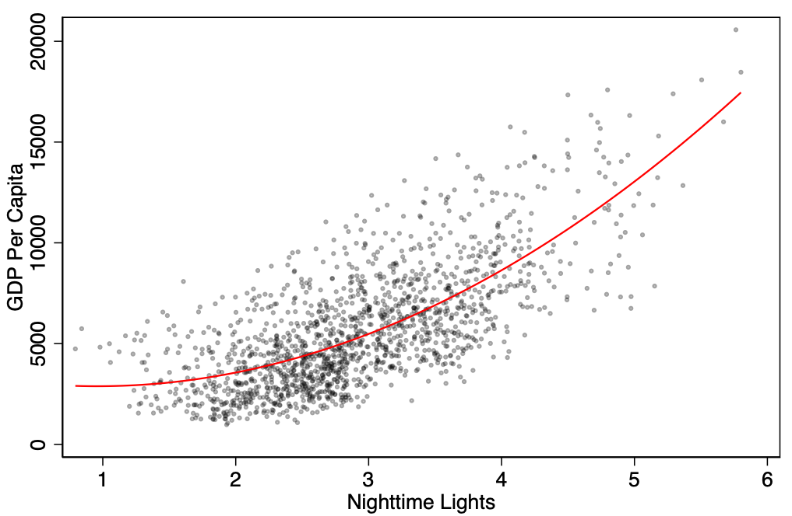
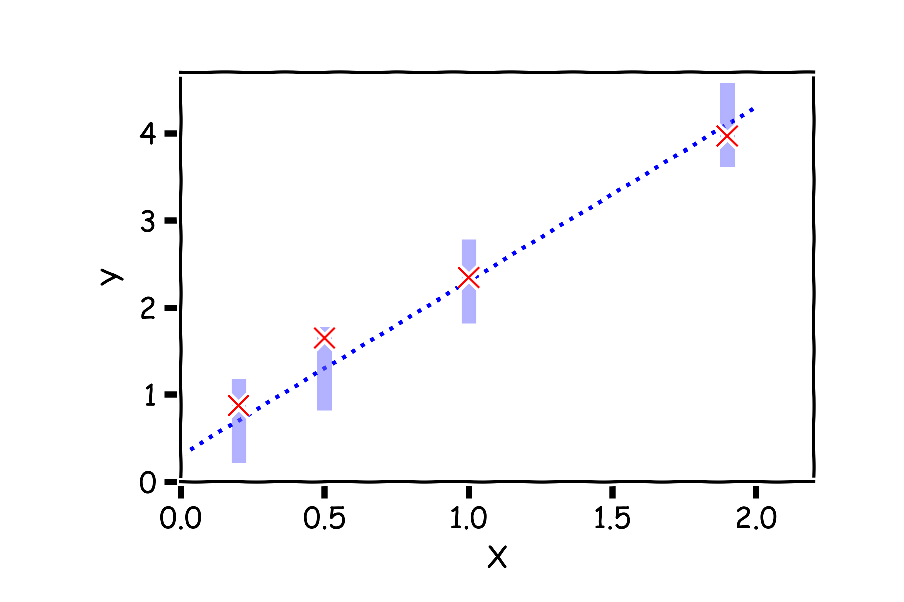
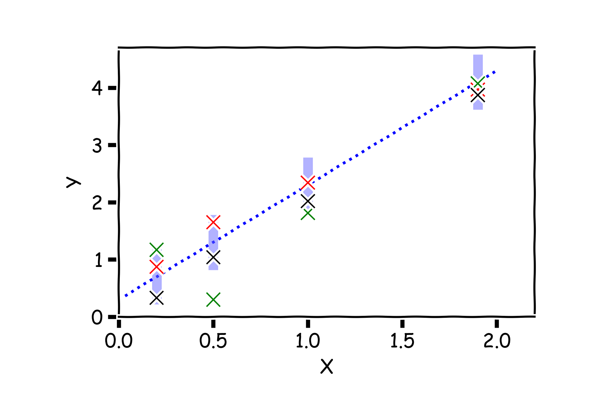

## {background-image="img/w07/slide_002.jpg" background-size="contain" .fallback}
<!-- slide 2 -->

::: notes
Slide text: The Data Science Process: · Ask a Question · Get the Data · Explore the Data · Model the Data · Visualize the Results · Build a model · Fit the model  · Validate the model
:::

## Outline
<!-- slide 3 -->

1. Visualization
1. Ordinary Least Squares (OLS)
    1. Fitting a Model
    1. Estimating Coefficients
    1. Standard Errors
    1. Confidence Interval on Predicted Values
1. Assumptions

# 1. Visualisation
<!-- slide 4 -->

## {background-image="img/w07/fad8c26675.jpg" background-size="contain"}
<!-- slide 5 -->

## {background-image="img/w07/3327278d2f.png" background-size="contain"}
<!-- slide 6 -->

## Nighttime Lights and Literacy
<!-- slide 7 -->

{.r-stretch fig-align="center"}

## Nighttime Lights and GDP Per Capita
<!-- slide 8 -->

{.r-stretch fig-align="center"}

## {background-image="img/w07/b90654c9a0c3dbf.jpg" background-size="contain"}
<!-- slide 9 -->

## Dark STS
<!-- slide 10 -->

::: {.columns}
:::: {.column width="42%"}
- Secondary segmentation model used to count visible ships in the satellite-based STS detections
- ”Dark STS” defined as
    - n visible ships > n AIS pings
- Over 500 identified in 2023 alone:
::::
:::: {.column width="58%"}
{.pic style="max-height:700px"}
::::
:::

## {background-image="img/w07/slide_011.jpg" background-size="contain" .fallback}
<!-- slide 11 -->

::: notes
Slide text: Estimating tonnage from satellite imagery
:::

## {background-image="img/w07/slide_012.jpg" background-size="contain" .fallback}
<!-- slide 12 -->

::: notes
Slide text: Estimating tonnage from satellite imagery · R2: 0.86  · MAE: 7296.60
:::

## Two continuous variables
<!-- slide 13 -->

- In the gender/race pay gap example, we had one categorical variable (gender/race) and one continuous variable (income).
- What if we wanted to measure the relationship between two continuous variables, like income and years of schooling?

# 2. Ordinary Least Squares
<!-- slide 14 -->

## {background-image="img/w07/slide_015.jpg" background-size="contain" .fallback}
<!-- slide 15 -->

::: notes
Slide text: The Regression Equation
:::

## {background-image="img/w07/slide_016.jpg" background-size="contain" .fallback}
<!-- slide 16 -->

::: notes
Slide text: Plotting two continuous variables
:::

## {background-image="img/w07/slide_017.jpg" background-size="contain" .fallback}
<!-- slide 17 -->

::: notes
Slide text: Finding the Line of Best Fit
:::

## {background-image="img/w07/slide_018.jpg" background-size="contain" .fallback}
<!-- slide 18 -->

::: notes
Slide text: Finding the Line of Best Fit
:::

## {background-image="img/w07/slide_019.jpg" background-size="contain" .fallback}
<!-- slide 19 -->

::: notes
Slide text: Finding the Line of Best Fit
:::

## {background-image="img/w07/slide_020.jpg" background-size="contain" .fallback}
<!-- slide 20 -->

::: notes
Slide text: Finding the Line of Best Fit
:::

## {background-image="img/w07/slide_021.jpg" background-size="contain" .fallback}
<!-- slide 21 -->

::: notes
Slide text: Assessing Fit using Residuals
:::

# 2.1 Model Fit
<!-- slide 22 -->

## {background-image="img/w07/slide_023.jpg" background-size="contain" .fallback}
<!-- slide 23 -->

::: notes
Slide text: The Residual Sum of Squares (RSS) · RSS measures the extent of variability of observed data not predicted by the regression model
:::

## {background-image="img/w07/slide_024.jpg" background-size="contain" .fallback}
<!-- slide 24 -->

::: notes
Slide text: The Total Sum of Squares (TSS) · TSS measures the extent of variability of observed data
:::

## {background-image="img/w07/slide_025.jpg" background-size="contain" .fallback}
<!-- slide 25 -->

# 1.3 Regression Coefficients
<!-- slide 26 -->

## {background-image="img/w07/slide_027.jpg" background-size="contain" .fallback}
<!-- slide 27 -->

::: notes
Slide text: Estimate of the regression coefficients
:::

## {background-image="img/w07/slide_028.jpg" background-size="contain" .fallback}
<!-- slide 28 -->

::: notes
Axes labels! (DLS)

Slide text: Interpretation of Predictors
:::

## {background-image="img/w07/slide_029.jpg" background-size="contain" .fallback}
<!-- slide 29 -->

## {background-image="img/w07/slide_030.jpg" background-size="contain" .fallback}
<!-- slide 30 -->

::: notes
Axes labels! (DLS)

Slide text: Interpretation of Predictors
:::

## {background-image="img/w07/slide_031.jpg" background-size="contain" .fallback}
<!-- slide 31 -->

## {background-image="img/w07/slide_032.jpg" background-size="contain" .fallback}
<!-- slide 32 -->

::: notes
Slide text: Making Predictions
:::

## {background-image="img/w07/slide_033.jpg" background-size="contain" .fallback}
<!-- slide 33 -->

## {background-image="img/w07/slide_034.jpg" background-size="contain" .fallback}
<!-- slide 34 -->

::: notes
Slide text: Making Predictions
:::

## {.notitle}
<!-- slide 35 -->

{.r-stretch fig-align="center"}

# 2.4 Standard Errors
<!-- slide 36 -->

## {background-image="img/w07/slide_037.jpg" background-size="contain" .fallback}
<!-- slide 37 -->

::: notes
Axes labels! (DLS)

Slide text: Confidence intervals for the coefficients
:::

## {background-image="img/w07/slide_038.jpg" background-size="contain" .fallback}
<!-- slide 38 -->

::: notes
Slide text: Confidence intervals for the coefficients
:::

## {background-image="img/w07/slide_039.jpg" background-size="contain" .fallback}
<!-- slide 39 -->

::: notes
Slide text: Confidence intervals for the coefficients · Start with a model
:::

## {background-image="img/w07/slide_040.jpg" background-size="contain" .fallback}
<!-- slide 40 -->

::: notes
Slide text: Confidence intervals for the coefficients
:::

## Confidence intervals for the coefficients
<!-- slide 41 -->

::: {.columns}
:::: {.column width="27%"}
But due to error, every time we measure the response *Y* for a fixed value of X we will obtain a different observation.
::::
:::: {.column width="73%"}
{.pic style="max-height:700px"}
::::
:::

## Confidence intervals for the coefficients
<!-- slide 42 -->

::: {.columns}
:::: {.column width="30%"}
One set of observations, “one realization” we obtain one set of *Y*s (red crosses).
::::
:::: {.column width="70%"}
{.pic style="max-height:700px"}
::::
:::

## Confidence intervals for the coefficients
<!-- slide 43 -->

::: {.columns}
:::: {.column width="28%"}
Another set of observations, “another realization” we obtain another set of *Y*s (green crosses).
::::
:::: {.column width="72%"}
{.pic style="max-height:700px"}
::::
:::

## Confidence intervals for the coefficients
<!-- slide 44 -->

::: {.columns}
:::: {.column width="29%"}
Another set of observations, “another realization” we obtain another set of *Y*s (black crosses).
::::
:::: {.column width="71%"}
{.pic style="max-height:700px"}
::::
:::

## {background-image="img/w07/slide_045.jpg" background-size="contain" .fallback}
<!-- slide 45 -->

::: notes
Slide text: Confidence intervals for the coefficients
:::

## {background-image="img/w07/slide_046.jpg" background-size="contain" .fallback}
<!-- slide 46 -->

::: notes
Slide text: Confidence intervals for the coefficients
:::

## {background-image="img/w07/slide_047.jpg" background-size="contain" .fallback}
<!-- slide 47 -->

::: notes
Slide text: Confidence intervals for the coefficients
:::

## {background-image="img/w07/slide_048.jpg" background-size="contain" .fallback}
<!-- slide 48 -->

::: notes
Gabriel García Márquez, whose novel One Hundred Years of Solitude … magic realism.

Slide text: Confidence intervals for the coefficients
:::

## {background-image="img/w07/slide_049.jpg" background-size="contain" .fallback}
<!-- slide 49 -->

::: notes
Slide text: Bootstrapping for Estimating Sampling Error
:::

## {background-image="img/w07/slide_050.jpg" background-size="contain" .fallback}
<!-- slide 50 -->

::: notes
Slide text: Bootstrapping With Replacement · Imagine a bowl full of marbles. · Sampling the marbles one-by-one, taking single marble out of the bowl, signing down it's color in your notebook and then returning it back to the bowl.  · So when sampling with replacement the same marble can be sampled multiple times.
:::

## {background-image="img/w07/slide_051.jpg" background-size="contain" .fallback}
<!-- slide 51 -->

::: notes
Slide text: Confidence intervals for the coefficients · Let’s start by taking one bootstrapped sample of our data and fitting a model
:::

## {background-image="img/w07/slide_052.jpg" background-size="contain" .fallback}
<!-- slide 52 -->

::: notes
Slide text: Confidence intervals for the coefficients · Now let’s take another sample
:::

## {background-image="img/w07/slide_053.jpg" background-size="contain" .fallback}
<!-- slide 53 -->

::: notes
Slide text: Confidence intervals for the coefficients · And another
:::

## {background-image="img/w07/slide_054.jpg" background-size="contain" .fallback}
<!-- slide 54 -->

::: notes
Slide text: Confidence intervals for the coefficients · And another
:::

## {background-image="img/w07/slide_055.jpg" background-size="contain" .fallback}
<!-- slide 55 -->

::: notes
Slide text: Confidence intervals for the coefficients · Repeat this 100 times
:::

## {background-image="img/w07/slide_056.jpg" background-size="contain" .fallback}
<!-- slide 56 -->

::: notes
Slide text: Confidence intervals for the coefficients · 2
:::

## {background-image="img/w07/slide_057.jpg" background-size="contain" .fallback}
<!-- slide 57 -->

::: notes
Slide text: Confidence intervals for the coefficients · 68% · 95%
:::

## {background-image="img/w07/slide_058.jpg" background-size="contain" .fallback}
<!-- slide 58 -->

::: notes
Slide text: Importance of predictors
:::

## {background-image="img/w07/slide_059.jpg" background-size="contain" .fallback}
<!-- slide 59 -->

::: notes
Slide text: Coefficient Plot
:::

## {.notitle}
<!-- slide 60 -->

{.r-stretch fig-align="center"}

# 3. Assumptions
<!-- slide 61 -->

## Linear Regression Assumptions
<!-- slide 62 -->

1. Normality
1. Homoscedasticity
1. Independence

## 1. Normality
<!-- slide 63 -->

::: {.columns}
:::: {.column width="39%"}
- The residuals from the regression should be normally distributed
- If they are not, our model does not perform consistently across the full range of our data
- The relationship between the variables may not be linear
::::
:::: {.column width="61%"}
{.pic style="max-height:700px"}
::::
:::

## {background-image="img/w07/slide_064.jpg" background-size="contain" .fallback}
<!-- slide 64 -->

::: notes
Slide text: y = 3.00 + 0.500x · Anscombe’s Quartet
:::

## {background-image="img/w07/slide_065.jpg" background-size="contain" .fallback}
<!-- slide 65 -->

::: notes
Slide text: Non-Linear relationships
:::

## Non-Linear relationships
<!-- slide 66 -->

::: {.columns}
:::: {.column width="51%"}
Linear-Linear

{.pic style="max-height:647px"}
::::
:::: {.column width="49%"}
Log-Linear

{.pic style="max-height:646px"}
::::
:::

## {background-image="img/w07/slide_067.jpg" background-size="contain" .fallback}
<!-- slide 67 -->

::: notes
Slide text: 1. Homoscedasticity · The variance of residuals is the same for any value of X
:::

## {background-image="img/w07/b203b499b7c1708.png" background-size="contain"}
<!-- slide 68 -->

## {background-image="img/w07/slide_069.jpg" background-size="contain" .fallback}
<!-- slide 69 -->

## {background-image="img/w07/925717c6e2.jpg" background-size="contain"}
<!-- slide 70 -->

## {background-image="img/w07/slide_071.jpg" background-size="contain" .fallback}
<!-- slide 71 -->

::: notes
Slide text: Heteroscedasticity
:::

## 3. Independence
<!-- slide 72 -->

- Observations in your sample must be independent from each other
    - i.e., The measurements for each sample subject are *in no way influenced by or related to the measurements of other subjects*.
- If we have repeat observations of the same individual, we have *two* kinds of variation:
    - **Within group**
    - **Across group**
- We need to conduct a **Panel Regression**

## {background-image="img/w07/f9cbbac8a9.jpg" background-size="contain"}
<!-- slide 73 -->

## {background-image="img/w07/105d1c8e89.jpg" background-size="contain"}
<!-- slide 74 -->

## Any Questions?
<!-- slide 75 -->

[[o.ballinger@ucl.ac.uk](mailto:o.ballinger@ucl.ac.uk)]{style="display:block;text-align:center"}
