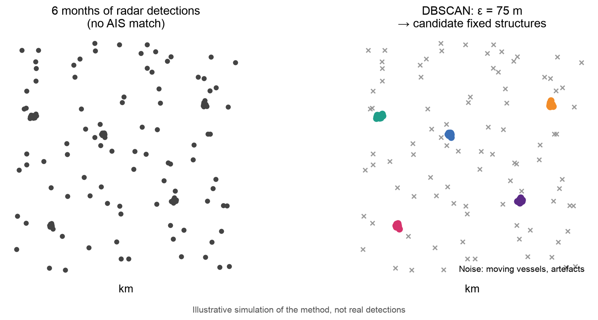
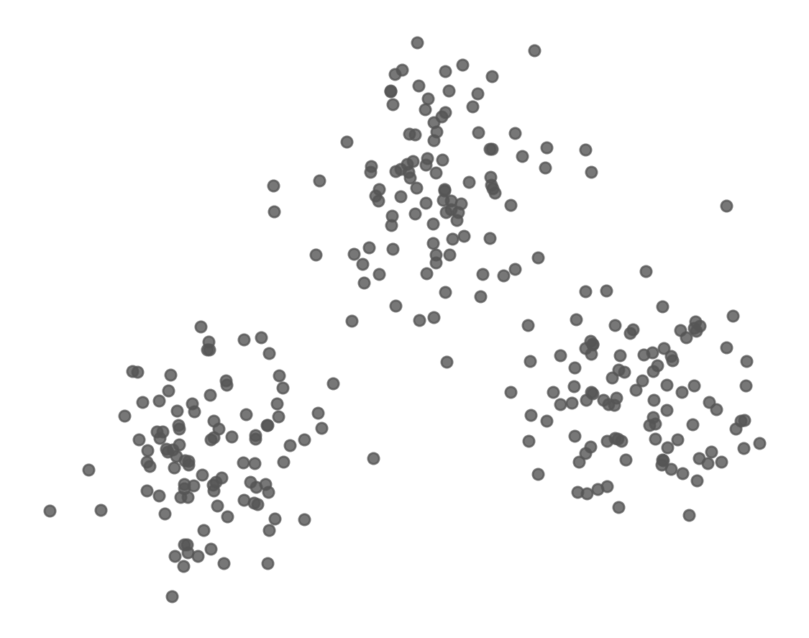
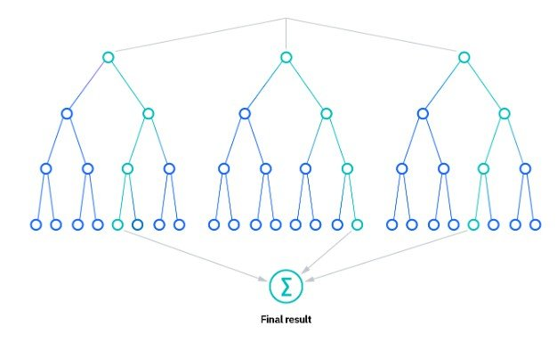
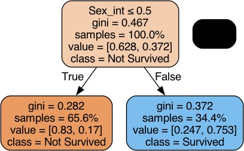
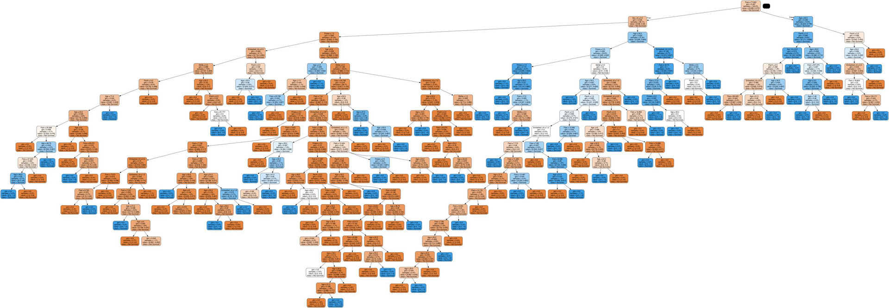
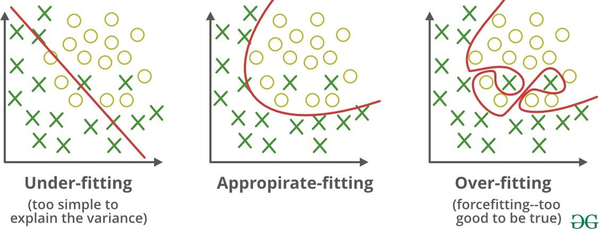
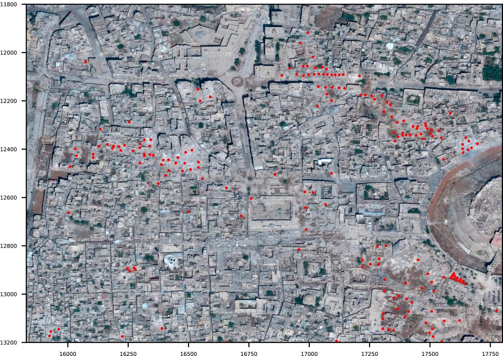
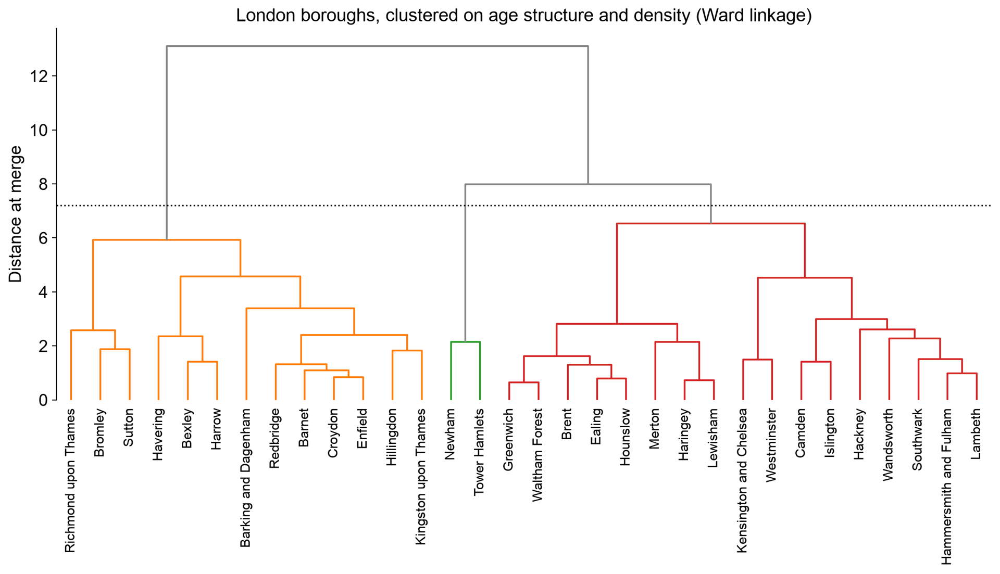

## {background-image="img/w10/slide_002.jpg" background-size="contain" .fallback}
<!-- slide 2 -->

::: notes
Slide text: The Data Science Process: · Ask a Question · Get the Data · Explore the Data · Model the Data · Visualize the Results · Build a model · Fit the model · Validate the model
:::

## Finding Oil Rigs from Space
<!-- slide 3 -->

- Global Fishing Watch maps offshore oil platforms and wind turbines worldwide, using **radar (Sentinel-1)** and **optical (Sentinel-2)** satellite imagery
- Every image produces thousands of detections of bright objects at sea. Most are **ships**; a few are **fixed structures**
- Ships broadcast their position (AIS), so we can remove most of them. What's left is a noisy mix of structures, unmatched vessels and artefacts
- Key insight: **ships move, platforms don't**. A platform is detected at the same spot again and again
- So: find places where detections **pile up** over time. That's a clustering problem

::: notes
Source: GFW infrastructure-v2 dataset writeup (ce-ai-1: ~/users/ollie/GFW/infrastructure-v2/docs/dataset_writeup.md).
:::

## Detections Pile Up Where Structures Are
<!-- slide 4 -->

::: {.columns}
:::: {.column width="37%"}
- Take 6 months of detections with no AIS match
- A platform shows up as a **tight knot** of detections; moving ships leave scattered points
- **DBSCAN** groups points that have enough neighbours within **75 m**, and labels the rest as noise
- No need to say in advance how many platforms there are
::::
:::: {.column width="63%"}
{.pic style="max-height:700px"}
::::
:::

## {background-image="img/w10/slide_005.jpg" background-size="contain" .fallback}
<!-- slide 5 -->

::: notes
Numbers from dataset_writeup.md coverage comparison (window starting July 2025): 26,241 in both, 875 V1-only, ~20,060 V2-only. Chart: docs/v1_v2_regional.png (V1 oil/wind counts by region and V1-V2 agreement).

Slide text: Infrastructure V2: Results · ~97% · of structures in the previous version recovered · ~20,000 · new structures not in the previous version · 75 m · clustering radius, over sliding 6-month windows
:::

## Outline
<!-- slide 6 -->

1. Supervised vs Unsupervised Learning
1. Supervised Learning: Trees and Forests
1. Accuracy Assessment
1. Overfitting and Testing
1. Case Study: Monitoring War Damage from Space
1. Unsupervised Learning: Clustering
1. Using Machine Learning Responsibly

# 1. Supervised vs Unsupervised Learning
<!-- slide 7 -->

## How Many Groups Do You See?
<!-- slide 8 -->

::: {.columns}
:::: {.column width="62%"}
{.pic style="max-height:700px"}
::::
:::: {.column width="38%"}
- You probably said **three**, instantly.
- Nobody told you what the groups were, or how many to look for.
- Clustering algorithms try to do this automatically, in many more dimensions than you can see.
::::
:::

## {background-image="img/w10/slide_009.jpg" background-size="contain" .fallback}
<!-- slide 9 -->

::: notes
Slide text: Supervised vs. Unsupervised Learning · Supervised · We have labels · Learn to predict a known outcome · e.g. Titanic: did this passenger survive? · Accuracy can be checked against the truth · Unsupervised · No labels · Find structure hidden in the data · e.g. which London neighbourhoods are alike? Which detections belong together? · There is no 'right answer' to check against · The oil-rig map uses both: cluster detections into structures, then classify each one as oil, wind or noise
:::

## What is a “Model”?
<!-- slide 10 -->

- A model defines the relationship between **features** and **label**. 	For example, a spam detection model might associate certain 	features strongly with "spam". Let's highlight two phases of a 	model's life:
    - **Training** means creating or **learning** the model. That is, you show the 	model labeled examples and enable the model to gradually learn the 	relationships between features and label.
    - **Inference** means applying the trained model to unlabeled examples. 	That is, you use the trained model to make useful predictions (y').

## Regression vs. Classification
<!-- slide 11 -->

- A **regression** model predicts continuous values. For example, regression models make predictions that answer questions like the following:
    - What is the value of a house in California?
    - What is the probability that a user will click on this ad?
- A **classification** model predicts discrete values. For example, classification models make predictions that answer questions like the following:
    - Is a given email message spam or not spam?
    - Is this an image of a dog, a cat, or a hamster?

## Machine Learning Workflow
<!-- slide 12 -->

{.r-stretch fig-align="center"}

# 2. Supervised Learning: Trees and Forests
<!-- slide 13 -->

## The Decision Tree
<!-- slide 14 -->

A **decision** **tree** is a non-parametric supervised learning 	algorithm, which is utilized for both classification and regression 	tasks. It has a hierarchical, tree structure, which consists of a 	root node, branches, internal nodes and leaf nodes.

{.r-stretch fig-align="center"}

## The Random Forest Algorithm
<!-- slide 15 -->

The random forest algorithm is made up of a collection of 	decision trees, and each tree in the ensemble is comprised of a 	data sample drawn from a training set with replacement, called 	the bootstrap sample.

{.r-stretch fig-align="center"}

## {.notitle}
<!-- slide 16 -->

{.r-stretch fig-align="center"}

## Predicting Survival on the Titanic
<!-- slide 17 -->

::: {.columns}
:::: {.column width="27%"}
- Survived:
    - 1: survived
    - 0: didn’t survive
- Pclass:
    - 1: First Class
    - 2: Second Class
    - 3: Third Class
- Embarked:
    - C: Cherbourg
    - Q: Queenstown
    - S: Southampton
::::
:::: {.column width="73%"}
{.pic style="max-height:700px"}
::::
:::

## Descriptive Statistics
<!-- slide 18 -->

{.r-stretch fig-align="center"}

## A random forest with one feature
<!-- slide 19 -->

::: {.columns}
:::: {.column width="22%"}
- Sex_int
    - 0 for male
    - 1 for female
::::
:::: {.column width="78%"}
{.pic style="max-height:700px"}
::::
:::

## Age, Sex, Class
<!-- slide 20 -->

{.r-stretch fig-align="center"}

# 3. Accuracy Assessment
<!-- slide 21 -->

## Accuracy: The boy who cried wolf
<!-- slide 22 -->

- **An** **Aesop's** **Fable:** **The** **Boy** **Who** **Cried** **Wolf** **(****compressed****)**
- A shepherd boy gets bored tending the town's flock. To have 	some fun, he cries out, "Wolf!" even though no wolf is in sight. 	The villagers run to protect the flock, but then get really mad 	when they realize the boy was playing a joke on them.
- [Iterate previous paragraph *N* times.]
- One night, the shepherd boy sees a real wolf approaching the flock and calls out, "Wolf!" The villagers refuse to be fooled again and stay in their houses. The hungry wolf turns the flock into lamb chops. The town goes hungry. Panic ensues.

## Accuracy: The boy who cried wolf
<!-- slide 23 -->

- Let's make the following definitions:
    - "Wolf" is a **positive** **class**.
    - "No wolf" is a **negative** **class**.
- A **true** **positive** is an outcome where the
- model *correctly* predicts the *positive* class. Similarly, a **true** **negative** is an outcome where the model *correctly* predicts the *negative* class.
- A **false** **positive** is an outcome where the
- model *incorrectly* predicts the *positive* class. And a **false** **negative** is an outcome where the model *incorrectly* predicts the *negative* class.

## {background-image="img/w10/slide_024.jpg" background-size="contain" .fallback}
<!-- slide 24 -->

::: notes
Slide text: Accuracy: The boy who cried wolf · PREDICTED · OBSERVED · WOLF · WOLF · NO WOLF · NO WOLF
:::

## {background-image="img/w10/slide_025.jpg" background-size="contain" .fallback}
<!-- slide 25 -->

::: notes
Slide text: Accuracy · Accuracy is one metric for evaluating classification models. Informally, accuracy is the fraction of predictions our model got right. Formally, accuracy has the following definition: · TP = True Positives · TN = True Negatives · FP = False Positives · FN = False Negatives.
:::

## Accuracy: Tumor example
<!-- slide 26 -->

{.r-stretch fig-align="center"}

## {background-image="img/w10/slide_027.jpg" background-size="contain" .fallback}
<!-- slide 27 -->

::: notes
Slide text: Accuracy: Tumor example · PREDICTED · OBSERVED · CANCER · CANCER · NO CANCER · NO CANCER · Let's try calculating accuracy for the following model that classified 100 	tumors as malignant (the positive class) or benign (the negative class):
:::

## How accurate is accuracy?
<!-- slide 28 -->

- Accuracy comes out to 91% (91 correct predictions out of 100 	total examples). That means our tumor classifier is doing a 	great job of identifying malignancies, right?
- let's do a closer analysis of positives and negatives
    - Of the 100 tumor examples
        - 91 are benign (90 TNs and 1 FP)
        - 9 are malignant (1 TP and 8 FNs).
- Of the 91 benign tumors, the model correctly identifies 90 as 	benign. That's good. However, of the 9 malignant tumors, the 	model only correctly identifies 1 as malignant—a terrible 	outcome, as **8** **out** **of** **9** **malignancies** **go** **undiagnosed!**

## How accurate is accuracy?
<!-- slide 29 -->

- While 91% accuracy may seem good at first glance, **another** 	**tumor-classifier** **model** **that** **always** **predicts** **benign** **would** 	**achieve** **the** **exact** **same** **accuracy** (91/100 correct predictions) 	on our examples.
    - In other words, **our** **model** **is** **no** **better** **than** **one** **that** **has** **zero**
- **predictive** **ability** to distinguish malignant tumors from benign tumors.
- Accuracy alone doesn't tell the full story when you're working 	with a **class-imbalanced** **data** **set**, like this one, where there is 	a significant disparity between the number of positive and 	negative labels.
- Let’s look at two better metrics for evaluating class-imbalanced problems: precision and recall.

## {background-image="img/w10/slide_030.jpg" background-size="contain" .fallback}
<!-- slide 30 -->

::: notes
Slide text: Precision · What proportion of positive identifications was actually correct? · Our model has a precision of 0.5—in other words, when it predicts a tumor is malignant, it is correct 50% of the time.
:::

## {background-image="img/w10/slide_031.jpg" background-size="contain" .fallback}
<!-- slide 31 -->

::: notes
Slide text: Recall · What proportion of actual positives was identified correctly? · Our model has a recall of 0.11—in other words, it correctly identifies 11% of the malignant tumors. (in other other words, it misses 89% of malignant tumors).
:::

## {background-image="img/w10/slide_032.jpg" background-size="contain" .fallback}
<!-- slide 32 -->

::: notes
Slide text: F1 Score · The F1 score is a measure of accuracy that is the harmonic 	mean of precision and recall, particularly useful in class-	imbalanced contexts (like the tumor example). · The F1 score of our tumor detection model is 0.18, which is 	very low– this is because it’s not taking true negatives into 	account
:::

## Back to Titanic
<!-- slide 33 -->

Lets evaluate the Random Forest Models we trained earlier 	using these metrics

{.r-stretch fig-align="center"}

## All variables
<!-- slide 34 -->

::: {.columns}
:::: {.column width="23%"}
- Accuracy: 82
- Precision: 80
- Recall: 77
- F1 Score: 78
::::
:::: {.column width="77%"}
{.pic style="max-height:700px"}
::::
:::

# 4. Overfitting and Testing
<!-- slide 35 -->

## The full model
<!-- slide 36 -->

Even with a relatively small dataset and a handful of variables, 	we’ve ended up with quite a complex model

{.r-stretch fig-align="center"}

## Overfitting
<!-- slide 37 -->

{.r-stretch fig-align="center"}

## Testing on Data the Model Hasn't Seen
<!-- slide 38 -->

- A model scored on its **own training data** will look better than it is: it can memorise
- **Train/test split**: fit on one part (say 80%), score on the held-out 20%
- **Cross-validation**: split into k folds, hold each out in turn, average the k scores
    - Uses all the data for testing, and shows how much the score varies
- Choosing settings (tree depth, number of features) by test score leaks the test set into training: keep a **final** test set you look at once

## Leakage: When the Answer Sneaks In
<!-- slide 39 -->

- **Leakage**: the model has access to information it wouldn't have when making a real prediction
- Examples:
    - A feature recorded **after** the outcome (e.g. "treatment given" when predicting diagnosis)
    - **Duplicates** or near-duplicates in both training and test sets
    - Spatial or temporal neighbours split across train and test: nearby cells and consecutive days look alike
- Kapoor & Narayanan (2023, *Patterns*) found leakage in **294 papers** across 17 fields using machine learning
- Ask of any impressive accuracy: *could the model have seen the answer?*

# 5. Case Study: Monitoring War Damage from Space
<!-- slide 40 -->

## {.notitle}
<!-- slide 41 -->

{.r-stretch fig-align="center"}

## Damage Labels
<!-- slide 42 -->

{.r-stretch fig-align="center"}

## {background-image="img/w10/slide_043.jpg" background-size="contain" .fallback}
<!-- slide 43 -->

::: notes
Slide text: Model Performance
:::

## {background-image="img/w10/slide_044.jpg" background-size="contain" .fallback}
<!-- slide 44 -->

::: notes
Slide text: Model Performance · When a model is trained 	only on imagery of Aleppo, it 	performs significantly worse 	in other cities in Syria · The model is learning what 	damage in Aleppo looks like, 	but damage may look 	different in different cities. · Imagine what would happen if we tried to use this model in Gaza, or Ukraine!
:::

# 6. Unsupervised Learning: Clustering
<!-- slide 45 -->

## {background-image="img/w10/slide_046.jpg" background-size="contain" .fallback}
<!-- slide 46 -->

::: notes
Slide text: Three Ingredients · Features · What describes each observation? e.g. a ward's age profile and population density · Distance · How far apart are two observations? Usually straight-line (Euclidean) distance in feature space · Scale · Standardise first! Otherwise density (0–300 people/ha) swamps age shares (0–0.3) · d(a, b) = √[ (a₁ − b₁)² + (a₂ − b₂)² + … ]
:::

## The K-Means Algorithm
<!-- slide 47 -->

{.r-stretch fig-align="center"}

Goal: make each cluster as **tight** as possible (minimise the total squared distance from each point to its centroid)

## K-Means: The Fine Print
<!-- slide 48 -->

- **You must choose k** before you start
- **Random starts** can land in a bad solution. Run it many times and keep the best (n_init in scikit-learn)
- Assumes clusters are **round and similar in size**
- **Every point** gets assigned to a cluster, even outliers
- Fast and simple: scales to millions of points

## Case Study: Geodemographics
<!-- slide 49 -->

- **Geodemographics** classifies neighbourhoods by who lives there. It's used in retail, public health and policy
- The UK's **Output Area Classification**, developed at UCL with the ONS, groups every small area in the country using k-means on census variables
- Let's build a mini version for London:
    - **624 wards**, each described by 7 features
    - Share of residents in 6 age bands, plus log population density
    - Standardised, then k-means

## Choosing k
<!-- slide 50 -->

::: {.columns}
:::: {.column width="37%"}
- **Elbow:** look for where adding clusters stops helping much. Here there's no sharp elbow
- **Silhouette:** how much closer each point is to its own cluster than to the next one (−1 to 1)
- Silhouette is highest at k = 2, but k = 5 (0.265) is barely worse and far more **useful**
- Choosing k is a **judgement call**, not a calculation
::::
:::: {.column width="63%"}
{.pic style="max-height:700px"}
::::
:::

## {background-image="img/w10/slide_051.jpg" background-size="contain" .fallback}
<!-- slide 51 -->

::: notes
Slide text: London's Neighbourhood Types · Young families · 164 wards · e.g. Barking and Dagenham, Brent · Inner-city professionals · 131 wards · e.g. Wandsworth, Lambeth · Established middle-aged · 111 wards · e.g. Richmond upon Thames, Kensington and Chelsea · Students & young renters · 60 wards · e.g. Tower Hamlets, Newham · Older outer suburbs · 158 wards · e.g. Havering, Bromley
:::

## What Makes Each Cluster Different?
<!-- slide 52 -->

{.r-stretch fig-align="center"}

The algorithm outputs numbers 0–4. **The names are ours**: an interpretation of these profiles, not a fact about the data

## Hierarchical Clustering: A Family Tree
<!-- slide 53 -->

- **Agglomerative** clustering builds clusters from the bottom up:
    - Start with every observation as its own cluster
    - Merge the two closest clusters
    - Repeat until everything is one cluster
- **Linkage** decides what 'closest' means for groups: nearest members (single), furthest members (complete), average, or **Ward** (smallest increase in spread)
- No need to choose k up front. Cut the tree wherever you like
- Slow for big data: best for tens to thousands of observations

## London's Boroughs as a Family Tree {.smaller}
<!-- slide 54 -->

{.r-stretch fig-align="center"}

32 boroughs, same 7 features. The height of each join shows how different the merged groups are. The dotted line cuts the tree into 3 clusters

## DBSCAN: Density-Based Clustering
<!-- slide 55 -->

::: {.columns}
:::: {.column width="43%"}
- **DBSCAN**: Density-Based Spatial Clustering of Applications with Noise (1996)
- Two settings: a radius **ε** and a minimum number of points
- **Core** points have enough neighbours within ε; clusters grow outwards from them
- Points that aren't near any core point are **noise**
- The number of clusters is **discovered**, not chosen
::::
:::: {.column width="57%"}
{.pic style="max-height:700px"}
::::
:::

## When K-Means Fails
<!-- slide 56 -->

::: {.columns}
:::: {.column width="33%"}
- k-means draws **straight boundaries** between centroids, so it can't follow curved shapes
- DBSCAN follows the **density** of points, whatever the shape
- …and it flags stray points as noise rather than forcing them into a cluster
::::
:::: {.column width="67%"}
{.pic style="max-height:700px"}
::::
:::

## Air-Quality Sensors in California
<!-- slide 57 -->

::: {.columns}
:::: {.column width="56%"}
- Week 3's air-quality data: **166 sensor sites**
- DBSCAN with a real-world radius: **30 km**, using haversine (great-circle) distance on lat/lon
- **9 clusters** emerge: the Bay Area, Los Angeles, San Diego, the Central Valley…
- **87 sites** are noise: isolated rural sensors
- Nobody told it where the cities are
::::
:::: {.column width="44%"}
{.pic style="max-height:700px"}
::::
:::

## Back to the Oil Rigs
<!-- slide 58 -->

- Infrastructure V2 runs DBSCAN **twice**:
    - **Pass 1:** detections within each 6-month window, 75 m radius → one cluster per structure per window
    - **Pass 2:** the centres of those clusters across all windows, 150 m radius → one persistent structure
- Why DBSCAN?
    - Nobody knows how many structures there are, and new ones appear every month
    - Most detections are **noise**, and DBSCAN is designed to discard it
    - The radius has a **physical meaning** (metres) that we can reason about
- Each structure is then classified as **oil**, **wind** or **noise** with a supervised model. Clustering first, then classification

# 7. Using Machine Learning Responsibly
<!-- slide 59 -->

## Clustering Always Finds Clusters
<!-- slide 60 -->

::: {.columns}
:::: {.column width="52%"}
{.pic style="max-height:700px"}
::::
:::: {.column width="48%"}
- 400 points drawn **completely at random**. Ask k-means for 5 clusters and you get 5 clusters.
- Silhouette score: **0.395**, higher than our real London wards (0.265)
- An algorithm will always return groups. Whether they **mean anything** is up to you to show
::::
:::

## Labels Stick to People
<!-- slide 61 -->

- Geodemographic labels ('struggling estates', 'affluent achievers') are used to set **insurance premiums**, target **advertising**, allocate **policing** and **public services**
- A cluster describes an **area average**, not the people in it. Assuming every resident fits the label is the **ecological fallacy**
- Names carry judgement. 'Young families' sounds neutral; 'deprived' or 'hard-pressed' shape how a place is treated
- Historical parallel: **redlining** in 1930s US cities graded neighbourhoods by 'risk', largely by race, and shaped lending for decades
- Ask: who chose the features, who named the clusters, and who is affected by the result?

## Which Method?
<!-- slide 62 -->

|  | **K-means** | **Hierarchical** | **DBSCAN** |
|---|---|---|---|
| **Choose k in advance?** | Yes | No (cut the tree) | No (choose ε and min points) |
| **Cluster shapes** | Round, similar size | Depends on linkage | Any shape |
| **Handles noise?** | No: every point assigned | No | Yes: labels outliers |
| **Speed on big data** | Fast | Slow | Fast with spatial indexing |
| **Good for** | Segmenting areas or customers | Small data; seeing structure | Spatial points; finding hotspots |

## Recap
<!-- slide 63 -->

1. **Supervised** learning predicts a known label; **unsupervised** learning finds structure without one
1. **Decision trees** split the data on features; **random forests** average many trees
1. Accuracy misleads on imbalanced data: check **precision**, **recall** and **F1**
1. Score models on data they **haven't seen**, and watch for **leakage**; a model trained on one city may fail in the next
1. **K-means**: fast, needs k, assumes round clusters. **Hierarchical**: a tree you cut. **DBSCAN**: dense regions of any shape, flags noise
1. **Standardise** features first. Algorithms **always** find clusters: validate them, and be careful how you name them

## Any Questions?
<!-- slide 64 -->

o.ballinger@ucl.ac.uk
