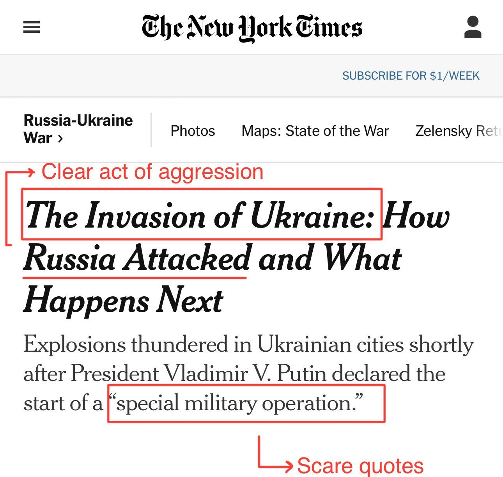
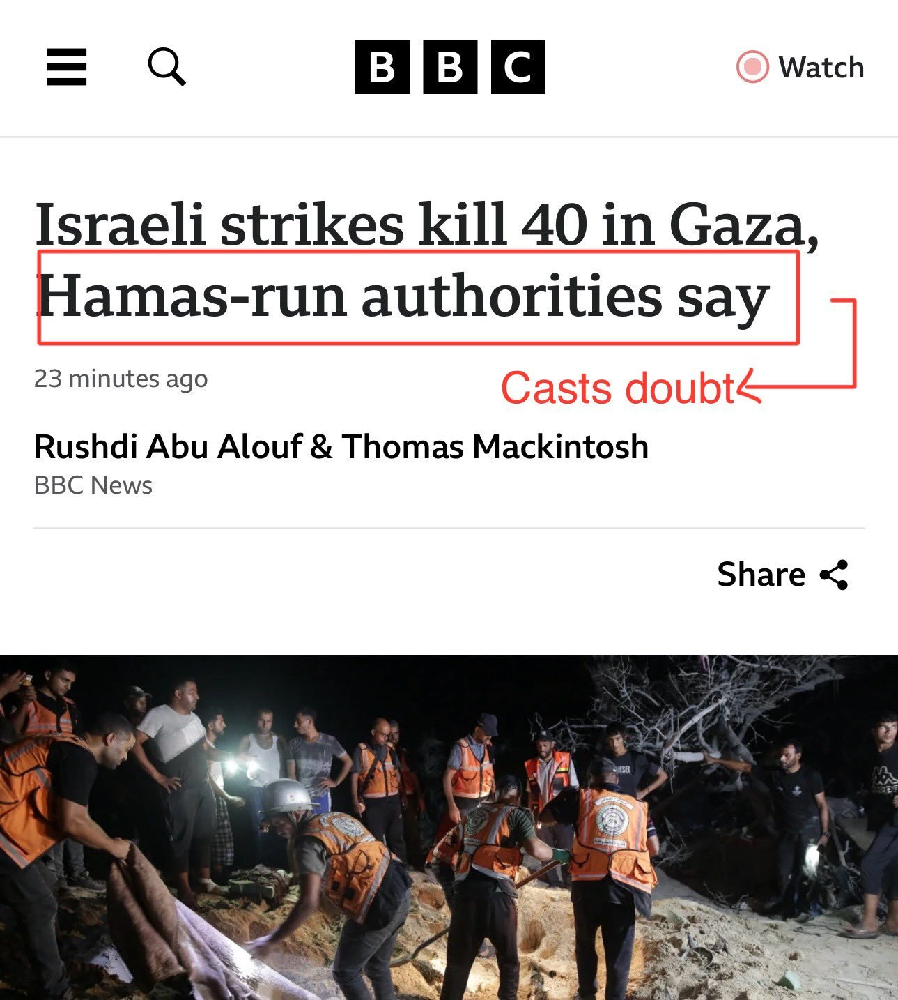
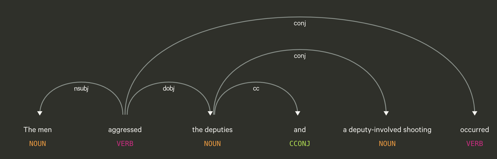
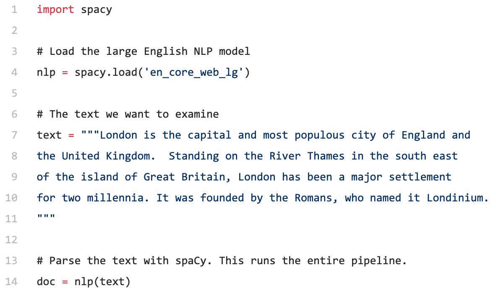
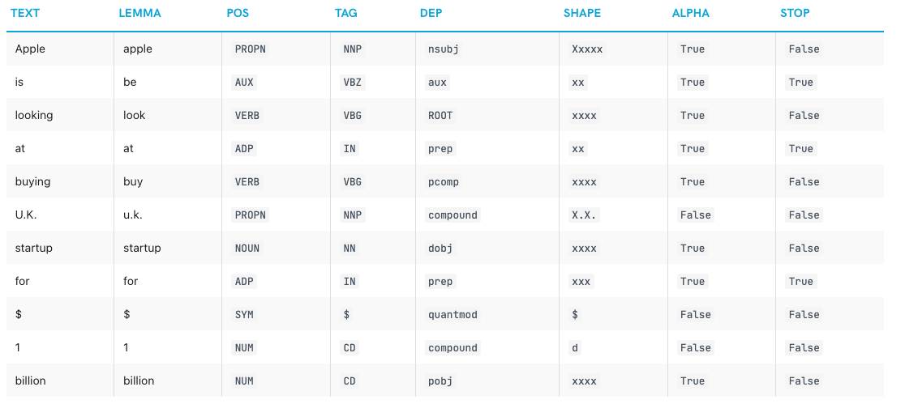
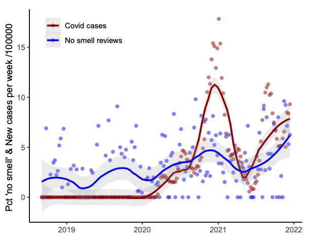
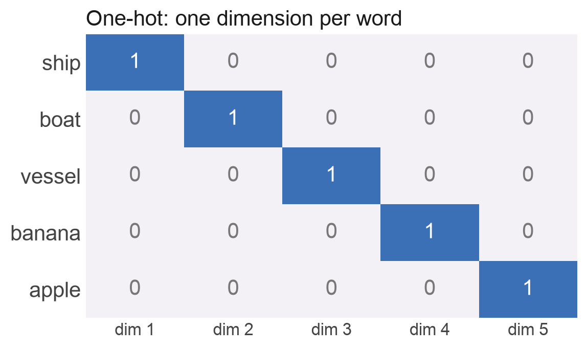

## {background-image="img/w04/w04_slide_002.jpg" background-size="contain" .fallback}
<!-- src: Week 4 - Text Data.pptx slide 2 -->

::: notes
Slide text: The Data Science Process: · Ask a Question · Get the Data · Explore the Data · Model the Data · Visualize the Results · What is the population of interest? · How were the data sampled? · Which data are relevant? · What are the ethical implications of using this data?
:::

## Outline

1. Case Study: The Grammar of Police Shootings
1. Natural Language Processing
1. Analysing Text
1. Embeddings: Text as Numbers

## {.notitle}
<!-- src: Week 4 - Text Data.pptx slide 4 -->

::: {.columns}
:::: {.column width="50%"}

::::
:::: {.column width="50%"}

::::
:::

## {.notitle}
<!-- src: Week 4 - Text Data.pptx slide 5 -->

::: {.columns}
:::: {.column width="50%"}

::::
:::: {.column width="50%"}

::::
:::

# The Curious Grammar of Police Shootings
<!-- src: Week 4 - Text Data.pptx slide 6 -->

## Civilian shoots Civilian
<!-- src: Week 4 - Text Data.pptx slide 7 -->

On February 10, 2014, around 6:10 p.m., the victim was in the parking lot in the 13640 block of Burbank Boulevard, to the rear, when he was confronted by the suspect. **The suspect produced a semi-automatic handgun and fired numerous times striking the victim in the torso.**
Source: [Washington Post](https://www.washingtonpost.com/news/the-watch/wp/2014/07/14/the-curious-grammar-of-police-shootings/)

## Officer Shoots Civilian
<!-- src: Week 4 - Text Data.pptx slide 8 -->

When the officers arrived they were confronted by a Hispanic male armed with a sword. The officers attempted to take the suspect into custody by using a taser but it was ineffective. **The suspect then ran towards the officers still armed with the sword and an officer-involved-shooting occurred.**

## {background-image="img/w04/w04_slide_009.jpg" background-size="contain" .fallback}
<!-- src: Week 4 - Text Data.pptx slide 9 -->

::: notes
Slide text: Grammar Matters · nsubj · The nominal subject is the more agentive, the do-er, or the proto-agent of the clause.  · dobj · The direct object is the noun phrase which is the (accusative) object of the verb.
:::

## The Grammar of a Police Shooting
<!-- src: Week 4 - Text Data.pptx slide 11 -->

{.r-stretch fig-align="center"}

## Text is data, bias can be measured
<!-- src: Week 4 - Text Data.pptx slide 12 -->

- Moreno-Medina, Jonathan, et al. [*Officer-Involved: The Media Language of Police Killings*](https://www.nber.org/system/files/working_papers/w30209/w30209.pdf). No. w30209. National Bureau of Economic Research, 2022.
- This paper studies the language used in television news broadcasts to describe police killings in the United States from 2013-19
- Data on: 6,000 police killings, 8,000 non-police homicides, 200,000 stories, and 470,000 sentences that describe the killings.
- **Four dimensions** of potential obfuscation relative to an active sentence in which a police officer is the subject
    - (‘**police officer killed man**’)

## {background-image="img/w04/w04_slide_013.jpg" background-size="contain" .fallback}
<!-- src: Week 4 - Text Data.pptx slide 13 -->

::: notes
Slide text: 1. Passive Voice · “man was killed by police officer” · pushes the role of the police officer to the background of the sentence, potentially decreasing its salience to the reader. · Active Voice · Passive Voice
:::

## {background-image="img/w04/w04_slide_014.jpg" background-size="contain" .fallback}
<!-- src: Week 4 - Text Data.pptx slide 14 -->

::: notes
Slide text: 2. No Agent · “man was killed” · A further transformation of the sentence to remove any reference to the police as the cause of the killing · Active Voice · No Agent
:::

## {background-image="img/w04/w04_slide_015.jpg" background-size="contain" .fallback}
<!-- src: Week 4 - Text Data.pptx slide 15 -->

::: notes
Slide text: 3. Nominalization · “deadly officer-involved shooting” · transforming the action of the police killing into a noun · Active Voice · Nominalization
:::

## {background-image="img/w04/w04_slide_016.jpg" background-size="contain" .fallback}
<!-- src: Week 4 - Text Data.pptx slide 16 -->

::: notes
Slide text: 4. Intransitive · “man dies [in shooting]” · Transforming the transitive verb ‘kill’, which requires an agent who generates the action, into the intransitive ‘die’, which does not require a cause · Active Voice · Intransitive
:::

## Main Findings
<!-- src: Week 4 - Text Data.pptx slide 17 -->

1. The media is significantly more likely to use several language structures - e.g., passive voice, nominalization, intransitive verbs - that obfuscate responsibility for police killings compared to civilian homicides
    1. There is some obfuscation in **35.6%** of stories about police killings, compared to **28.8%** for civilian homicides
1. News broadcasts are especially likely to use obfuscatory language structures when the decedent was unarmed or when body camera video is available.
1. **Survey participants (n=2,402) are less likely to hold a police officer morally responsible for a killing and to demand penalties after reading a story that uses obfuscatory language.**

# Natural Language Processing
<!-- src: Week 4 - Text Data.pptx slide 18 -->

## Natural Language Processing Pipeline
<!-- src: Week 4 - Text Data.pptx slide 19 -->

1. Sentence Segmentation
1. Tokenization
1. Parts-of-Speech Tagging
1. Lemmatization
1. Stop Words
1. Dependency Parsing
1. Named Entity Recognition
1. Coreference Resolution
Source: [Adam Geitgey](https://medium.com/@ageitgey/natural-language-processing-is-fun-9a0bff37854e)

## 1. Sentence Segmentation
<!-- src: Week 4 - Text Data.pptx slide 22 -->

- Split the text up into sentences
1. “London is the capital and most populous city of England and the United Kingdom.”
1. “Standing on the River Thames in the south east of the island of Great Britain, London has been a major settlement for two millennia.”
1. “It was founded by the Romans, who named it Londinium.”

::: notes
The first step in almost any NLP pipeline is to split our corpus into sentences. This is called Sentence Segmentation
:::

## 2. Word Tokenization
<!-- src: Week 4 - Text Data.pptx slide 23 -->

- Split the sentences up into words
- “London is the capital and most populous city of England and the United Kingdom.”
- [“London”, “is”, “ the”, “capital”, “and”, “most”, “populous”, “city”, “of”, “England”, “and”, “the”, “United”, “Kingdom”, “.”]

## 3. Part-of-Speech tagging
<!-- src: Week 4 - Text Data.pptx slide 24 -->

::: {.columns}
:::: {.column width="50%"}

::::
:::: {.column width="50%"}

::::
:::

::: notes
Next, we’ll look at each token and try to guess its part of speech — whether it is a noun, a verb, an adjective and so on. Knowing the role of each word in the sentence will help us start to figure out what the sentence is talking about. 
The part-of-speech model was originally trained by feeding it millions of English sentences with each word’s part of speech already tagged and having it learn to replicate that behavior. 
Keep in mind that the model is completely based on statistics — it doesn’t actually understand what the words mean in the same way that humans do. It just knows how to guess a part of speech based on similar sentences and words it has seen before.
:::

## {background-image="img/w04/w04_slide_025.jpg" background-size="contain" .fallback}
<!-- src: Week 4 - Text Data.pptx slide 25 -->

::: notes
Slide text: 4. Lemmatization · Words with the same meaning appear in different forms · Lemmatization identifies the  · Root of a noun or  · Unconjugated form of a verb · Lemmatization · I ate a sandwich. · I’m eating two sandwiches. · I [eat] a [sandwich]. · I [be] [eat] two [sandwich].
:::

## {background-image="img/w04/w04_slide_026.jpg" background-size="contain" .fallback}
<!-- src: Week 4 - Text Data.pptx slide 26 -->

::: notes
Slide text: 5. Identifying Stop Words · There are lots of filler words in text · “a”, “the”, ”and”, etc.  · These usually aren’t analytically important. Their frequencies/distribution doesn’t tell us much. · Luckily there aren’t that many of them · We can simply tag them using a known list of stop words · They can then be filtered
:::

## {background-image="img/w04/w04_slide_027.jpg" background-size="contain" .fallback}
<!-- src: Week 4 - Text Data.pptx slide 27 -->

::: notes
This parse tree shows us that the subject of the sentence is the noun “London” and it has a “be” relationship with “capital”. We finally know something useful — London is a capital! And if we followed the complete parse tree for the sentence (beyond what is shown), we would even found out that London is the capital of the United Kingdom.

Slide text: 6. Dependency Parsing · How do the words in this sentence relate to each other? · Build a tree that assigns a single “parent” word toeach word in the sentence ·  · The root of the treeis the man verb in the sentence · List of dependencies
:::

## {background-image="img/w04/w04_slide_028.jpg" background-size="contain" .fallback}
<!-- src: Week 4 - Text Data.pptx slide 28 -->

::: notes
Slide text: 7. Named Entity Recognition · Some nouns are special, and reference real-world concepts: · People’s names · Company names · Geographic locations (Both physical and political)  · Product names · Dates and times · Amounts of money · Names of events
:::

## Python Implementation
<!-- src: Week 4 - Text Data.pptx slide 31 -->

{.r-stretch fig-align="center"}

## From Text to Table
<!-- src: Week 4 - Text Data.pptx slide 34 -->

{.r-stretch fig-align="center"}

# Analytical Approaches
<!-- src: Week 4 - Text Data.pptx slide 35 -->

## Types of Text Analysis
<!-- src: Week 4 - Text Data.pptx slide 36 -->

- The Statistical Features of the Text
    - Word frequency
    - Word proximity
    - Topic modelling
- Language Processing
    - Entity extraction (Named Entity Recognition)
    - Semantic analysis
    - Sentiment analysis

## Word Frequency
<!-- src: Week 4 - Text Data.pptx slide 37 -->

::: {.columns}
:::: {.column width="33%"}

::::
:::: {.column width="33%"}

::::
:::: {.column width="33%"}

::::
:::

## {background-image="img/w04/w04_slide_038.jpg" background-size="contain" .fallback}
<!-- src: Week 4 - Text Data.pptx slide 38 -->

::: notes
Slide text: Topic modelling · Uses statistical analysis to discover words which are more likely to appear together · These collections are called “topics” · Source: Joyce Xu
:::

## Sentiment Analysis
<!-- src: Week 4 - Text Data.pptx slide 39 -->

- Sentiment analysis or opinion mining is the computational study of people's opinions, sentiments, emotions, appraisals, and attitudes towards entities such as products, services, organizations, individuals, issues, events, topics, and their attributes
- Uses ‘weighted’ dictionaries of words to assess how ‘positive’ or ‘negative’ a text might be
- One of the fastest-growing areas of NLP research
- But, beware the black box

## Social Media Data
<!-- src: Week 4 - Text Data.pptx slide 42 -->

- Tumasjan *et. al.*, ‘Predicting Elections with Twitter: What 140 Characters Reveal about Political Sentiment’
- [http://www.aaai.org/ocs/index.php/ICWSM/ICWSM10/paper/viewFile/1441/1852](http://www.aaai.org/ocs/index.php/ICWSM/ICWSM10/paper/viewFile/1441/1852)
- An analysis of over 100,000 Tweets prior to the German Federal Elections, September 2009
- Questions Raised:
    - Does Twitter provide a platform for political deliberation online?
    - Can Twitter serve as a predictor of election results?

## {background-image="img/w04/w04_slide_047.jpg" background-size="contain" .fallback}
<!-- src: Week 4 - Text Data.pptx slide 47 -->

::: notes
Slide text: Devil’s in the details · Jungherr, A., Jürgens, P., & Schoen, H. (2012). Why the pirate party won the german election of 2009 or the trouble with predictions, Social Science Computer Review, 30(2), 229-234.
:::

# What Is an Embedding?
<!-- src: Week X - Embeddings.pptx slide 8 -->

## Computers Need Numbers
<!-- src: Week X - Embeddings.pptx slide 9 -->

- Statistical models take a table of numbers as input
- Some data is **already numeric**: income, age, air quality
- Much of the interesting data **isn't**: words, documents, photos, satellite images, songs, people
- Earlier today we turned text into numbers by **counting words** and using spaCy's sentiment scores
- An **embedding** is a more powerful answer: a learned list of numbers (a **vector**) that captures what something **means**
    - **Similar meaning → nearby vectors**

## Attempt 1: One-Hot Encoding
<!-- src: Week X - Embeddings.pptx slide 10 -->

::: {.columns}
:::: {.column width="43%"}
- Give every word its own column
- A vocabulary of 50,000 words → vectors with **50,000 dimensions**, almost all zeros
- Every word is **equally different** from every other word
    - 'ship' is as far from 'boat' as it is from 'banana'
- This is what dummy variables do in a regression
::::
:::: {.column width="57%"}

::::
:::

## Attempt 2: Dense Vectors
<!-- src: Week X - Embeddings.pptx slide 11 -->

::: {.columns}
:::: {.column width="37%"}
- Give each word a **short list of real numbers**, e.g. 100
- No single number means anything on its own. **Meaning is in the pattern**
- Now similarity is measurable (GloVe):
    - ship · boat: **0.83**
    - banana · apple: **0.51**
    - ship · banana: **0.18**
::::
:::: {.column width="63%"}

::::
:::

::: notes
Values are cosine similarities from the pretrained GloVe model glove-wiki-gigaword-100 (Pennington et al. 2014), computed in src/figs.py. We define cosine similarity properly in Section 2.
:::

## Where Do the Numbers Come From?
<!-- src: Week X - Embeddings.pptx slide 12 -->

- **'You shall know a word by the company it keeps'** (J.R. Firth, 1957)
- Words that appear in **similar contexts** tend to have **similar meanings**
    - 'The ___ sailed into port': ship, boat, vessel, ferry…
- **word2vec** (Mikolov et al., Google, 2013) learns vectors by training a small neural network to **predict a word's neighbours** in billions of sentences
- Nobody tells it what words mean. The vectors are a **by-product** of getting good at the prediction task
- GloVe, the model in these slides, does something similar using word co-occurrence counts

## king − man + woman ≈ queen
<!-- src: Week X - Embeddings.pptx slide 13 -->

::: {.columns}
:::: {.column width="43%"}
- Directions in the space can carry meaning
- Take the vector for **king**, subtract **man**, add **woman**
- The nearest word to the result is **queen** (similarity 0.77), then monarch and throne
- Nobody programmed this in. It emerged from reading text
::::
:::: {.column width="57%"}

::::
:::

::: notes
Real GloVe-100 vectors. The two axes are directions computed from the vectors themselves (average female-minus-male offset; average royal-minus-plain offset), not hand-placed points. Honest caveat: the analogy trick is famous but works less reliably than the headline suggests, and the query words themselves are excluded from the answer.
:::

## Embeddings Learn Our Biases Too
<!-- src: Week X - Embeddings.pptx slide 14 -->

- The same arithmetic finds patterns we'd rather it didn't
- Bolukbasi et al. (2016): in word2vec trained on news, **man : computer programmer :: woman : homemaker**
- An embedding is a compressed summary of its **training data**, including its stereotypes
- When embeddings feed into CV screening, search ranking or policing tools, **those biases become decisions**
- Always ask: **what was this trained on, and what did it learn to ignore?**

# Measuring Similarity
<!-- src: Week X - Embeddings.pptx slide 16 -->

## Cosine Similarity

Measure the **angle** between two vectors, ignoring their length:

$$\cos(a, b) = \frac{a \cdot b}{|a|\,|b|}$$

- $a \cdot b$: multiply matching elements and add them up; $|a|$, $|b|$: the length of each vector
- **1** = same direction, **0** = unrelated, **−1** = opposite

{fig-align="center" width="70%"}

::: {.columns}
:::: {.column width="33%"}
[similar: cos ≈ 0.97]{style="display:block;text-align:center"}
::::
:::: {.column width="33%"}
[unrelated: cos = 0]{style="display:block;text-align:center"}
::::
:::: {.column width="33%"}
[opposite: cos ≈ −1]{style="display:block;text-align:center"}
::::
:::

## {background-image="img/w04/embeddings_slide_018.jpg" background-size="contain" .fallback}
<!-- src: Week X - Embeddings.pptx slide 18 -->

::: notes
Slide text: Worked Example · Three made-up 3-dimensional embeddings: · a = [2, 1, 0]        b = [4, 2, 1]        c = [0, 1, 3] · a vs b · a · b = 2×4 + 1×2 + 0×1 = 10 · ‖a‖ = √5 = 2.24,  ‖b‖ = √21 = 4.58 · cos = 10 / (2.24 × 4.58) · 0.98 · a vs c · a · c = 2×0 + 1×1 + 0×3 = 1 · ‖a‖ = 2.24,  ‖c‖ = √10 = 3.16 · cos = 1 / (2.24 × 3.16) · 0.14 · b points almost the same way as a (it's roughly 2 × a), so it's the nearer neighbour even though it's longer
:::

## Nearest-Neighbour Search
<!-- src: Week X - Embeddings.pptx slide 19 -->

- To identify a query, compare its vector with **every stored vector** and return the top k
    - This is k-nearest neighbours (kNN), which we'll meet again for prediction in Week 9, used for **retrieval** instead of prediction
- If most of the neighbours are the same labelled item, that's probably who it is
- The same pattern powers:
    - Reverse image search, 'more like this' on Spotify and Netflix
    - **Retrieval-augmented generation (RAG)**: chatbots that look up relevant documents before answering

## Any Questions?
<!-- src: Week 4 - Text Data.pptx slide 60 -->

[o.ballinger@ucl.ac.uk](mailto:o.ballinger@ucl.ac.uk)
