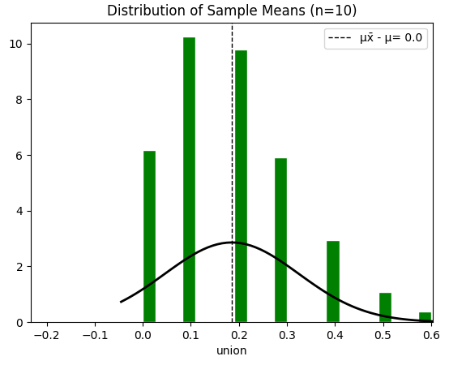
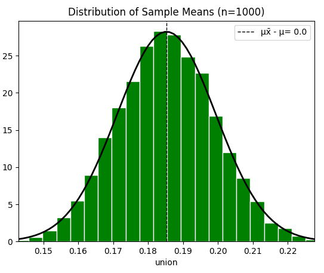
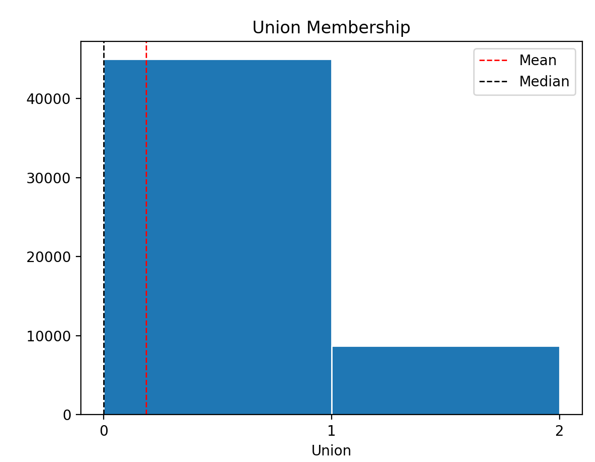
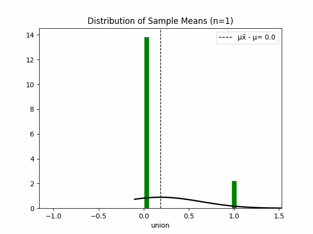
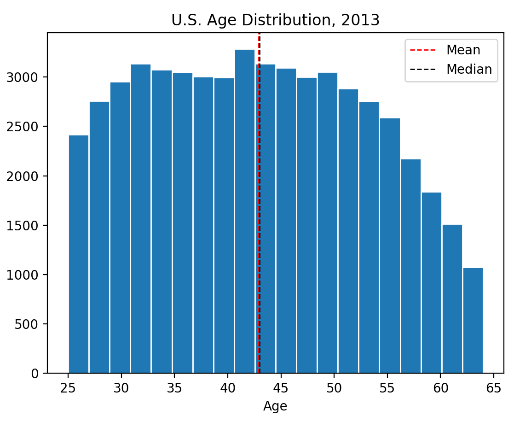
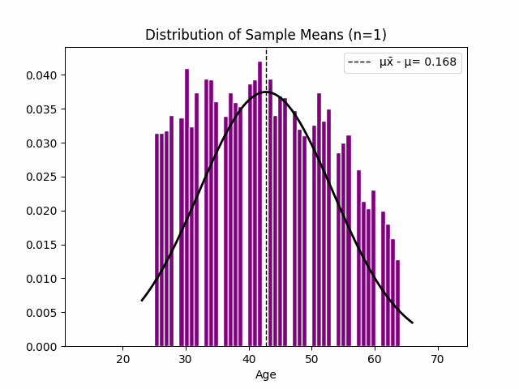
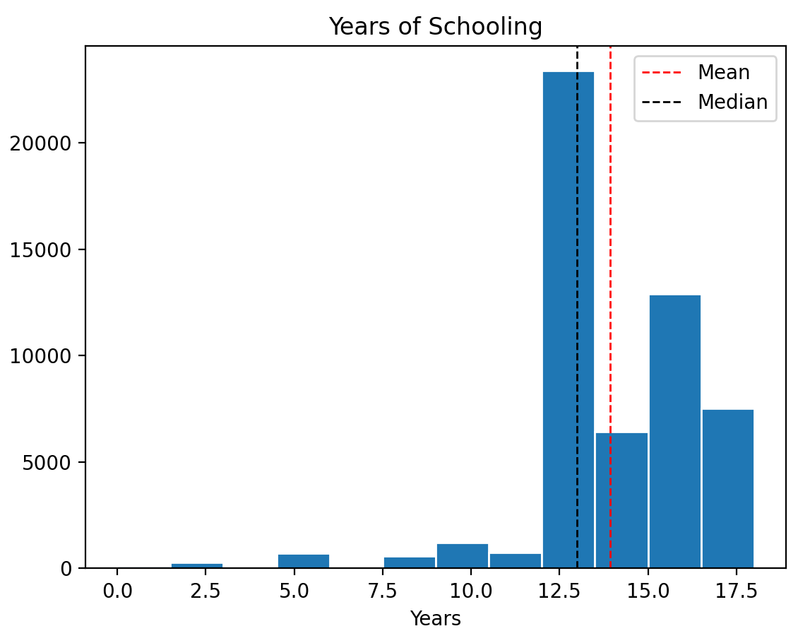
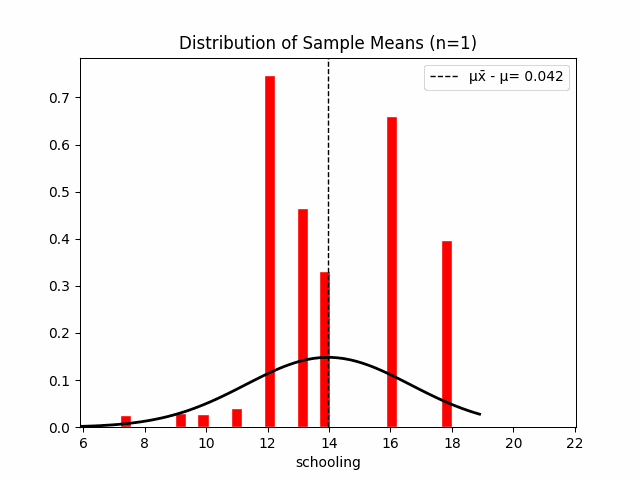
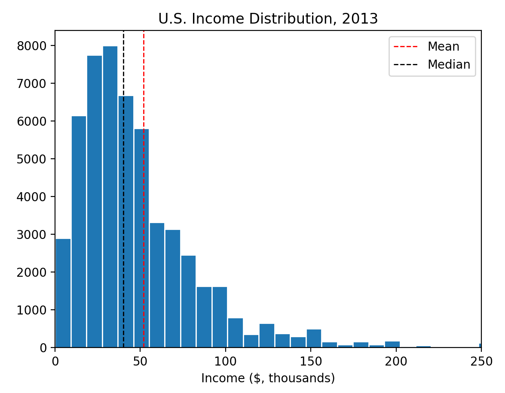
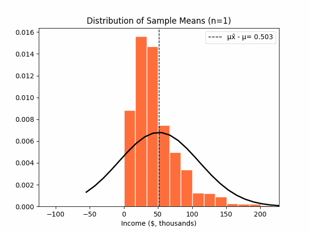

## {background-image="img/w05/w05_slide_002.jpg" background-size="contain" .fallback}
<!-- src: Week 5 - Sampling and Distributions.pptx slide 2 -->

::: notes
Slide text: The Data Science Process: · Ask a Question · Get the Data · Explore the Data · Model the Data · Visualize the Results · Generate summary statistics · Mean, variance, range etc.  · Plot the data · Are there patterns?
:::

## {background-image="img/w05/w05_739b7e9c55cd28f.jpg" background-size="contain"}
<!-- src: Week 5 - Sampling and Distributions.pptx slide 3 -->

## {background-image="img/w05/w05_slide_004.jpg" background-size="contain" .fallback}
<!-- src: Week 5 - Sampling and Distributions.pptx slide 4 -->

::: notes
Slide text: Frequentism · Frequentist inference is the process of determining properties of an underlying distribution via the observation of data. · It relies on the Central Limit Theorem · Using the properties of a sample to estimate the parameters of a population · Thus, the nature of a sample is of extreme importance to the quality of inferences that can be drawn from it. · R.A. Fisher · He was alsoa eugenicist ☹
:::

## {background-image="img/w05/w05_slide_005.jpg" background-size="contain" .fallback}
<!-- src: Week 5 - Sampling and Distributions.pptx slide 5 -->

::: notes
Go to menti

Slide text: War Planes · During World War II, U.S. bombers experienced heavy losses · The Navy asked the Statistical Research Group at Columbia University to help them figure out how to reduce losses  · Abraham Wald, an influential statistician, looked at a large sample of damaged planes that had returned from bombing runs, and made a diagram of each bullet hole
:::

## Selection Bias
<!-- src: Week 5 - Sampling and Distributions.pptx slide 7 -->

- We rarely have all the data on a specific **population;** Often, we only have a **sample.**
- When a sample is drawn randomly, we can use the distribution of the sample to make inferences about the population.
- **Selection Bias** can occur when our sample is not randomly selected.
- Wald was interested in the **population** of bomber planes, but only observed a highly biased **sample:** those that returned.
    - This is known as **survivorship bias,** and is a subset of general **selection bias**

## Populations and Samples
<!-- src: Week 5 - Sampling and Distributions.pptx slide 8 -->

- There are two kinds of distributions: populations and samples.
- **A population is the set of all relevant measurements**
- **A sample is a group of observations drawn in some way from a wider population**

| Population | Sample |
|---|---|
| All the fish in the sea | The fish I caught |
| The adult population of the UK | Census responses |
| All U.S. Navy Bomber planes | Bombers that made it back to base |
| All 19-20 year olds in the world | The people in this classroom |
| A person’s movements over a month | Mobile phone location pings |
| Public sentiment on race in South Africa | Tweets about race from South African users |

## Outline
<!-- src: Week 5 - Sampling and Distributions.pptx slide 9 -->

1. Basic Statistics
1. The Central Limit Theorem
1. Quantifying Uncertainty

# Basic Statistics
<!-- src: Week 5 - Sampling and Distributions.pptx slide 11 -->

## {background-image="img/w05/w05_slide_012.jpg" background-size="contain" .fallback}
<!-- src: Week 5 - Sampling and Distributions.pptx slide 12 -->

::: notes
Slide text: Sample mean
:::

## {background-image="img/w05/w05_slide_013.jpg" background-size="contain" .fallback}
<!-- src: Week 5 - Sampling and Distributions.pptx slide 13 -->

::: notes
Slide text: Sample median · The median of a set of n number of observations in a sample, ordered by value, of a variable is is defined by  ·  ·  ·  · Example (already in order): · Ages: 17, 19, 21, 22, 23, 23, 23, 38  · Median = (22+23) / 2 = 22.5  · The median also describes what a typical observation looks like, or where is the center of the distribution of the sample of observations.
:::

## {background-image="img/w05/w05_slide_014.jpg" background-size="contain" .fallback}
<!-- src: Week 5 - Sampling and Distributions.pptx slide 14 -->

::: notes
Slide text: Mean vs. Median · The mean is sensitive to extreme values (outliers)
:::

## {background-image="img/w05/w05_slide_015.jpg" background-size="contain" .fallback}
<!-- src: Week 5 - Sampling and Distributions.pptx slide 15 -->

::: notes
Slide text: Mean, median, and skewness · The mean is sensitive to outliers:  ·  ·  ·  ·  ·  ·  ·  · skewness often “follows the longer tail”.
:::

## {background-image="img/w05/w05_bdaa6a7390.png" background-size="contain"}
<!-- src: Week 5 - Sampling and Distributions.pptx slide 17 -->

## {background-image="img/w05/w05_slide_018.jpg" background-size="contain" .fallback}
<!-- src: Week 5 - Sampling and Distributions.pptx slide 18 -->

::: notes
Slide text: Regarding Categorical Variables... · For categorical variables, neither mean or median make sense. Why? ·  ·  ·  ·  ·  ·  ·  ·  · The mode might be a better way to find the most “representative” value.
:::

## {background-image="img/w05/w05_slide_019.jpg" background-size="contain" .fallback}
<!-- src: Week 5 - Sampling and Distributions.pptx slide 19 -->

::: notes
Slide text: Measures of Spread: Variance
:::

## {background-image="img/w05/w05_slide_020.jpg" background-size="contain" .fallback}
<!-- src: Week 5 - Sampling and Distributions.pptx slide 20 -->

::: notes
Slide text: Measures of Spread: Standard Deviation
:::

## {background-image="img/w05/w05_slide_021.jpg" background-size="contain" .fallback}
<!-- src: Week 5 - Sampling and Distributions.pptx slide 21 -->

::: notes
Slide text: Sample A: High standard deviation · Sample A
:::

## {background-image="img/w05/w05_slide_022.jpg" background-size="contain" .fallback}
<!-- src: Week 5 - Sampling and Distributions.pptx slide 22 -->

::: notes
Slide text: Sample B: Low standard deviation · Sample B
:::

# The Central Limit Theorem
<!-- src: Week 5 - Sampling and Distributions.pptx slide 23 -->

## Inferring from samples
<!-- src: Week 5 - Sampling and Distributions.pptx slide 24 -->

- There are generally equal numbers of men and women in the population\*;
- In other words, a random individual plucked from this population has a ~50% chance of being a man or a woman.
- Let’s assume a variable where woman=1, man=0
- If I take a random sample of 4 people,
    - we might expect 2 men and 2 women, or a [0,0,1,1] sample
    - But we might not be entirely surprised if we got all men [0,0,0,0] or all women [1,1,1,1].
    - Similarly, you could flip a coin 4 times and get all heads or all tails.

## {background-image="img/w05/w05_slide_025.jpg" background-size="contain" .fallback}
<!-- src: Week 5 - Sampling and Distributions.pptx slide 25 -->

::: notes
Slide text: Inferring from samples · But what are the chances of flipping a coin 100 times and never getting heads? Or drawing a random sample of 100 people and none of them are women? Probably extremely low. How low?
:::

## {background-image="img/w05/w05_slide_026.jpg" background-size="contain" .fallback}
<!-- src: Week 5 - Sampling and Distributions.pptx slide 26 -->

::: notes
Slide text: Inferring from samples · Turns out, if you plot the means from sufficiently large random samples, they approximate a normal distribution · The mean of the sample means will approach the population mean
:::

## Central Limit Theorem
<!-- src: Week 5 - Sampling and Distributions.pptx slide 27 -->

- This is the most important concept you will learn in this course.
- If you take sufficiently large random samples from the population,
- **The distribution of sample means will be approximately normally distributed**
- *Regardless of the underlying population distribution*

## Why does this matter?
<!-- src: Week 5 - Sampling and Distributions.pptx slide 29 -->

- This means that **we can use the normal probability model to quantify uncertainty when making inferences about a population mean based on the sample mean.**
- In other words, because we know the shape of the normal distribution, we can precisely estimate the likelihood of observing a sample mean as extreme as the one we have
- We rarely observe the whole population, but if we have a large enough random sample, **we can assume that the mean of this sample has a:**
    - 68% chance of falling within 1 standard deviation of the population mean
    - 95% chance of falling within 2 standard deviations of the population mean
    - 99.7% chance of falling within 3 standard deviations of the population mean

## {background-image="img/w05/w05_slide_030.jpg" background-size="contain" .fallback}
<!-- src: Week 5 - Sampling and Distributions.pptx slide 30 -->

::: notes
Slide text: Estimating Union membership in America · “Union” is a binary variable, in which  · 0= person is not a member of a union · 1= person is a member of a union  · I don’t know what the rate of union membership is in the population.  · But lets say I can draw a random sample of 7 people from across the U.S.
:::

## {background-image="img/w05/w05_slide_031.jpg" background-size="contain" .fallback}
<!-- src: Week 5 - Sampling and Distributions.pptx slide 31 -->

::: notes
Slide text: Again, it’s possible that none of them would be union members  · i.e., our sample would look like this: [0,0,0,0,0,0,0,0], with a mean of 0. · Given such a small sample, there’s a decent chance that our sample mean would be 0 due to pure chance. · Estimating Union membership in America
:::

## Estimating Union membership in America
<!-- src: Week 5 - Sampling and Distributions.pptx slide 32 -->

{.r-stretch fig-align="center"}

## Estimating Union membership in America
<!-- src: Week 5 - Sampling and Distributions.pptx slide 33 -->

::: {.columns}
:::: {.column width="50%"}
- What if we took a random sample of 1000 people.
    - How likely is it that not a single person in the sample is a member of a union?
    - **Given such a large sample, it’s unlikely that our sample mean would be 0 due to pure chance.**
- **But how unlikely?**
::::
:::: {.column width="50%"}
{.pic style="max-height:700px"}
::::
:::

## Estimating Union membership in America
<!-- src: Week 5 - Sampling and Distributions.pptx slide 34 -->

{.r-stretch fig-align="center"}

## The distribution of sample means becomes normal, regardless of the underlying distribution
<!-- src: Week 5 - Sampling and Distributions.pptx slide 35 -->

::: {.columns}
:::: {.column width="53%"}
{.pic style="max-height:700px"}
::::
:::: {.column width="47%"}
{.pic style="max-height:700px"}
::::
:::

## The distribution of sample means becomes normal, regardless of the underlying distribution
<!-- src: Week 5 - Sampling and Distributions.pptx slide 36 -->

::: {.columns}
:::: {.column width="50%"}
{.pic style="max-height:700px"}
::::
:::: {.column width="50%"}
{.pic style="max-height:700px"}
::::
:::

## The distribution of sample means becomes normal, regardless of the underlying distribution
<!-- src: Week 5 - Sampling and Distributions.pptx slide 37 -->

::: {.columns}
:::: {.column width="51%"}
{.pic style="max-height:700px"}
::::
:::: {.column width="49%"}
{.pic style="max-height:700px"}
::::
:::

## The distribution of sample means becomes normal, regardless of the underlying distribution
<!-- src: Week 5 - Sampling and Distributions.pptx slide 38 -->

::: {.columns}
:::: {.column width="51%"}
{.pic style="max-height:700px"}
::::
:::: {.column width="49%"}
{.pic style="max-height:700px"}
::::
:::

## Why the CLT is ✨magic✨
<!-- src: Week 5 - Sampling and Distributions.pptx slide 40 -->

- In these examples, I’ve had access to the entire population and have been drawing thousands of large samples to show that their means are normally distributed.
- If you have **one sufficiently large random sample, you can ASSUME** that the distribution of sample means will be normally distributed.
    - You can **ASSUME** that the mean of your sample has a 95% chance of falling within 2 standard deviations of the population mean

# Quantifying Uncertainty
<!-- src: Week 5 - Sampling and Distributions.pptx slide 41 -->

## The Signal and the Noise
<!-- src: Week 5 - Sampling and Distributions.pptx slide 42 -->

- Signal
    - meaningful information that you're actually trying to detect.
- Noise
    - random, unwanted variation or fluctuation that interferes with the signal.
- Sometimes we may observe a strong signal
    - E.g. a big difference between two values (e.g. income for men vs women)
    - But there may be big differences between *all* the values; in other words, there may be lots of noise. The observed difference could be due to chance.
    - If there’s a big difference in our two values, but the rest of the values are close together, the likelihood that our observed difference is due to chance is low.

## {background-image="img/w05/w05_slide_043.jpg" background-size="contain" .fallback}
<!-- src: Week 5 - Sampling and Distributions.pptx slide 43 -->

::: notes
Slide text: The Signal and the Noise · The challenge of inference is understanding how likely it is that the signal we’re observing is due to random chance (noise).  · Most inferential statistics are basically a ratio of signal to noise:
:::

## {background-image="img/w05/w05_slide_044.jpg" background-size="contain" .fallback}
<!-- src: Week 5 - Sampling and Distributions.pptx slide 44 -->

::: notes
Slide text: Signal · Noise · Noise · N   o   i   s   e · N   o   i   s   e
:::

## Recap
<!-- src: Week 5 - Sampling and Distributions.pptx slide 60 -->

1. A **population** is the set of all relevant measurements
1. A **sample** is a group of observations drawn in some way from a wider population
1. If you take sufficiently large random samples from the population,
    1. **The distribution of** **sample** **means will be approximately normally distributed**
1. If you have **one sufficiently large random** **sample****, you can ASSUME** that the distribution of sample means will be normally distributed.
    1. You can **ASSUME** that the mean of your sample has a 95% chance of falling within 2 standard deviations of the population mean

## Any Questions?
<!-- src: Week 5 - Sampling and Distributions.pptx slide 63 -->

[o.ballinger@ucl.ac.uk](mailto:o.ballinger@ucl.ac.uk)
