## {background-image="img/w06/w06_slide_002.jpg" background-size="contain" .fallback}
<!-- src: Week 6 - Hypothesis Testing.pptx slide 2 -->

::: notes
Slide text: The Data Science Process: · Ask a Question · Get the Data · Explore the Data · Model the Data · Visualize the Results · Build a model · Fit the model  · Validate the model
:::

## Problem
<!-- src: Week 6 - Hypothesis Testing.pptx slide 3 -->

- Satellite imagery is used extensively to detect damaged buildings. The highest levels of accuracy are generally achieved using Deep Learning and Very High Resolution optical satellite imagery. However, such approaches have significant limitations:
- Financially and computationally expensive
    - $23/km2, so **$13.9 million** for all of Ukraine
- Optical imagery is not consistently available
    - High-resolution imagery must be tasked
    - Clouds.
- Neural Networks require retraining to be accurate in different geographies.

## {background-image="img/w06/w06_slide_005.jpg" background-size="contain" .fallback}
<!-- src: Week 6 - Hypothesis Testing.pptx slide 5 -->

::: notes
Slide text: Detecting Damage from Space · Sentinel-1 SAR imagery is free, has a high revisit rate, and can penetrate clouds. Static structures are highly consistent in multitemporal imagery. A destructive event results in a change in backscatter amplitude, but relatively low variance in pixel values in both the pre- and post- shock periods for damaged buildings. A standard T-test can be used to calculate the ratio of the change in amplitude to general pixel variance, detecting collapsed buildings.
:::

## {background-image="img/w06/w06_bc7b83f38b.png" background-size="contain"}
<!-- src: Week 6 - Hypothesis Testing.pptx slide 6 -->

## {background-image="img/w06/w06_568321a454.png" background-size="contain"}
<!-- src: Week 6 - Hypothesis Testing.pptx slide 8 -->

## {background-image="img/w06/w06_3eae8586fa.png" background-size="contain"}
<!-- src: Week 6 - Hypothesis Testing.pptx slide 9 -->

## {background-image="img/w06/w06_9f14aee4cb.png" background-size="contain"}
<!-- src: Week 6 - Hypothesis Testing.pptx slide 12 -->

## {background-image="img/w06/w06_slide_015.jpg" background-size="contain" .fallback}
<!-- src: Week 6 - Hypothesis Testing.pptx slide 15 -->

::: notes
Slide text: Model Output · The result is a damage probability raster, in which each pixel value reflects the average of four T-values. On the right, the PWTT algorithm is applied to Beirut following the explosion in August 2020.
:::

## {background-image="img/w06/w06_slide_020.jpg" background-size="contain" .fallback}
<!-- src: Week 6 - Hypothesis Testing.pptx slide 20 -->

::: notes
2022- present

Abstract: 

In the context of recent, highly destructive conflicts in Gaza and Ukraine, reliable estimates of building damage are essential for an informed public discourse, human rights monitoring, and humanitarian aid provision. Given the contentious nature of conflict damage assessment, these estimates must be fully reproducible, explainable, and derived from open access data. This paper introduces a new method for building damage detection-- the Pixel-Wise T-Test (PWTT)-- that satisfies these conditions. Using a combination of freely-available synthetic aperture radar imagery and statistical change detection, the PWTT generates accurate conflict damage estimates across a wide area at regular time intervals. Accuracy is assessed using an original dataset of over half a million labeled building footprints spanning 12 cities across Ukraine, Palestine, Syria, and Iraq. Despite being simple and lightweight, the algorithm achieves building-level accuracy statistics (AUC=0.88 across Ukraine, 0.81 in Gaza) rivalling state of the art methods that use deep learning and high resolution imagery. The workflow is open source and deployed entirely within the Google Earth Engine environment, allowing for the generation of interactive Battle Damage Dashboards for Ukraine and Gaza that update in near-real time, allowing the public and humanitarian practitioners to immediately get estimates of damaged buildings in a given area.

Slide text: Open Access Battle Damage Detection via Pixel-Wise T-Test on Sentinel-1 Imagery
:::

## Outline
<!-- src: Week 6 - Hypothesis Testing.pptx slide 21 -->

1. Case Study
1. Confidence Intervals
1. The T-Test
1. Bayesian Inference

# 2. Confidence Intervals
<!-- src: Week 6 - Hypothesis Testing.pptx slide 22 -->

## {background-image="img/w06/w06_slide_023.jpg" background-size="contain" .fallback}
<!-- src: Week 6 - Hypothesis Testing.pptx slide 23 -->

::: notes
Slide text: Is there a gender pay gap? · I have a random sample of 1000 people’s income data, of which 505 are men and 495 women
:::

## {background-image="img/w06/w06_slide_024.jpg" background-size="contain" .fallback}
<!-- src: Week 6 - Hypothesis Testing.pptx slide 24 -->

## Sampling Error
<!-- src: Week 6 - Hypothesis Testing.pptx slide 25 -->

- If multiple samples are taken from the same population, there still will be some difference between the sample means.
- This difference is called **sampling error**
- The hypothesis test provides a standardized, formal procedure for determining whether the mean difference obtained in a research study is significantly greater than can be explained by sampling error

## {background-image="img/w06/w06_98cd28422f.jpg" background-size="contain"}
<!-- src: Week 6 - Hypothesis Testing.pptx slide 26 -->

## {background-image="img/w06/w06_bf85d88862.jpg" background-size="contain"}
<!-- src: Week 6 - Hypothesis Testing.pptx slide 27 -->

## {background-image="img/w06/w06_7ee7b5908e.jpg" background-size="contain"}
<!-- src: Week 6 - Hypothesis Testing.pptx slide 28 -->

## {background-image="img/w06/w06_054c641c1c.jpg" background-size="contain"}
<!-- src: Week 6 - Hypothesis Testing.pptx slide 29 -->

## {background-image="img/w06/w06_e50bccdb01.jpg" background-size="contain"}
<!-- src: Week 6 - Hypothesis Testing.pptx slide 30 -->

## {background-image="img/w06/w06_579306f0bd.jpg" background-size="contain"}
<!-- src: Week 6 - Hypothesis Testing.pptx slide 31 -->

## CLT Recap
<!-- src: Week 6 - Hypothesis Testing.pptx slide 32 -->

- If you take a big enough (usually n>30) random sample, you can safely assume that 95% of the time,
    - **The** **population mean** **will lie within two standard errors of the observed** **sample mean.**
- If you have **one sufficiently large random sample, you can ASSUME** that the distribution of sample means will be normally distributed.
    - You can ASSUME that the mean of your sample has a 95% chance of falling within 2 **standard errors** of the population mean

## {background-image="img/w06/w06_slide_033.jpg" background-size="contain" .fallback}
<!-- src: Week 6 - Hypothesis Testing.pptx slide 33 -->

::: notes
Slide text: Standard Error
:::

## {background-image="img/w06/w06_slide_034.jpg" background-size="contain" .fallback}
<!-- src: Week 6 - Hypothesis Testing.pptx slide 34 -->

::: notes
Slide text: Calculate the standard deviation
:::

## {background-image="img/w06/w06_slide_035.jpg" background-size="contain" .fallback}
<!-- src: Week 6 - Hypothesis Testing.pptx slide 35 -->

## {background-image="img/w06/w06_slide_036.jpg" background-size="contain" .fallback}
<!-- src: Week 6 - Hypothesis Testing.pptx slide 36 -->

::: notes
Slide text: Building a Confidence Interval
:::

## {background-image="img/w06/w06_slide_037.jpg" background-size="contain" .fallback}
<!-- src: Week 6 - Hypothesis Testing.pptx slide 37 -->

::: notes
Slide text: 95% Confidence Interval,Men
:::

## {.notitle}
<!-- src: Week 6 - Hypothesis Testing.pptx slide 38 -->

::: {.columns}
:::: {.column width="54%"}
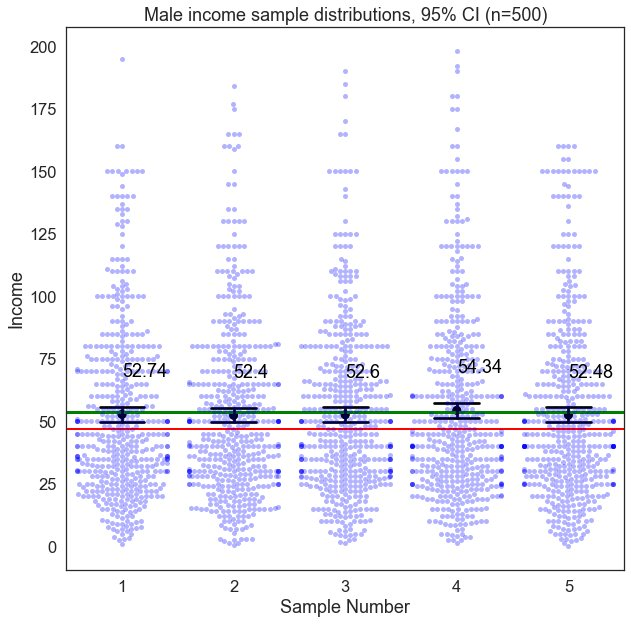{.pic style="max-height:700px"}
::::
:::: {.column width="46%"}
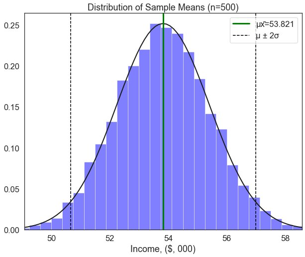{.pic style="max-height:700px"}
::::
:::

## {background-image="img/w06/w06_slide_039.jpg" background-size="contain" .fallback}
<!-- src: Week 6 - Hypothesis Testing.pptx slide 39 -->

::: notes
Slide text: 95% Confidence Interval,Women
:::

## {.notitle}
<!-- src: Week 6 - Hypothesis Testing.pptx slide 40 -->

::: {.columns}
:::: {.column width="54%"}
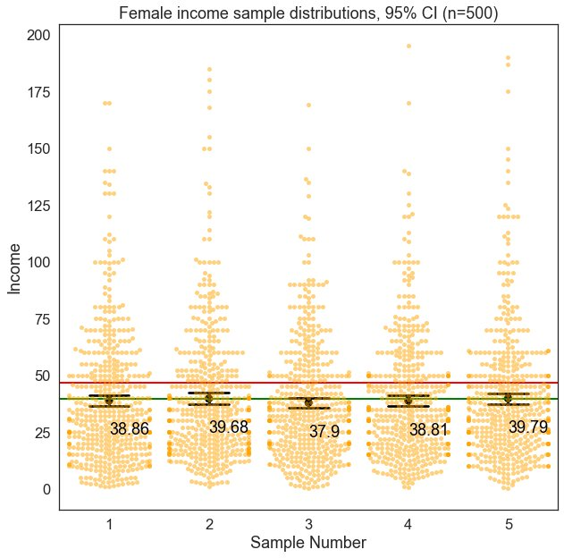{.pic style="max-height:700px"}
::::
:::: {.column width="46%"}
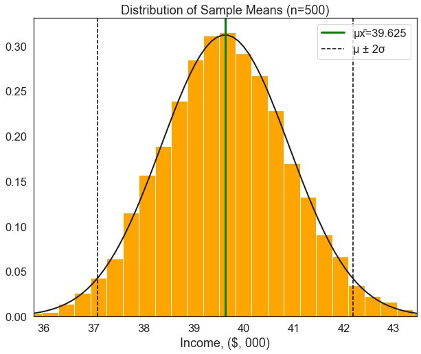{.pic style="max-height:700px"}
::::
:::

## {background-image="img/w06/w06_1245ab5910.jpg" background-size="contain"}
<!-- src: Week 6 - Hypothesis Testing.pptx slide 41 -->

## {background-image="img/w06/w06_slide_042.jpg" background-size="contain" .fallback}
<!-- src: Week 6 - Hypothesis Testing.pptx slide 42 -->

# 3. The T-Test
<!-- src: Week 6 - Hypothesis Testing.pptx slide 43 -->

## Independent-Measures Designs
<!-- src: Week 6 - Hypothesis Testing.pptx slide 44 -->

- The independent-measures design is used in situations where a researcher has no prior knowledge about either of the two populations (or treatments) being compared.
- In particular, the population means and standard deviations are all unknown.
- Because the population variances are not known, these values must be estimated from the sample data.
- The purpose of a T-test is to determine
    - **whether the sample mean difference indicates a real mean difference between the two populations** or
    - **whether the obtained difference is simply the result of sampling error.**

## {background-image="img/w06/w06_slide_046.jpg" background-size="contain" .fallback}
<!-- src: Week 6 - Hypothesis Testing.pptx slide 46 -->

::: notes
Slide text: The Student’s T-Test · Developed by William Sealy Gosset in 1908, who worked for Guinness at the time · “How can we determine, to a reasonable degree of scientific certainty, if one variety of barley yields more than another?”
:::

## {background-image="img/w06/w06_slide_047.jpg" background-size="contain" .fallback}
<!-- src: Week 6 - Hypothesis Testing.pptx slide 47 -->

::: notes
Slide text: T-Test Formula
:::

## {background-image="img/w06/w06_slide_048.jpg" background-size="contain" .fallback}
<!-- src: Week 6 - Hypothesis Testing.pptx slide 48 -->

::: notes
Slide text: T-Test
:::

## {background-image="img/w06/w06_slide_049.jpg" background-size="contain" .fallback}
<!-- src: Week 6 - Hypothesis Testing.pptx slide 49 -->

::: notes
Slide text: T-Test
:::

## {background-image="img/w06/w06_slide_050.jpg" background-size="contain" .fallback}
<!-- src: Week 6 - Hypothesis Testing.pptx slide 50 -->

::: notes
Slide text: T-Test
:::

## {background-image="img/w06/w06_slide_051.jpg" background-size="contain" .fallback}
<!-- src: Week 6 - Hypothesis Testing.pptx slide 51 -->

::: notes
Slide text: Is there a gender pay gap?
:::

## {background-image="img/w06/w06_slide_052.jpg" background-size="contain" .fallback}
<!-- src: Week 6 - Hypothesis Testing.pptx slide 52 -->

::: notes
Slide text: Hypothesis Test steps
:::

## {background-image="img/w06/w06_slide_053.jpg" background-size="contain" .fallback}
<!-- src: Week 6 - Hypothesis Testing.pptx slide 53 -->

::: notes
Slide text: 1. The Null and Alternative Hypotheses
:::

## {background-image="img/w06/w06_slide_054.jpg" background-size="contain" .fallback}
<!-- src: Week 6 - Hypothesis Testing.pptx slide 54 -->

::: notes
Slide text: 2. Select a Critical Value · If we want to test the null hypothesis at the 95% confidence level, we would select a critical value of 1.96.   · If our T-statistic exceeds this value, we reject the null hypothesis that there is no difference between the group means.
:::

## {background-image="img/w06/w06_5be88f4e2fcaa14.png" background-size="contain"}
<!-- src: Week 6 - Hypothesis Testing.pptx slide 55 -->

## {background-image="img/w06/w06_slide_056.jpg" background-size="contain" .fallback}
<!-- src: Week 6 - Hypothesis Testing.pptx slide 56 -->

::: notes
Slide text: 3. Calculate the test statistic
:::

## 4. Make a Decision
<!-- src: Week 6 - Hypothesis Testing.pptx slide 57 -->

- The T-statistic from our T test is 6.4, which exceeds the critical value of 1.96.
- Therefore, we can **reject** the null hypothesis that there is no difference in means between male and female income at 95% confidence.
- Interpretation:
    - In a sample of 505 men and 495 women, the mean income for men was $13,600 higher than for women. The difference in these means is statistically significant at the 95% confidence level.
    - i.e., there is less than a 5% chance of observing a such an extreme difference in means between these two groups due to random chance alone.

## {background-image="img/w06/w06_slide_058.jpg" background-size="contain" .fallback}
<!-- src: Week 6 - Hypothesis Testing.pptx slide 58 -->

::: notes
Slide text: Summary of key terms
:::

## A Note of Caution
<!-- src: Week 6 - Hypothesis Testing.pptx slide 59 -->

::: {.columns}
:::: {.column width="51%"}
- Hypothesis testing is the basis of modern scientific research.
- They allow us to evaluate the likelihood of our test results being attributable to random chance.
- But, statistically significant results can be misleading
    - **Publication bias** (a form of selection bias in academic publishing) is a real threat.
    - **Bayes’** **Theorem** suggests that many statistically significant research findings may be false.
::::
:::: {.column width="49%"}
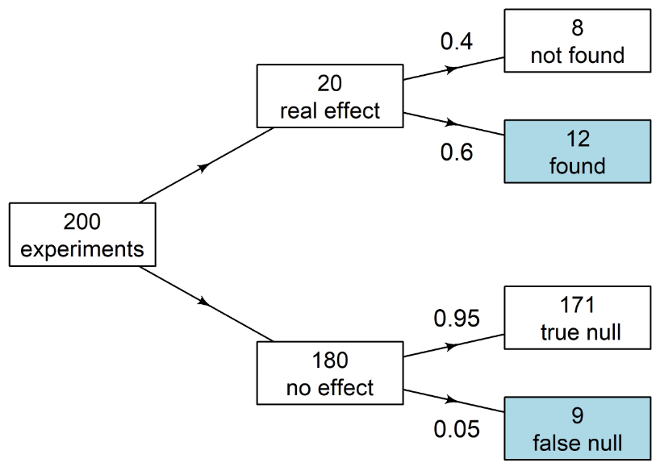{.pic style="max-height:636px"}

Source: [Adrian Barnett](https://agbarnett.github.io/talks/TRI/slides)
::::
:::

## Where do null findings go?
<!-- src: Week 6 - Hypothesis Testing.pptx slide 60 -->

::: {.columns}
:::: {.column width="52%"}
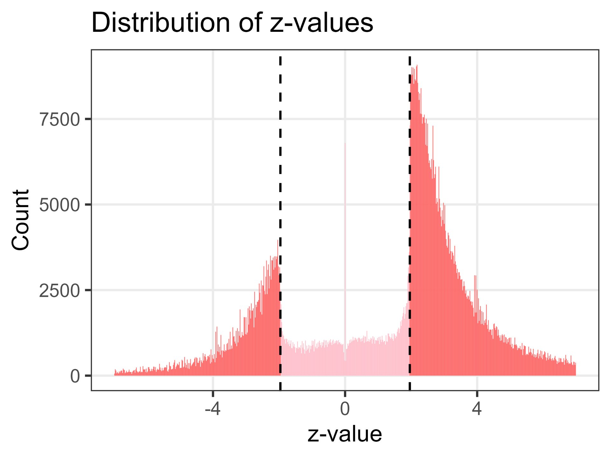{.pic style="max-height:700px"}
::::
:::: {.column width="48%"}
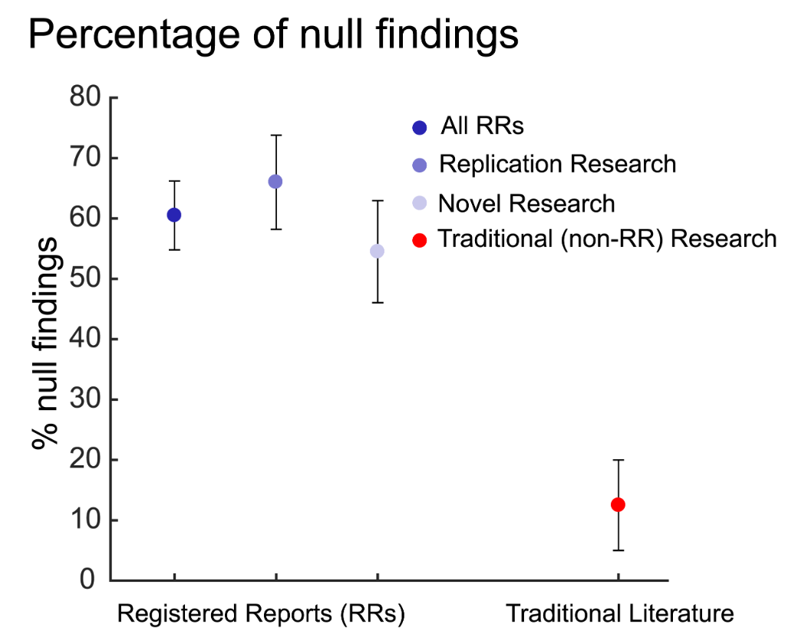{.pic style="max-height:700px"}
::::
:::

## {.notitle}
<!-- src: Week 6 - Hypothesis Testing.pptx slide 61 -->

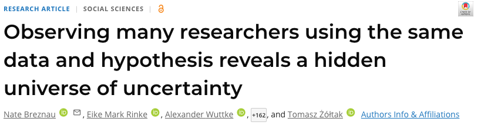{.pic style="max-height:230px"}

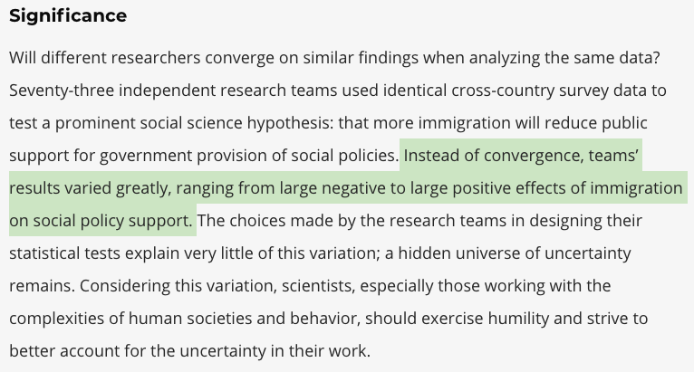{.pic style="max-height:470px"}

## {background-image="img/w06/w06_8b947f61c4.jpg" background-size="contain"}
<!-- src: Week 6 - Hypothesis Testing.pptx slide 62 -->

# 4. Bayes' Theorem
<!-- src: Week X - Bayesian Statistics.pptx slide 6 -->

## {background-image="img/w06/bayes_slide_007.jpg" background-size="contain" .fallback}
<!-- src: Week X - Bayesian Statistics.pptx slide 7 -->

::: notes
Gigerenzer found most doctors answer close to 90%. The answer is about 9%. Adapted from Gigerenzer & Hoffrage (1995) on natural frequencies.

Slide text: A Quick Question · A disease affects 1% of people. A test catches 90% of people who have it, but also wrongly flags 9% of healthy people. ·  · You test positive. What's the chance you have the disease? · 90% · 81% · 50% · 9% · Go to menti
:::

## {background-image="img/w06/bayes_slide_008.jpg" background-size="contain" .fallback}
<!-- src: Week X - Bayesian Statistics.pptx slide 8 -->

::: notes
Slide text: Think in People, Not Percentages · Of 1,000 people: · 10 are sick; 9 of them test positive · 990 are healthy; 89 of them test positive anyway · 9 / (9 + 89) = · 9% · Most positives are false, because healthy people vastly outnumber sick ones
:::

## {background-image="img/w06/bayes_slide_009.jpg" background-size="contain" .fallback}
<!-- src: Week X - Bayesian Statistics.pptx slide 9 -->

::: notes
Slide text: Bayes' Theorem · P(A | B)  =  P(B | A) × P(A)  /  P(B) · Posterior · P(A | B) · What we believe after seeing the data · Likelihood · P(B | A) · How probable the data are if A is true · Prior · P(A) · What we believed before seeing the data · Evidence · P(B) · How probable the data are overall · Posterior ∝ Likelihood × Prior
:::

## Plugging In
<!-- src: Week X - Bayesian Statistics.pptx slide 10 -->

- A = you have the disease;  B = you test positive
    - Prior:  P(sick) = 0.01
    - Likelihood:  P(positive | sick) = 0.90
    - Evidence:  P(positive) = 0.90 × 0.01 + 0.09 × 0.99 = 0.098
- Posterior:  P(sick | positive) = 0.90 × 0.01 / 0.098 = **0.092**
- P(positive | sick) = 90% but P(sick | positive) = 9%. **Flipping the conditional changes everything**
- A second, independent positive test? Use 9% as the **new prior** and you get about 50%

::: notes
Second test: 0.9*0.092 / (0.9*0.092 + 0.09*0.908) = 0.0828/0.1645 ≈ 0.50.
:::

## A Very Old Idea
<!-- src: Week X - Bayesian Statistics.pptx slide 11 -->

- **Rev. Thomas Bayes** (c.1701–1761), a Presbyterian minister, worked out how to reason backwards from effects to causes
    - His essay was published after his death by Richard Price in **1763**. Bayes is buried in Bunhill Fields, a 20-minute walk from here
- **Pierre-Simon Laplace** independently developed and generalised the idea from 1774, using it on everything from astronomy to birth ratios
- For most of the 20th century, **frequentism** (Fisher, Neyman, Pearson) dominated. Priors were seen as too subjective for science
- Since the 1990s, cheap computing (**MCMC**) has made Bayesian methods practical for complex models

## Are Most Published Findings False?
<!-- src: Week X - Bayesian Statistics.pptx slide 13 -->

- Ioannidis (2005), one of the most-cited papers in the history of PLoS Medicine
- Earlier today we rejected the null if p < 0.05. But how often is a 'significant' result actually **true**?
- Imagine a field that tests **1,000 hypotheses**:
    - Only **10%** of them are actually true (the prior)
    - Studies have **80% power**: they detect a true effect 80% of the time
    - α = 0.05: **5%** of false hypotheses come out significant by chance
- What share of significant findings are false?

## {background-image="img/w06/bayes_slide_014.jpg" background-size="contain" .fallback}
<!-- src: Week X - Bayesian Statistics.pptx slide 14 -->

::: notes
Slide text: Are Most Published Findings False? · 125 significant results: · 80 true effects · 45 false positives · 36% · of 'discoveries' are false · With 20% power (common in small studies) it's 45 / 65 = 69%
:::

## The p-value Trap
<!-- src: Week X - Bayesian Statistics.pptx slide 15 -->

- A p-value is **P(data this extreme | null is true)**
- It is **not** P(null is true | data), though it's constantly reported that way
- Confusing the two is called the **prosecutor's fallacy**
    - **Sally Clark** (1999) was convicted of murdering her two baby sons after an expert claimed two cot deaths in one family had a '1 in 73 million' chance
    - That's P(evidence | innocent). The jury needed P(innocent | evidence), and double murder is also extremely rare
    - The conviction was overturned in 2003
- Bayes' theorem is the only correct way to **flip** a conditional probability

# 5. Priors, Likelihoods and Posteriors
<!-- src: Week X - Bayesian Statistics.pptx slide 16 -->

## Estimating Union Membership, Again
<!-- src: Week X - Bayesian Statistics.pptx slide 17 -->

- In Week 5 we asked: what share of American workers are in a union?
- Suppose we sample **7 people** and **none** of them are union members
    - Frequentist estimate: 0 / 7 = **0%**
    - A 95% confidence interval based on the normal approximation: 0% to 0%
- Does anyone in this room believe union membership in the US is **0%**?
- We knew something **before** we saw the data. Frequentist methods have no place to put that knowledge. Bayesian methods do: the **prior**

## {background-image="img/w06/bayes_slide_018.jpg" background-size="contain" .fallback}
<!-- src: Week X - Bayesian Statistics.pptx slide 18 -->

::: notes
Slide text: Three Ingredients · Prior · p(θ) · What we believe about θ before seeing data, written as a probability distribution · 'Union membership is probably somewhere between 5% and 40%' · Likelihood · p(data | θ) · How probable the data we observed would be, for each possible value of θ · 'If θ were 50%, getting 0 of 7 would be very unlikely' · Posterior · p(θ | data) · Updated beliefs: the prior reweighted by the likelihood · 'Given what we knew and what we saw, θ is probably around 12%' · Posterior ∝ Likelihood × Prior
:::

## The Beta Distribution
<!-- src: Week X - Bayesian Statistics.pptx slide 19 -->

::: {.columns}
:::: {.column width="45%"}
- We need a distribution for a **proportion**: something that lives between 0 and 1
- **Beta(a, b)** is the standard choice
    - Think of a − 1 as prior 'successes' and b − 1 as prior 'failures'
    - Mean = a / (a + b)
- Beta(1, 1) is **flat**: every value equally likely
- Beta(2, 8) says 'probably low, but I'm not sure'
- Beta(20, 80) says 'about 20%, and I'm fairly confident'
::::
:::: {.column width="55%"}
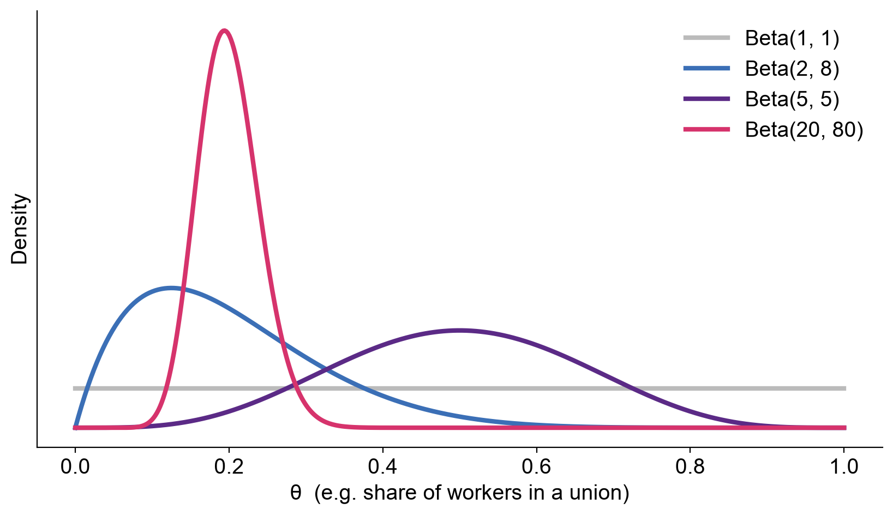{.pic style="max-height:700px"}
::::
:::

## {background-image="img/w06/bayes_slide_020.jpg" background-size="contain" .fallback}
<!-- src: Week X - Bayesian Statistics.pptx slide 20 -->

::: notes
Slide text: Updating Is Just Counting · With a Beta prior and k successes out of n: · Beta(a, b)   +   k of n   →   Beta(a + k,  b + n − k) · Prior: Beta(2, 8): mean 20%, 'probably low' · Data: 0 union members out of 7 · Posterior: Beta(2 + 0, 8 + 7) = Beta(2, 15): mean 11.8%, 95% interval 1.6% to 30.2% · Small sample, so the prior still does a lot of the work, and the estimate is far more sensible than 0%
:::

## Prior × Likelihood = Posterior
<!-- src: Week X - Bayesian Statistics.pptx slide 21 -->

::: {.columns}
:::: {.column width="39%"}
- The **likelihood** (dashed) peaks at 0%: that's all the data alone can say
- The **prior** pulls the estimate towards plausible values
- The **posterior** is a compromise, weighted by how much information each carries
- The true rate in our CPS data (22%) sits comfortably inside the posterior
::::
:::: {.column width="61%"}
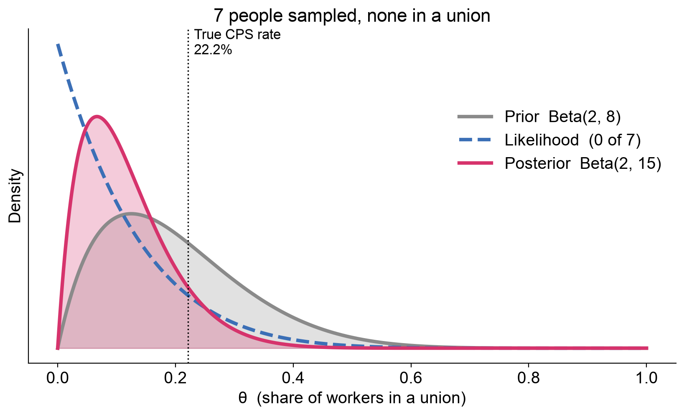{.pic style="max-height:700px"}
::::
:::

## More Data, Less Prior
<!-- src: Week X - Bayesian Statistics.pptx slide 22 -->

::: {.columns}
:::: {.column width="39%"}
- A random sample of 1,000 people from the CPS: **237** are union members
- The likelihood is now sharp and **overwhelms** the prior
- 95% interval: **21.1% to 26.3%**
- Sound familiar? Just like the CLT, uncertainty shrinks as n grows
::::
:::: {.column width="61%"}
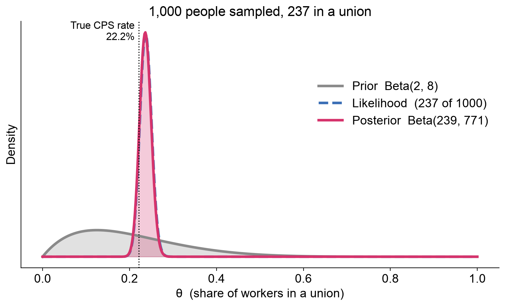{.pic style="max-height:700px"}
::::
:::

## Today's Posterior Is Tomorrow's Prior
<!-- src: Week X - Bayesian Statistics.pptx slide 23 -->

::: {.columns}
:::: {.column width="37%"}
- We can update **one observation at a time**
- Start flat, Beta(1, 1), and feed in CPS respondents one by one
- Each posterior becomes the prior for the next batch
- The answer is the same whether you update in one go or one at a time
- This is how search-and-rescue, spam filters and election models learn as data arrive
::::
:::: {.column width="63%"}
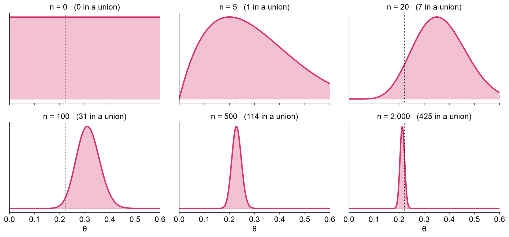{.pic style="max-height:700px"}
::::
:::

## Does the Prior Matter?
<!-- src: Week X - Bayesian Statistics.pptx slide 24 -->

::: {.columns}
:::: {.column width="34%"}
- With **20** observations, the three priors give quite different answers
- With **1,000**, even a strong, wrong prior (centred on 50%) is mostly overwhelmed
- **Rule of thumb:** priors matter when data are scarce, which is exactly when we most need extra information
::::
:::: {.column width="66%"}
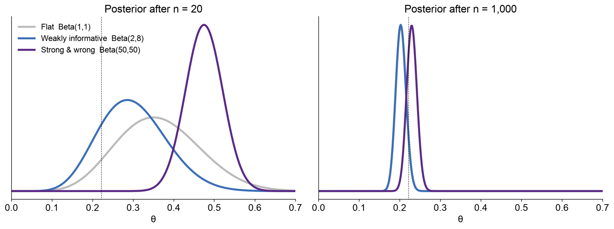{.pic style="max-height:700px"}
::::
:::

## {background-image="img/w06/bayes_slide_025.jpg" background-size="contain" .fallback}
<!-- src: Week X - Bayesian Statistics.pptx slide 25 -->

::: notes
Slide text: Choosing a Prior · Flat · Beta(1, 1) · Every value equally likely. Lets the data speak, but can give silly answers with tiny samples. · Weakly informative · Beta(2, 8) · Rules out absurd values without committing to much. The usual default. · Informative · Beta(20, 80) · Encodes real prior evidence, e.g. last year's survey or a meta-analysis. · The critique: 'priors are subjective, so you can get any answer you want' · The response: every model makes subjective choices (which controls? which sample? α = 0.05?). Priors are at least written down. Report them, and show that your conclusions survive reasonable alternatives (a sensitivity analysis)
:::

## Credible Intervals
<!-- src: Week X - Bayesian Statistics.pptx slide 26 -->

::: {.columns}
:::: {.column width="41%"}
- Because the posterior is a probability distribution **for θ**, we can make direct probability statements about θ
- 'There is a **95% probability** that the union membership rate is between **21.1% and 26.3%**'
- This is the sentence everyone **wants** to say about a confidence interval, but can't
::::
:::: {.column width="59%"}
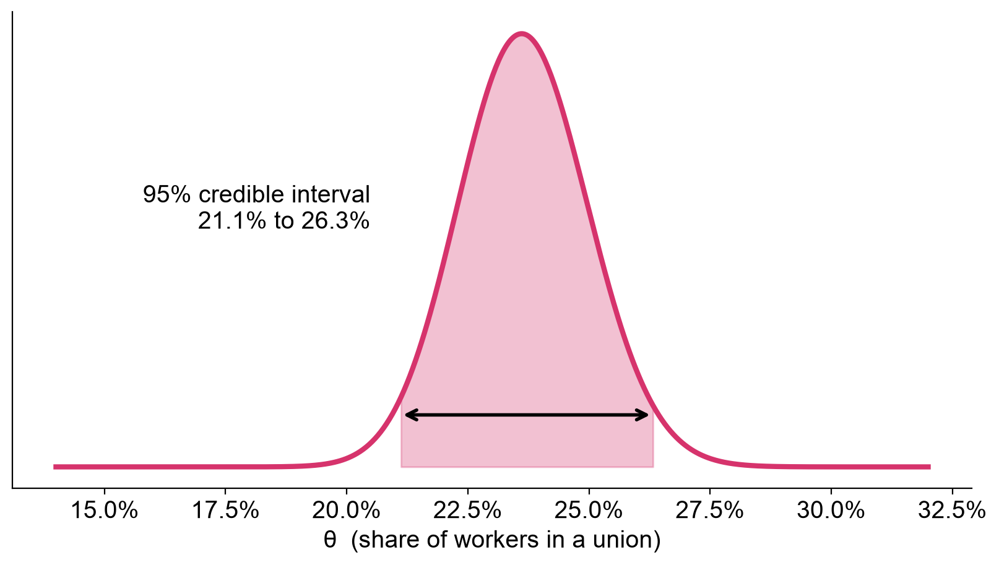{.pic style="max-height:700px"}
::::
:::

## Confidence vs. Credible Intervals
<!-- src: Week X - Bayesian Statistics.pptx slide 27 -->

|  | 95% Confidence interval | 95% Credible interval |
|---|---|---|
| θ is... | A fixed, unknown number | A random variable with a distribution |
| Randomness comes from | The sampling process | Our uncertainty about θ |
| Correct interpretation | If we repeated the study many times, 95% of intervals would contain θ | Given the data and prior, there's a 95% probability θ is in this interval |
| Needs a prior? | No | Yes |
| With lots of data and a flat prior | Nearly identical numbers | Nearly identical numbers |

# 6. Bayes vs. Frequentism
<!-- src: Week X - Bayesian Statistics.pptx slide 35 -->

## Two Schools
<!-- src: Week X - Bayesian Statistics.pptx slide 36 -->

|  | Frequentist | Bayesian |
|---|---|---|
| Probability means | Long-run frequency of events | Degree of belief |
| Parameters (θ) are | Fixed but unknown | Uncertain, with a distribution |
| Prior knowledge | Not formally used | Encoded in the prior |
| Main output | Point estimate, p-value, confidence interval | Posterior distribution |
| Answers | P(data \| hypothesis) | P(hypothesis \| data) |
| Main criticism | Answers a question nobody asked | Priors are subjective |
| Computation | Usually fast, closed-form | Often needs MCMC |

## Which Should You Use?
<!-- src: Week X - Bayesian Statistics.pptx slide 37 -->

- It's not a religion. With lots of data and weak priors, the two approaches give **nearly identical numbers**
- Bayesian methods shine when:
    - Samples are **small**, or some groups are tiny (e.g. estimating rates for small areas or rare subgroups)
    - You have genuine **prior information** worth using
    - Data arrive **sequentially** and decisions can't wait (search, trials, forecasting)
    - You want to say how **probable** a hypothesis is, not just whether to reject it
- Whichever you use: state your assumptions, visualise uncertainty, and never report a p-value as the probability your hypothesis is true

## Recap
<!-- src: Week 6 - Hypothesis Testing.pptx slide 63 -->

- The purpose of a T-test is to determine
    - **whether the sample mean difference indicates a real mean difference between the two populations** or
    - **whether the obtained difference is simply the result of sampling error.**
- Hypothesis testing has 4 steps:
    1. State the hypotheses.
    1. Select an α level (e.g. 95%, 99%) and locate the critical region.
    1. Compute the test statistic.
    1. Make a decision
- The hypothesis testing procedure, and the T-Test, are foundational to empirical research from medicine to social and physical sciences.
- But, just because a result is statistically significant, doesn’t mean it’s true!

## Any Questions?
<!-- src: Week 6 - Hypothesis Testing.pptx slide 64 -->

[o.ballinger@ucl.ac.uk](mailto:o.ballinger@ucl.ac.uk)
