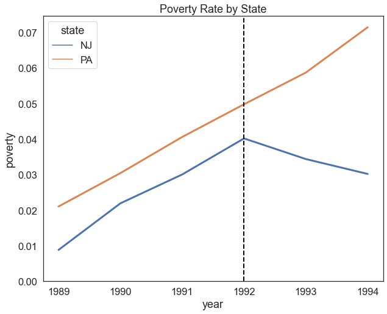
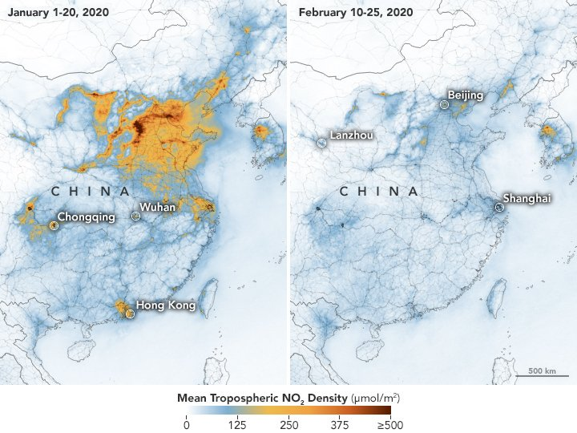
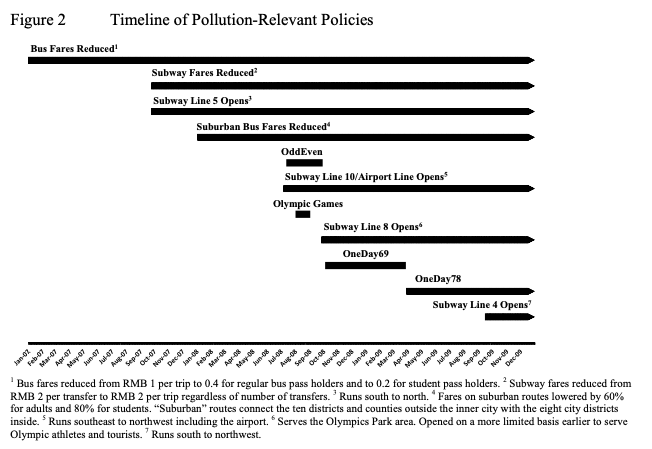
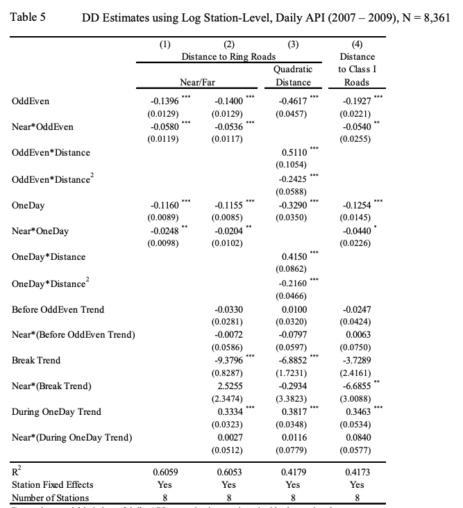

## Outline
<!-- src: Week 8 - Causal Inference I.pptx slide 2 -->

1. Panel Regression
1. Case Study 1: The Mariel Boatlift
1. Difference in Differences
1. Case Study 2: Driving Bans in China

## {background-image="img/w08/w08_c951146b87.jpg" background-size="contain"}
<!-- src: Week 8 - Causal Inference I.pptx slide 3 -->

## {background-image="img/w08/w08_slide_004.jpg" background-size="contain" .fallback}
<!-- src: Week 8 - Causal Inference I.pptx slide 4 -->

::: notes
Slide text: $2.13/hr
:::

# Panel Regression
<!-- src: Week 8 - Causal Inference I.pptx slide 5 -->

## {background-image="img/w08/w08_slide_006.jpg" background-size="contain" .fallback}
<!-- src: Week 8 - Causal Inference I.pptx slide 6 -->

::: notes
Slide text: Panel Data · Each point represents the employment rate of a state in a given year. How would you model the relationship between the two? · Employment · Minimum Wage
:::

## {background-image="img/w08/w08_slide_007.jpg" background-size="contain" .fallback}
<!-- src: Week 8 - Causal Inference I.pptx slide 7 -->

::: notes
Slide text: Pooled OLS · Employment · Minimum Wage
:::

## {background-image="img/w08/w08_slide_008.jpg" background-size="contain" .fallback}
<!-- src: Week 8 - Causal Inference I.pptx slide 8 -->

::: notes
Slide text: Fixed Individual-Level Effects · Points are now colored by state and labeled by year. How would you model the relationship between minimum wage and employment now? · Employment · Minimum Wage · 2018 · 2019 · 2020 · 2021 · 2018 · 2019 · 2020 · 2021 · 2018 · 2019 · 2020 · 2021 · 2018 · 2019 · 2020 · 2021 · 2018 · 2019 · 2020 · 2021 · California · New Jersey · Pennsylvania · Alaska · New York
:::

## Fixed-Effects Panel Regression
<!-- src: Week 8 - Causal Inference I.pptx slide 9 -->

- **Fixed effects** are [variables](https://www.statisticshowto.com/variable/) that are **constant across individuals**;
    - E.g. sex or ethnicity for individuals
    - Geographic size or terrain for countries/states
- These variables don’t change or **change at a constant rate over time**.
- They have fixed effects; in other words, any change they cause to an individual is the same.

## {background-image="img/w08/w08_slide_010.jpg" background-size="contain" .fallback}
<!-- src: Week 8 - Causal Inference I.pptx slide 10 -->

::: notes
Slide text: Fixed Effects · Employment · Minimum Wage
:::

## {background-image="img/w08/w08_slide_011.jpg" background-size="contain" .fallback}
<!-- src: Week 8 - Causal Inference I.pptx slide 11 -->

::: notes
Slide text: The Fixed Effects Estimator · Employment · Minimum Wage
:::

## {background-image="img/w08/w08_slide_012.jpg" background-size="contain" .fallback}
<!-- src: Week 8 - Causal Inference I.pptx slide 12 -->

::: notes
Slide text: Interpretation · When we have panel data (repeat observations of the same individuals i over multiple time periods t), there are two components to the variation: · Within  · Between · A fixed effects model allowsus to control for variation between groups due to time-invariant characteristics, and focus on identifying meaningfulvariation within groups. · Employment · Minimum Wage
:::

## Correlation vs. Causation
<!-- src: Week 8 - Causal Inference I.pptx slide 13 -->

- Just because we observe a correlation between X and Y, we **cannot** say that X causes Y.
- We observe that broadly, as minimum wages increase over time, poverty decreases. Our regression returns statistically significant results. Why might we hesitate in saying for certain that increasing the minimum wage decreases poverty?
- **Endogeneity**
    - Occurs when the independent variable X is correlated with the error term e.

## Endogeneity
<!-- src: Week 8 - Causal Inference I.pptx slide 14 -->

- There are three main sources of endogeneity:
    1. **Omitted Variables**
        - The relationship between X and Y is mediated by an unobserved variable Z.
        - E.g. i run a regression between the percent of a district that is forest and the total number of crimes in a year. Massive negative effect. Do trees reduce crime?
    1. **Simultaneity**
        - X causes Y, but Y also causes X. In its most extreme form, we might worry about *reverse causality*.
        - E.g. If I run a panel regression across countries where x=poverty and y=conflict incidence, I’ll probably see a correlation. But does poverty cause war, or does war cause poverty, or both?
    1. **Selection Bias**
        - The sample is not representative of the wider population.
        - E.g. conducting phone interviews for political polling will probably overestimate conservative support because old people use landlines and tend to vote conservative.

## Experimental Designs
<!-- src: Week 8 - Causal Inference I.pptx slide 15 -->

::: {.columns}
:::: {.column width="27%"}
- To measure the **causal effect** of an intervention, we need to isolate its effect.
- In experimental settings, we can do this through randomization.
- But what about non-experimental settings?
::::
:::: {.column width="73%"}

::::
:::

# Case Study 1: Immigration and Employment
<!-- src: Week 8 - Causal Inference I.pptx slide 16 -->

## Does immigration increase unemployment
<!-- src: Week 8 - Causal Inference I.pptx slide 17 -->

::: {.columns}
:::: {.column width="66%"}
- Many argue that immigration is undesirable because low-skilled immigrants may displace low-skilled or less-educated US citizens in the labor market.
- Anecdotal evidence for this claim includes newspaper accounts of hostility between immigrants and natives in some cities, but the empirical evidence is inconclusive.
- [Card’s (1990)](https://www.sciencedirect.com/science/article/pii/S1573446399030047#bb0280) study of the effect of immigration on the employment of American citizens, using a Difference in Differences design and the Mariel Boatlift.
::::
:::: {.column width="34%"}

::::
:::

## §
<!-- src: Week 8 - Causal Inference I.pptx slide 18 -->

{.r-stretch fig-align="center"}

## {background-image="img/w08/w08_82ecaf348c.jpg" background-size="contain"}
<!-- src: Week 8 - Causal Inference I.pptx slide 19 -->

## {background-image="img/w08/w08_slide_020.jpg" background-size="contain" .fallback}
<!-- src: Week 8 - Causal Inference I.pptx slide 20 -->

::: notes
Slide text: The Mariel Boatlift · In 1980 there was a mass emigration of Cubans to the United States.  · The exodus was driven by a stagnant economy that had weakened under the grip of a U.S. trade embargo.
:::

## {background-image="img/w08/w08_slide_021.jpg" background-size="contain" .fallback}
<!-- src: Week 8 - Causal Inference I.pptx slide 21 -->

::: notes
Slide text: “Those who have no revolutionary genes, those who have no revolutionary blood...we do not want them, we do not need them,”  · Castro declared in a May 1, 1980 speech. In a stance that reversed the government’s closed emigration policy, Castro told Cubans who wanted to leave Cuba to leave, and directed would-be emigrants to go to the Port of Mariel. · The Mariel Boatlift
:::

## Experimental Design
<!-- src: Week 8 - Causal Inference I.pptx slide 22 -->

- **Data**: Current Population Survey (CPS), same data we’ve been using in the workshops
- **Treatment Group**: Miami
- **Control Group**: Atlanta, Los Angeles, Houston, and Tampa-St. Petersburg. These cities were chosen because, like Miami, they have large Black and Hispanic populations and because discussions of the impact of immigrants often focuses on the consequences for minorities. Most importantly, these cities appear to have employment trends similar to those in Miami at least since 1976.
- **Treatment period**: pre/post 1980

## {.notitle}
<!-- src: Week 8 - Causal Inference I.pptx slide 23 -->

::: {.columns}
:::: {.column width="50%"}

::::
:::: {.column width="50%"}

::::
:::

## {background-image="img/w08/w08_slide_024.jpg" background-size="contain" .fallback}
<!-- src: Week 8 - Causal Inference I.pptx slide 24 -->

::: notes
Slide text: Results · Unemployment
:::

## Results
<!-- src: Week 8 - Causal Inference I.pptx slide 25 -->

- Between 1981 and 1979, the unemployment rate for Blacks in Miami rose by about 1.3%, though this change is not significant.
- Unemployment rates in the comparisons cities rose even more, by 2.3%. The difference in these two changes, − 1.0%, is a DD estimate of the effect of the Mariel immigrants on the unemployment rate of Blacks in Miami.
- In this case, the estimated effect on the unemployment rate is actually negative, though not significantly different from zero.

## Findings
<!-- src: Week 8 - Causal Inference I.pptx slide 26 -->

- The Mariel immigrants increased the Miami labor force by 7%, and the percentage increase in labor supply to less-skilled occupations and industries was even greater because most of the immigrants were relatively unskilled.
- **The Mariel influx appears to have had virtually no effect on the wages or unemployment rates of less-skilled workers, even among Cubans who had immigrated earlier.**
- The author suggests that the ability of Miami's labor market to rapidly absorb the Mariel immigrants was largely owing to its adjustment to other large waves of immigrants in the two decades before the Mariel Boatlift.

# Difference-in-Differences
<!-- src: Week 8 - Causal Inference I.pptx slide 27 -->

## What is Difference-in-Differences?
<!-- src: Week 8 - Causal Inference I.pptx slide 28 -->

- Differences-in-differences strategies are simple panel-data methods applied to sets of group means in cases when certain groups are exposed to the causing variable of interest and others are not.
- This approach, which is transparent and often at least superficially plausible, is well-suited to estimating the effect of sharp changes in the economic environment or changes in government policy.

## Counterfactuals
<!-- src: Week 8 - Causal Inference I.pptx slide 29 -->

- Difference in differences requires a few things:
    1. **A treatment located at a point in time**
    1. **Two distinct groups for which we have measurement pre-and post- treatment**
    1. Parallel pre-treatment trends in the outcome variable y
    1. No simultaneous treatment occurring around our treatment of interest
- These allow us to construct a valid **counterfactual:**
    - We can argue that the control group in the post-treatment period acts as a valid representation of the treatment group’s behaviour in the absence of treatment. We can thus interpret the difference between the two as the causal effect of the treatment.

## Do Minimum Wages Decrease Poverty?
<!-- src: Week 8 - Causal Inference I.pptx slide 30 -->

- A bill signed into law on November 1989 raised the federal minimum wage from $3.35 per hour to $3.8 effective April 1, 1990, with a further increase from $4.25 per hour to $5.05 on April 1, 1992.
- New Jersey experiences the wage increase but not in Pennsylvania.
- David and Krueger run two rounds of survey right before and after the rise.

## Correlation versus Causation
<!-- src: Week 8 - Causal Inference I.pptx slide 31 -->

- We cannot draw **causal** conclusions by observing simple before-and-after changes in outcomes, as factors other than the treatment may influence the outcome over time.
    - E.g. New Jersey may have also implemented new social programmes, improved public transport, etc. which would also influence poverty.
- We cannot simply compare NJ and PA directly due to differences in unobservable characteristics between the states.
    - E.g. geographic size, economic structure, population, governance, etc.

## {background-image="img/w08/w08_slide_032.jpg" background-size="contain" .fallback}
<!-- src: Week 8 - Causal Inference I.pptx slide 32 -->

::: notes
Slide text: Difference-in-differences · Difference-in-differences combines these two methods to compare the before-and-after changes in outcomes for treatment and control groups and estimate the overall impact of the treatment.
:::

## Do Minimum Wages Decrease Poverty?
<!-- src: Week 8 - Causal Inference I.pptx slide 33 -->

::: {.columns}
:::: {.column width="25%"}
| State | Year | Treatment | Post | Poverty |
|---|---|---|---|---|
| NJ | 1989 | 1 | 0 | 0.1 |
| NJ | 1990 | 1 | 0 | 0.2 |
| NJ | 1991 | 1 | 0 | 0.3 |
| NJ | 1992 | 1 | 1 | 0.25 |
| NJ | 1993 | 1 | 1 | 0.2 |
| NJ | 1994 | 1 | 1 | 0.15 |
| PA | 1989 | 0 | 0 | 0.2 |
| PA | 1990 | 0 | 0 | 0.3 |
| PA | 1991 | 0 | 0 | 0.4 |
| PA | 1992 | 0 | 1 | 0.5 |
| PA | 1993 | 0 | 1 | 0.6 |
| PA | 1994 | 0 | 1 | 0.7 |
::::
:::: {.column width="75%"}

::::
:::

## {background-image="img/w08/w08_slide_034.jpg" background-size="contain" .fallback}
<!-- src: Week 8 - Causal Inference I.pptx slide 34 -->

::: notes
Slide text: The Four Scenarios
:::

## {background-image="img/w08/w08_slide_035.jpg" background-size="contain" .fallback}
<!-- src: Week 8 - Causal Inference I.pptx slide 35 -->

## {background-image="img/w08/w08_slide_036.jpg" background-size="contain" .fallback}
<!-- src: Week 8 - Causal Inference I.pptx slide 36 -->

## Parallel Trends Assumption
<!-- src: Week 8 - Causal Inference I.pptx slide 37 -->

::: {.columns}
:::: {.column width="40%"}
- Treatment and control would have developed in the same way in the absence of treatment.
- We can provide suggestive evidence of this if we have data on pre-years.
::::
:::: {.column width="60%"}

::::
:::

## Assessing Parallel Trends
<!-- src: Week 8 - Causal Inference I.pptx slide 38 -->

1. Visual Assessment (are pre-treatment trends parallel)
1. Perform a placebo test using a fake treatment group. The fake treatment group should be a group that was not affected by the program. A placebo test that reveals zero impact supports the equal-trend assumption.
1. Perform a placebo test using a fake outcome. A placebo test that reveals zero impact supports the equal-trend assumption.
1. Perform the difference-in-differences estimation using different comparison groups. Similar estimates of the impact of program confirms the equal-trend assumption.

# Case Study 2: Air quality and Driving Restrictions
<!-- src: Week 8 - Causal Inference I.pptx slide 39 -->

## Exercise
<!-- src: Week 8 - Causal Inference I.pptx slide 40 -->

- Let’s think about how we would explore the relationship between air quality and driving restrictions in China.
- Seven Chinese cities have recently instituted driving bans; these cities are
    - Tianjin, Nanchang, Hangzhou, Lanzhou, Guiyang, Chengdu, and Changchun
- Suppose we have some data on the daily amount of traffic in these cities, and some data on pollution

## Air Quality Data
<!-- src: Week 8 - Causal Inference I.pptx slide 41 -->

::: {.columns}
:::: {.column width="38%"}
- Pollution dropped significantly during the coronavirus pandemic
- Air quality was measured using satellite-borne sensors of various pollutants such as Nitrogen Dioxide (NO2).
::::
:::: {.column width="62%"}

::::
:::

## {background-image="img/w08/w08_slide_042.jpg" background-size="contain" .fallback}
<!-- src: Week 8 - Causal Inference I.pptx slide 42 -->

::: notes
Slide text: Design a Panel Regression
:::

## Omitted Variables
<!-- src: Week 8 - Causal Inference I.pptx slide 43 -->

- Air quality metrics like AQI are closely related to other atmospheric variables like moisture and temperature.
    - The restrictions came in to effect in July, when it tends to be hot and humid.
- Are cars the only source of air pollution?

## Simultaneity
<!-- src: Week 8 - Causal Inference I.pptx slide 44 -->

{.r-stretch fig-align="center"}

## Selection Bias
<!-- src: Week 8 - Causal Inference I.pptx slide 45 -->

- It has been argued that compositional changes in monitoring stations over time may reflect systematic government decisions to close stations in highly polluted places to improve air quality statistics with out actually improving air quality
    - E.g. Andrews, S. Q. (2008). “Inconsistencies in Air Quality Metrics: ‘Blue Sky’ Days and PM10 Concentrations in Beijing,” Environmental Research Letters, 3, 1 – 14.

## Driving Restrictions
<!-- src: Week 8 - Causal Inference I.pptx slide 46 -->

- [Viard](https://www.aeaweb.org/conference/2014/retrieve.php?pdfid=138) [and Fu, 2013](https://www.aeaweb.org/conference/2014/retrieve.php?pdfid=138)
- Driving restrictions are used in numerous cities around the world to reduce pollution and congestion.
- Such restrictions may be ineffective either due to non-compliance or compensating responses such as inter-temporal substitution of driving or adding second vehicles.
- If effective, they may lower economic activity by increasing commute costs and reducing workers’ willingness to supply labor for given compensation.

## Motivation
<!-- src: Week 8 - Causal Inference I.pptx slide 47 -->

- There is little empirical evidence of driving restrictions’ effect on pollution and none about their effect on economic activity.
- We examine both effects under driving restrictions imposed by the Beijing government since July 20, 2008. The restrictions, based on license plate numbers, initially prevented driving every other day and later one day per week.

## {background-image="img/w08/w08_slide_048.jpg" background-size="contain" .fallback}
<!-- src: Week 8 - Causal Inference I.pptx slide 48 -->

## {background-image="img/w08/w08_f308a59efb.png" background-size="contain"}
<!-- src: Week 8 - Causal Inference I.pptx slide 49 -->

## Experimental Design
<!-- src: Week 8 - Causal Inference I.pptx slide 50 -->

- **Question: What is the effect of driving restrictions on air quality in Beijing?**
- **Data**: A panel dataset with daily measures of Beijing air pollution at the individual monitoring-station level, spanning January 1, 2007 to December 31, 2009.
- **Treatment Group**: Air quality monitoring stations near roads
- **Control Group**: Air quality monitoring stations far from roads
- **Treatment period**: After the implementation of the driving restriction.

## {background-image="img/w08/w08_slide_051.jpg" background-size="contain" .fallback}
<!-- src: Week 8 - Causal Inference I.pptx slide 51 -->

::: notes
where S APIst is the daily API at station s on day t. 

a: station fixed effects. that control for time-constant unobserved factors that cause some stations to have higher pollution levels. This includes nearby stationary pollution sources as well as the baseline effect of distance to a major road. These fixed effects prevent the estimate of the treatment effect from being biased upward by the fact that stations closer to a major road have higher pollution levels, both before and after the treatment, than do stations further away.

m: month-ofyear dummies to capture seasonality, 
WE: weekend and 
HO: holiday dummies to allow for differential effects, 

BR: dummies during the break between the two policies. 

OE: odd even policy 
OD: One Day policy

The BR , OE , OD , and OD WE * terms prevent the estimate of the treatment effect from being biased by the fact that all monitoring stations, regardless of distance from a major road, may be affected by the driving restrictions.

The control variables Zst  include the same daily weather controls as before as well as station-level indicators for days when the API is below 50 or sulfur dioxide is the worst pollutant. 

which captures the effect of the driving restrictions as a function of distance Dists  between each station and the nearest major road.

DDst  which captures the effect of the driving restrictions as a function of distance Dists  between each station and the nearest major road. 

f

Slide text: Experimental Design · “Particulate matter’s ambient properties dictate that it is deposited within a few kilometers of its release. We exploit this to develop a differences-in-differences (DD) approach that combines time-series variation with spatial variation in monitoring stations’ locations to eliminate other explanations besides cars for the pollution reduction.”
:::

## Identifying Assumptions
<!-- src: Week 8 - Causal Inference I.pptx slide 52 -->

- The identifying assumption for our DD estimation is that, conditional on the other covariates, station-specific unobserved factors affecting the API are uncorrelated with the treatment.
- That is, **unobserved factors do not vary systematically with distance from a major road during the policy periods relative to before.**
- This assumption may not hold if stations closer to a major road have different long-term pollution trends than those further away. This might be the case if, for example, traffic patterns changed differently over time on major roads relative to smaller roads.

## Results
<!-- src: Week 8 - Causal Inference I.pptx slide 53 -->

::: {.columns}
:::: {.column width="41%"}
- The effects are highly significant with either a 45- and 60-day window showing declines of
    - 12% and 19% for “far” stations
    - 16% and 23% for “near” stations.
::::
:::: {.column width="59%"}

::::
:::

## Detailed Results
<!-- src: Week 8 - Causal Inference I.pptx slide 54 -->

::: {.columns}
:::: {.column width="46%"}
Instead of just using a binary near/far cutoff, these results use continuous distance
::::
:::: {.column width="54%"}

::::
:::

## Findings
<!-- src: Week 8 - Causal Inference I.pptx slide 55 -->

- Pollution drops more at stations closer to a major road. This means confounding factors are related to proximity to a major road and therefore traffic flow. We consider, and rule out, changes in gasoline prices, parking rates, number of taxis, emissions standards, and government-imposed working hours.
- **The** **OddEven** **policy reduces the API by 12.5%**
- **The** **OneDay** **policy reduces the API by 16.0%**

## Any Questions?
<!-- src: Week 8 - Causal Inference I.pptx slide 56 -->

[o.ballinger@ucl.ac.uk](mailto:o.ballinger@ucl.ac.uk)
