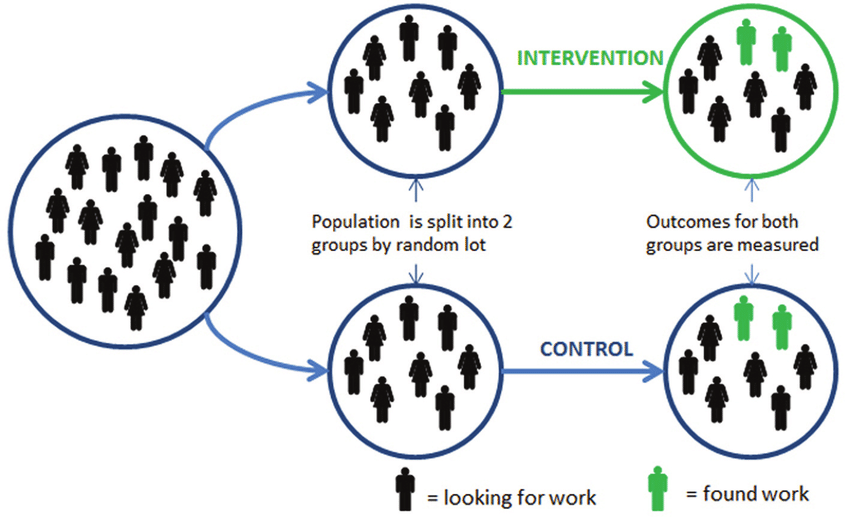
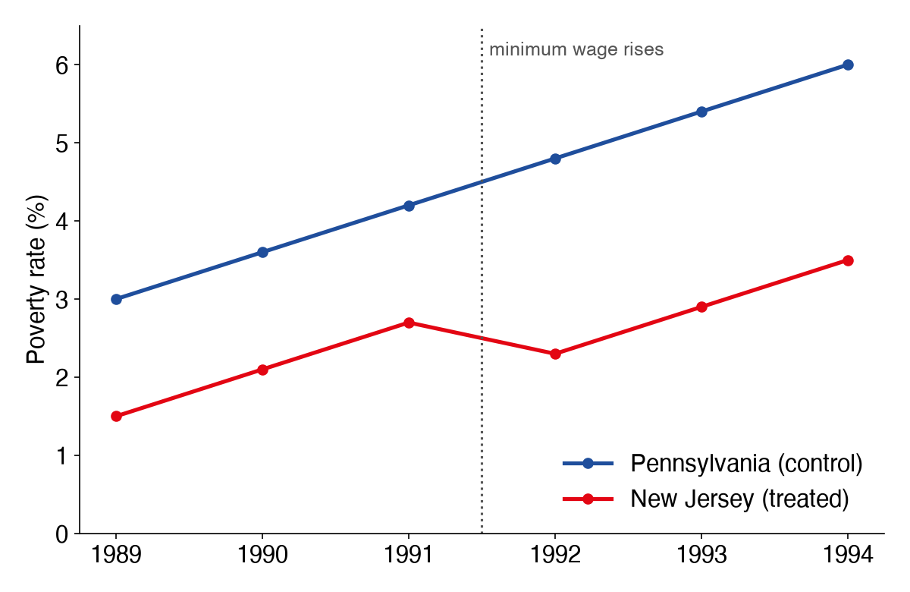
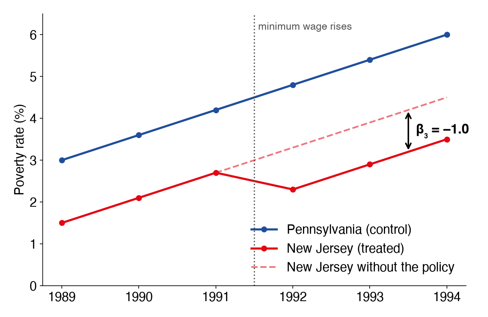
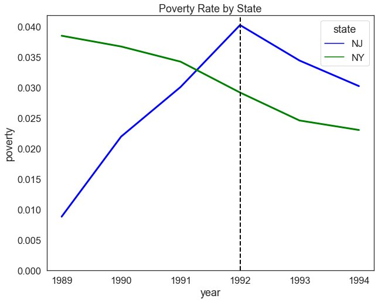
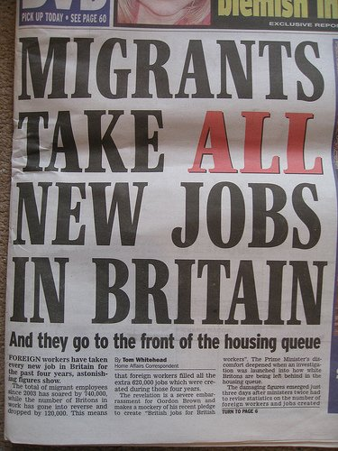
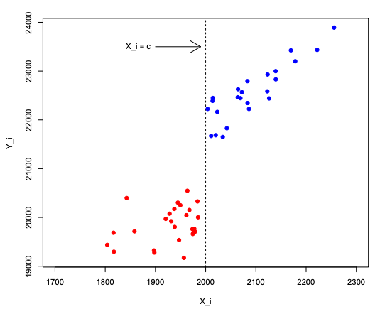
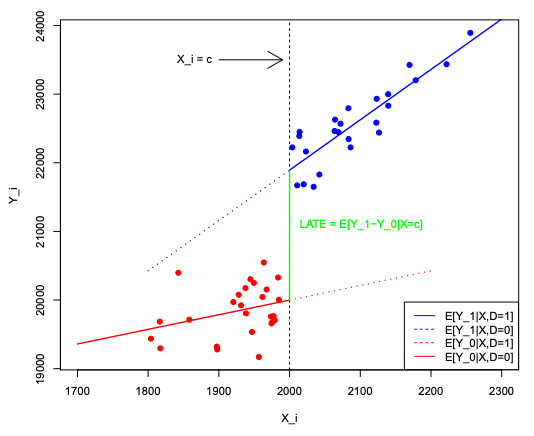
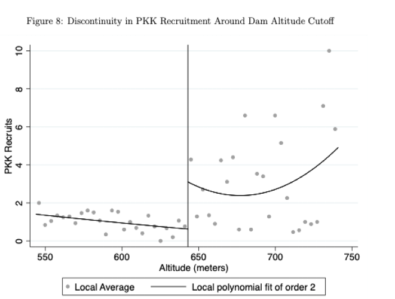

## Outline

1. Why correlation isn't enough
1. Difference-in-Differences
1. Case Study: The Mariel Boatlift
1. Regression Discontinuity
1. Case Study: Irrigation and Insurgency
1. Auditing a causal claim

## {background-image="img/w08/w08_c951146b87.jpg" background-size="contain"}
<!-- src: Week 8 - Causal Inference I.pptx slide 3 -->

## {background-image="img/w08/w08_slide_004.jpg" background-size="contain" .fallback}
<!-- src: Week 8 - Causal Inference I.pptx slide 4 -->

::: notes
Slide text: $2.13/hr
:::

## Correlation vs. Causation
<!-- src: Week 8 - Causal Inference I.pptx slide 13 -->

- Just because we observe a correlation between X and Y, we **cannot** say that X causes Y.
- We observe that broadly, as minimum wages increase over time, poverty decreases. Our regression returns statistically significant results. Why might we hesitate in saying for certain that increasing the minimum wage decreases poverty?
- **Endogeneity**
    - Occurs when the independent variable X is correlated with the error term e.

## Endogeneity
<!-- src: Week 8 - Causal Inference I.pptx slide 14 -->

- There are three main sources of endogeneity:
    1. **Omitted Variables**
        - The relationship between X and Y is mediated by an unobserved variable Z.
        - E.g. i run a regression between the percent of a district that is forest and the total number of crimes in a year. Massive negative effect. Do trees reduce crime?
    1. **Simultaneity**
        - X causes Y, but Y also causes X. In its most extreme form, we might worry about *reverse causality*.
        - E.g. If I run a panel regression across countries where x=poverty and y=conflict incidence, I’ll probably see a correlation. But does poverty cause war, or does war cause poverty, or both?
    1. **Selection Bias**
        - The sample is not representative of the wider population.
        - E.g. conducting phone interviews for political polling will probably overestimate conservative support because old people use landlines and tend to vote conservative.

## Experimental Designs
<!-- src: Week 8 - Causal Inference I.pptx slide 15 -->

::: {.columns}
:::: {.column width="27%"}
- To measure the **causal effect** of an intervention, we need to isolate its effect.
- In experimental settings, we can do this through randomization.
- But what about non-experimental settings?
::::
:::: {.column width="73%"}

::::
:::

## The Counterfactual Problem

- The causal effect is the outcome **with** the treatment minus the outcome **without** it, for the same units
- We only ever observe one of the two
- A randomised experiment solves this: treated and control groups are alike on average
- Without randomisation we need a design that builds a credible stand-in for the missing counterfactual:
    - **Difference-in-Differences**: a group that would have followed the same trend
    - **Regression Discontinuity**: units just the other side of a cutoff

# Difference-in-Differences
<!-- src: Week 8 - Causal Inference I.pptx slide 27 -->

## Counterfactuals
<!-- src: Week 8 - Causal Inference I.pptx slide 29 -->

- Difference in differences requires a few things:
    1. **A treatment located at a point in time**
    1. **Two distinct groups for which we have measurement pre-and post- treatment**
    1. Parallel pre-treatment trends in the outcome variable y
    1. No simultaneous treatment occurring around our treatment of interest
- These allow us to construct a valid **counterfactual:**
    - We can argue that the control group in the post-treatment period acts as a valid representation of the treatment group’s behaviour in the absence of treatment. We can thus interpret the difference between the two as the causal effect of the treatment.

## Do Minimum Wages Decrease Poverty?
<!-- src: Week 8 - Causal Inference I.pptx slide 30 -->

- A bill signed into law on November 1989 raised the federal minimum wage from $3.35 per hour to $3.8 effective April 1, 1990, with a further increase from $4.25 per hour to $5.05 on April 1, 1992.
- New Jersey experiences the wage increase but not in Pennsylvania.
- David and Krueger run two rounds of survey right before and after the rise.

## Why Not Just Compare Before and After?
<!-- src: Week 8 - Causal Inference I.pptx slide 31 -->

- We cannot draw **causal** conclusions by observing simple before-and-after changes in outcomes, as factors other than the treatment may influence the outcome over time.
    - E.g. New Jersey may have also implemented new social programmes, improved public transport, etc. which would also influence poverty.
- We cannot simply compare NJ and PA directly due to differences in unobservable characteristics between the states.
    - E.g. geographic size, economic structure, population, governance, etc.

## Difference-in-Differences

Compare the **before-and-after change** in the treated group with the change in the control group:

$$Y_{it} = \beta_0 + \beta_1 Post_t + \beta_2 Treat_i + \beta_3 (Treat_i \times Post_t) + \varepsilon_{it}$$

|            | Control           | Treatment                               |
|------------|-------------------|-----------------------------------------|
| **Before** | $\beta_0$           | $\beta_0 + \beta_2$                     |
| **After**  | $\beta_0 + \beta_1$ | $\beta_0 + \beta_1 + \beta_2 + \beta_3$ |

$\beta_3$ is the difference-in-differences: the treatment effect.

## Do Minimum Wages Decrease Poverty? {.smaller}

::: {.columns}
:::: {.column width="42%"}

| State | Year | Treat | Post | Poverty (%) |
|---|---|---|---|---|
| NJ | 1989 | 1 | 0 | 1.5 |
| NJ | 1990 | 1 | 0 | 2.1 |
| NJ | 1991 | 1 | 0 | 2.7 |
| NJ | 1992 | 1 | 1 | 2.3 |
| NJ | 1993 | 1 | 1 | 2.9 |
| NJ | 1994 | 1 | 1 | 3.5 |
| PA | 1989 | 0 | 0 | 3.0 |
| PA | 1990 | 0 | 0 | 3.6 |
| PA | 1991 | 0 | 0 | 4.2 |
| PA | 1992 | 0 | 1 | 4.8 |
| PA | 1993 | 0 | 1 | 5.4 |
| PA | 1994 | 0 | 1 | 6.0 |
::::
:::: {.column width="58%"}

::::
:::

::: notes
Illustrative numbers, not real poverty rates. They are generated by tools/causal_figs.py.
:::

## Reading Off the Effect {.smaller}

::: {.columns}
:::: {.column width="48%"}
Mean poverty rate (%), before (1989–91) and after (1992–94):

|                    | PA (control)       | NJ (treated)                   | NJ − PA            |
|--------------------|--------------------|--------------------------------|--------------------|
| **Before**         | 3.6 = $\beta_0$       | 2.1 = $\beta_0+\beta_2$           | −1.5 = $\beta_2$      |
| **After**          | 5.4 = $\beta_0+\beta_1$ | 2.9 = $\beta_0+\beta_1+\beta_2+\beta_3$ | −2.5 = $\beta_2+\beta_3$ |
| **After − Before** | 1.8 = $\beta_1$       | 0.8 = $\beta_1+\beta_3$           | **−1.0 = $\beta_3$**  |

The policy lowered poverty in NJ by **1 percentage point** relative to the trend it would have followed.
::::
:::: {.column width="52%"}

::::
:::

## Parallel Trends Assumption
<!-- src: Week 8 - Causal Inference I.pptx slide 37 -->

::: {.columns}
:::: {.column width="40%"}
- Treatment and control would have developed in the same way in the absence of treatment.
- We can provide suggestive evidence of this if we have data on pre-years.
::::
:::: {.column width="60%"}

::::
:::

## Assessing Parallel Trends
<!-- src: Week 8 - Causal Inference I.pptx slide 38 -->

1. Visual Assessment (are pre-treatment trends parallel)
1. Perform a placebo test using a fake treatment group. The fake treatment group should be a group that was not affected by the program. A placebo test that reveals zero impact supports the equal-trend assumption.
1. Perform a placebo test using a fake outcome. A placebo test that reveals zero impact supports the equal-trend assumption.
1. Perform the difference-in-differences estimation using different comparison groups. Similar estimates of the impact of program confirms the equal-trend assumption.

# Case Study: The Mariel Boatlift
<!-- src: Week 8 - Causal Inference I.pptx slide 16 -->

## Does immigration increase unemployment
<!-- src: Week 8 - Causal Inference I.pptx slide 17 -->

::: {.columns}
:::: {.column width="66%"}
- Many argue that immigration is undesirable because low-skilled immigrants may displace low-skilled or less-educated US citizens in the labor market.
- Anecdotal evidence for this claim includes newspaper accounts of hostility between immigrants and natives in some cities, but the empirical evidence is inconclusive.
- [Card’s (1990)](https://www.sciencedirect.com/science/article/pii/S1573446399030047#bb0280) study of the effect of immigration on the employment of American citizens, using a Difference in Differences design and the Mariel Boatlift.
::::
:::: {.column width="34%"}

::::
:::

## {background-image="img/w08/w08_82ecaf348c.jpg" background-size="contain"}
<!-- src: Week 8 - Causal Inference I.pptx slide 19 -->

## Experimental Design
<!-- src: Week 8 - Causal Inference I.pptx slide 22 -->

- **Data**: Current Population Survey (CPS), same data we’ve been using in the workshops
- **Treatment Group**: Miami
- **Control Group**: Atlanta, Los Angeles, Houston, and Tampa-St. Petersburg. These cities were chosen because, like Miami, they have large Black and Hispanic populations and because discussions of the impact of immigrants often focuses on the consequences for minorities. Most importantly, these cities appear to have employment trends similar to those in Miami at least since 1976.
- **Treatment period**: pre/post 1980

## Results {.smaller}

Unemployment rates (%), standard errors in brackets:

|                                  | 1979       | 1981        | 1981 − 1979 |
|----------------------------------|------------|-------------|-------------|
| ***Whites***                     |            |             |             |
| Miami                            | 5.1 (1.1)  | 3.9 (0.9)   | −1.2 (1.4)  |
| Comparison cities                | 4.4 (0.3)  | 4.3 (0.3)   | −0.1 (0.4)  |
| **Miami − comparison**           | 0.7 (1.1)  | −0.4 (0.95) | **−1.1 (1.5)** |
| ***Blacks***                     |            |             |             |
| Miami                            | 8.3 (1.7)  | 9.6 (1.8)   | 1.3 (2.5)   |
| Comparison cities                | 10.3 (0.8) | 12.6 (0.9)  | 2.3 (1.2)   |
| **Miami − comparison**           | −2.0 (1.9) | −3.0 (2.0)  | **−1.0 (2.8)** |

Source: Card (1990), *Industrial and Labor Relations Review*.

## Findings
<!-- src: Week 8 - Causal Inference I.pptx slide 26 -->

- The Mariel immigrants increased the Miami labor force by 7%, and the percentage increase in labor supply to less-skilled occupations and industries was even greater because most of the immigrants were relatively unskilled.
- **The Mariel influx appears to have had virtually no effect on the wages or unemployment rates of less-skilled workers, even among Cubans who had immigrated earlier.**
- The author suggests that the ability of Miami's labor market to rapidly absorb the Mariel immigrants was largely owing to its adjustment to other large waves of immigrants in the two decades before the Mariel Boatlift.

# Regression Discontinuity
<!-- src: Week 9 - Causal Inference II.pptx slide 18 -->

## Regression Discontinuity Design
<!-- src: Week 9 - Causal Inference II.pptx slide 24 -->

- Regression Discontinuity Design (RDD) is a quasi-experimental evaluation option that measures the impact of an intervention, or treatment, by applying a treatment assignment mechanism based on a cutoff point in a continuous eligibility index.
- RDD estimates local average treatment effects around the cutoff point, where treatment and comparison units are most similar.
[Source: World Bank](https://dimewiki.worldbank.org/Regression_Discontinuity#:~:text=Regression%20Discontinuity%20Design%20(RDD)%20is,who%20is%20eligible%20to%20participate.)

## Conditions
<!-- src: Week 9 - Causal Inference II.pptx slide 26 -->

1. A continuous eligibility index
    - A continuous measure on which the population of interest is ranked (i.e. test score, poverty score, age).
1. A clearly defined cutoff point
    - A point on the index above or below which the population is determined to be eligible for the program.
    - For example, students with a test score of at least 80 of 100 might be eligible for a scholarship, households with a poverty score less than 60 out of 100 might be eligible for food stamps, and individuals age 67 and older might be eligible for pension. The cutoff points in these examples are 80, 60, and 67, respectively. The cutoff point may also be referred to as the threshold.

## {background-image="img/w08/w09_slide_027.jpg" background-size="contain" .fallback}
<!-- src: Week 9 - Causal Inference II.pptx slide 27 -->

::: notes
Slide text: Assumption 1 · The eligibility index should be continuous around the cutoff point. There should be no jumps in the eligibility index at the cutoff point or any other sign of individuals manipulating their eligibility index in order to increase their chances of being included in or excluded from the program. · Heaping around the cutoff · Continuous distribution
:::

## Assumption 2
<!-- src: Week 9 - Causal Inference II.pptx slide 28 -->

- Individuals close to the cutoff point should be very similar, on average, in observed and unobserved characteristics.
    - In the RDD framework, this means that the distribution of the **observed and unobserved variables should be continuous around the threshold.**
    - Even though researchers can check similarity between observed covariates, the similarity between unobserved characteristics must be assumed. This is considered a plausible assumption to make for individuals very close to the cutoff point, that is, for a relatively narrow window.

## {background-image="img/w08/w09_slide_031.jpg" background-size="contain" .fallback}
<!-- src: Week 9 - Causal Inference II.pptx slide 31 -->

::: notes
Slide text: Treatment Assignment
:::

## Observed Outcomes
<!-- src: Week 9 - Causal Inference II.pptx slide 32 -->

::: {.columns}
:::: {.column width="40%"}
There appears to be a jump in the observed values of the outcome variable (earnings) around the cutoff (scholarship eligibility)
::::
:::: {.column width="60%"}

::::
:::

## Potential Outcomes
<!-- src: Week 9 - Causal Inference II.pptx slide 33 -->

::: {.columns}
:::: {.column width="41%"}
We can use the discontinuity created by the treatment to estimate the effect of D on Y at the threshold
::::
:::: {.column width="59%"}

::::
:::

## {background-image="img/w08/w09_slide_036.jpg" background-size="contain" .fallback}
<!-- src: Week 9 - Causal Inference II.pptx slide 36 -->

::: notes
Slide text: Linear, Different Slopes
:::

## {background-image="img/w08/w09_slide_037.jpg" background-size="contain" .fallback}
<!-- src: Week 9 - Causal Inference II.pptx slide 37 -->

::: notes
Slide text: Non-Linear
:::

# Case Study: Irrigation and Insurgency

## Does irrigation reduce insurgent recruitment in Southeastern Turkey? {.center}
<!-- src: Week 9 - Causal Inference II.pptx slide 7 -->

## Kurdish Insurgency
<!-- src: Week 9 - Causal Inference II.pptx slide 3 -->

::: {.columns}
:::: {.column width="41%"}
- 44% of the population in Southeast living on less than US$1.1/day
- “The Kurdish identity question was expressed in terms of regional economic inequalities and suggested a socialist solution” (Yavuz, 2001: 10)
- Originally a “peasant movement”, recruiting largely from farming communities (Yavuz, 2001: 10)
::::
:::: {.column width="59%"}

::::
:::

## Southeastern Anatolia Project(GAP)
<!-- src: Week 9 - Causal Inference II.pptx slide 4 -->

::: {.columns}
:::: {.column width="55%"}
- Infrastructural development project started in 1985
- Goals:
    - 19 dams
    - 22 hydropower plants
    - 1.8 million hectares of irrigation
- Income gains associated with switch to irrigated farming: 3-7x (Tokdemir et. al., 2016)
- Government hoped it would reduce appeal of PKK
::::
:::: {.column width="45%"}

::::
:::

## RDD Framework
<!-- src: Week 9 - Causal Inference II.pptx slide 12 -->

- **Question**: Does irrigation reduce recruitment?
- **Endogenous variable**:
    - Irrigation– a village in the mountains is very different from a village in the lowlands, in ways that probably affect PKK recruitment
- **Exogenous cutoff**:
    - Dam elevation
- **Bandwidth**:
    - If we compare *just* above and *just* below the altitude of a dam, they’re probably going to be pretty similar in terms of demographics, politics, economy.
    - We could even make a plausible argument that the main difference between them is the ability to access irrigation

## {background-image="img/w08/w09_slide_014.jpg" background-size="contain" .fallback}
<!-- src: Week 9 - Causal Inference II.pptx slide 14 -->

::: notes
Slide text: Terrain and Irrigation · 5km x 5km cells · 3. Empirical Strategy
:::

## {.notitle}
<!-- src: Week 9 - Causal Inference II.pptx slide 15 -->

{.r-stretch fig-align="center"}

## Main Findings
<!-- src: Week 9 - Causal Inference II.pptx slide 17 -->

- Irrigation is negatively related to conflict incidence and recruitment.
- Panel models indicate that a **27km****2** **increase in irrigated area leads to a 49% drop in the probability of conflict.**
- Cross-sectional models suggest that **a fully irrigated 25km² area is 58% less likely than the average cell to experience a conflict event** involving Kurdish rebels during the 2016-2019 period

## Where RDD Shows Up: Close Elections
<!-- src: Week 9 - Causal Inference II.pptx slide 42 -->

- **Question**: Do members of Party A curtail women’s rights?
- **Running variable**:
    - Vote share– districts that are strongholds for Party A will be different in terms of their social, economic and cultural factors compared to strongholds of Party B.
- **Exogenous cutoff**:
    - Sharp, victory/loss (assuming a 2 party system, 50% vote share)
- **Bandwidth**:
    - 50%±4%
    - If we compare districts where candidates of that party narrowly won against those where they narrowly lost, those districts are very similar in terms of their **unobserved characteristics**

## Fuzzy Regression Discontinuity
<!-- src: Week 9 - Causal Inference II.pptx slide 45 -->

- Threshold may not perfectly determine treatment exposure, but **it creates a discontinuity in the probability of treatment exposure**
- Incentives to participate in a program may change discontinuously at a threshold, but the incentives are not powerful enough to move all units from non-participation to participation
- We can use such discontinuities to produce instrumental variable estimators of the effect of the treatment (close to the discontinuity)

## Sharp vs. Fuzzy RDD
<!-- src: Week 9 - Causal Inference II.pptx slide 46 -->

{.r-stretch fig-align="center"}

## Auditing a Causal Claim

Questions to ask of any DiD or RDD, including one an AI wrote for you:

- **What is the counterfactual**, and why should I believe it?
- **DiD**: were pre-treatment trends parallel? Does a placebo group or a fake treatment date show an "effect"? Did anything else change at the same time?
- **RDD**: could people manipulate the running variable (heaping at the cutoff)? Do other characteristics jump at the cutoff? Does the estimate survive a different bandwidth or functional form?
- **Who does it apply to?** DiD: the treated group. RDD: only units near the cutoff.

## Any Questions?
<!-- src: Week 9 - Causal Inference II.pptx slide 50 -->

[o.ballinger@ucl.ac.uk](mailto:o.ballinger@ucl.ac.uk)
