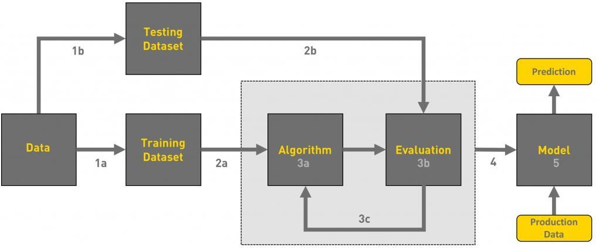
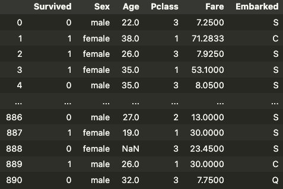
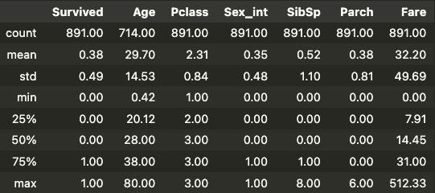
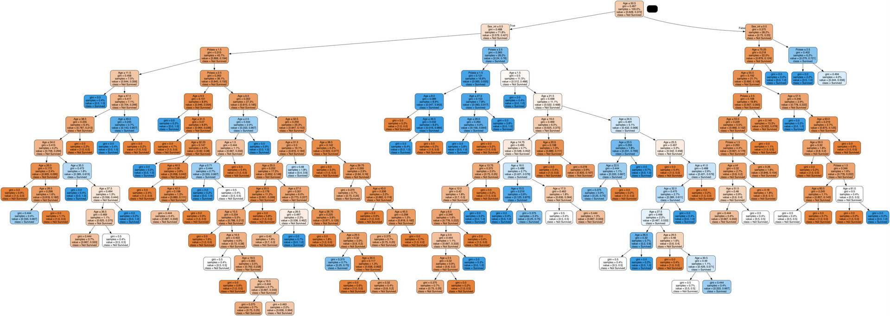
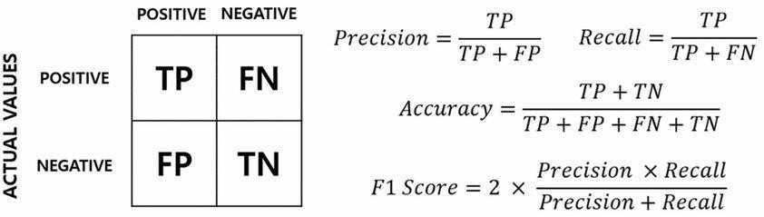
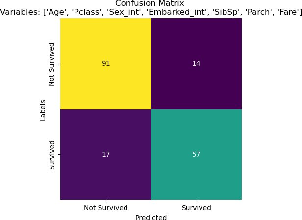
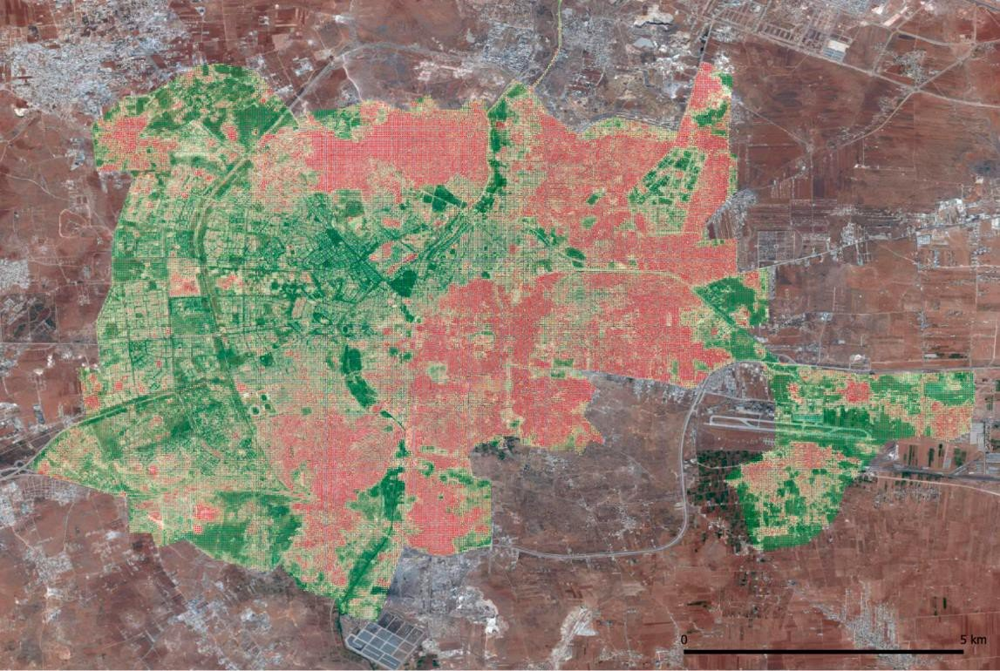

## {background-image="img/w09/w10_slide_002.jpg" background-size="contain" .fallback}
<!-- src: Week 10 - Machine Learning.pptx slide 2 -->

::: notes
Slide text: The Data Science Process: · Ask a Question · Get the Data · Explore the Data · Model the Data · Visualize the Results · Build a model · Fit the model · Validate the model
:::

## Outline

1. The Machine Learning Pipeline
1. Predicting Survival on the Titanic
1. Accuracy Assessment
1. Overfitting and Testing
1. Case Study: Monitoring War Damage from Space

## The Machine Learning Pipeline {.center}
<!-- src: Week 10 - Machine Learning.pptx slide 4 -->

## What is a “Model”?
<!-- src: Week 10 - Machine Learning.pptx slide 5 -->

- A model defines the relationship between **features** and **label**. 	For example, a spam detection model might associate certain 	features strongly with "spam". Let's highlight two phases of a 	model's life:
    - **Training** means creating or **learning** the model. That is, you show the 	model labeled examples and enable the model to gradually learn the 	relationships between features and label.
    - **Inference** means applying the trained model to unlabeled examples. 	That is, you use the trained model to make useful predictions (y').

## Regression vs. Classification
<!-- src: Week 10 - Machine Learning.pptx slide 6 -->

- A **regression** model predicts continuous values. For example, regression models make predictions that answer questions like the following:
    - What is the value of a house in California?
    - What is the probability that a user will click on this ad?
- A **classification** model predicts discrete values. For example, classification models make predictions that answer questions like the following:
    - Is a given email message spam or not spam?
    - Is this an image of a dog, a cat, or a hamster?

## Machine Learning Workflow
<!-- src: Week 10 - Machine Learning.pptx slide 7 -->

{.r-stretch fig-align="center"}

## The Decision Tree
<!-- src: Week 10 - Machine Learning.pptx slide 8 -->

A **decision** **tree** is a non-parametric supervised learning 	algorithm, which is utilized for both classification and regression 	tasks. It has a hierarchical, tree structure, which consists of a 	root node, branches, internal nodes and leaf nodes.

{.r-stretch fig-align="center"}

## The Random Forest Algorithm
<!-- src: Week 10 - Machine Learning.pptx slide 9 -->

The random forest algorithm is made up of a collection of 	decision trees, and each tree in the ensemble is comprised of a 	data sample drawn from a training set with replacement, called 	the bootstrap sample.

{.r-stretch fig-align="center"}

## {.notitle}
<!-- src: Week 10 - Machine Learning.pptx slide 10 -->

{.r-stretch fig-align="center"}

## Predicting Survival on the Titanic
<!-- src: Week 10 - Machine Learning.pptx slide 11 -->

::: {.columns}
:::: {.column width="27%"}
- Survived:
    - 1: survived
    - 0: didn’t survive
- Pclass:
    - 1: First Class
    - 2: Second Class
    - 3: Third Class
- Embarked:
    - C: Cherbourg
    - Q: Queenstown
    - S: Southampton
::::
:::: {.column width="73%"}
{.pic style="max-height:700px"}
::::
:::

## Descriptive Statistics
<!-- src: Week 10 - Machine Learning.pptx slide 12 -->

{.r-stretch fig-align="center"}

## A random forest with one feature
<!-- src: Week 10 - Machine Learning.pptx slide 13 -->

::: {.columns}
:::: {.column width="22%"}
- Sex_int
    - 0 for male
    - 1 for female
::::
:::: {.column width="78%"}
{.pic style="max-height:700px"}
::::
:::

## Age, Sex, Class
<!-- src: Week 10 - Machine Learning.pptx slide 17 -->

{.r-stretch fig-align="center"}

## Accuracy Assessment {.center}
<!-- src: Week 10 - Machine Learning.pptx slide 19 -->

## Accuracy: The boy who cried wolf
<!-- src: Week 10 - Machine Learning.pptx slide 20 -->

- **An** **Aesop's** **Fable:** **The** **Boy** **Who** **Cried** **Wolf** **(****compressed****)**
- A shepherd boy gets bored tending the town's flock. To have 	some fun, he cries out, "Wolf!" even though no wolf is in sight. 	The villagers run to protect the flock, but then get really mad 	when they realize the boy was playing a joke on them.
- [Iterate previous paragraph *N* times.]
- One night, the shepherd boy sees a real wolf approaching the flock and calls out, "Wolf!" The villagers refuse to be fooled again and stay in their houses. The hungry wolf turns the flock into lamb chops. The town goes hungry. Panic ensues.

## Accuracy: The boy who cried wolf
<!-- src: Week 10 - Machine Learning.pptx slide 21 -->

- Let's make the following definitions:
    - "Wolf" is a **positive** **class**.
    - "No wolf" is a **negative** **class**.
- A **true** **positive** is an outcome where the
- model *correctly* predicts the *positive* class. Similarly, a **true** **negative** is an outcome where the model *correctly* predicts the *negative* class.
- A **false** **positive** is an outcome where the
- model *incorrectly* predicts the *positive* class. And a **false** **negative** is an outcome where the model *incorrectly* predicts the *negative* class.

## {background-image="img/w09/w10_slide_022.jpg" background-size="contain" .fallback}
<!-- src: Week 10 - Machine Learning.pptx slide 22 -->

::: notes
Slide text: Accuracy: The boy who cried wolf · PREDICTED · OBSERVED · WOLF · WOLF · NO WOLF · NO WOLF
:::

## {background-image="img/w09/w10_slide_023.jpg" background-size="contain" .fallback}
<!-- src: Week 10 - Machine Learning.pptx slide 23 -->

::: notes
Slide text: Accuracy · Accuracy is one metric for evaluating classification models. Informally, accuracy is the fraction of predictions our model got right. Formally, accuracy has the following definition: · TP = True Positives · TN = True Negatives · FP = False Positives · FN = False Negatives.
:::

## Accuracy: Tumor example
<!-- src: Week 10 - Machine Learning.pptx slide 24 -->

{.r-stretch fig-align="center"}

## {background-image="img/w09/w10_slide_026.jpg" background-size="contain" .fallback}
<!-- src: Week 10 - Machine Learning.pptx slide 26 -->

::: notes
Slide text: Accuracy: Tumor example · PREDICTED · OBSERVED · CANCER · CANCER · NO CANCER · NO CANCER · Let's try calculating accuracy for the following model that classified 100 	tumors as malignant (the positive class) or benign (the negative class):
:::

## How accurate is accuracy?
<!-- src: Week 10 - Machine Learning.pptx slide 28 -->

- Accuracy comes out to 91% (91 correct predictions out of 100 	total examples). That means our tumor classifier is doing a 	great job of identifying malignancies, right?
- let's do a closer analysis of positives and negatives
    - Of the 100 tumor examples
        - 91 are benign (90 TNs and 1 FP)
        - 9 are malignant (1 TP and 8 FNs).
- Of the 91 benign tumors, the model correctly identifies 90 as 	benign. That's good. However, of the 9 malignant tumors, the 	model only correctly identifies 1 as malignant—a terrible 	outcome, as **8** **out** **of** **9** **malignancies** **go** **undiagnosed!**

## How accurate is accuracy?
<!-- src: Week 10 - Machine Learning.pptx slide 29 -->

- While 91% accuracy may seem good at first glance, **another** 	**tumor-classifier** **model** **that** **always** **predicts** **benign** **would** 	**achieve** **the** **exact** **same** **accuracy** (91/100 correct predictions) 	on our examples.
    - In other words, **our** **model** **is** **no** **better** **than** **one** **that** **has** **zero**
- **predictive** **ability** to distinguish malignant tumors from benign tumors.
- Accuracy alone doesn't tell the full story when you're working 	with a **class-imbalanced** **data** **set**, like this one, where there is 	a significant disparity between the number of positive and 	negative labels.
- Let’s look at two better metrics for evaluating class-imbalanced problems: precision and recall.

## {background-image="img/w09/w10_slide_030.jpg" background-size="contain" .fallback}
<!-- src: Week 10 - Machine Learning.pptx slide 30 -->

::: notes
Slide text: Precision · What proportion of positive identifications was actually correct? · Our model has a precision of 0.5—in other words, when it predicts a tumor is malignant, it is correct 50% of the time.
:::

## {background-image="img/w09/w10_slide_031.jpg" background-size="contain" .fallback}
<!-- src: Week 10 - Machine Learning.pptx slide 31 -->

::: notes
Slide text: Recall · What proportion of actual positives was identified correctly? · Our model has a recall of 0.11—in other words, it correctly identifies 11% of the malignant tumors. (in other other words, it misses 89% of malignant tumors).
:::

## {background-image="img/w09/w10_slide_032.jpg" background-size="contain" .fallback}
<!-- src: Week 10 - Machine Learning.pptx slide 32 -->

::: notes
Slide text: F1 Score · The F1 score is a measure of accuracy that is the harmonic 	mean of precision and recall, particularly useful in class-	imbalanced contexts (like the tumor example). · The F1 score of our tumor detection model is 0.18, which is 	very low– this is because it’s not taking true negatives into 	account
:::

## Back to Titanic
<!-- src: Week 10 - Machine Learning.pptx slide 33 -->

Lets evaluate the Random Forest Models we trained earlier 	using these metrics

{.r-stretch fig-align="center"}

## All variables
<!-- src: Week 10 - Machine Learning.pptx slide 38 -->

::: {.columns}
:::: {.column width="23%"}
- Accuracy: 82
- Precision: 80
- Recall: 77
- F1 Score: 78
::::
:::: {.column width="77%"}
{.pic style="max-height:700px"}
::::
:::

## {background-image="img/w09/w10_5bc0b4d387.jpg" background-size="contain"}
<!-- src: Week 10 - Machine Learning.pptx slide 39 -->

## The full model
<!-- src: Week 10 - Machine Learning.pptx slide 40 -->

Even with a relatively small dataset and a handful of variables, 	we’ve ended up with quite a complex model

{.r-stretch fig-align="center"}

## Overfitting {.center}
<!-- src: Week 10 - Machine Learning.pptx slide 41 -->

## Overfitting
<!-- src: Week 10 - Machine Learning.pptx slide 42 -->

{.r-stretch fig-align="center"}

## Testing on Data the Model Hasn't Seen

- A model scored on its **own training data** will look better than it is: it can memorise
- **Train/test split**: fit on one part (say 80%), score on the held-out 20%
- **Cross-validation**: split into k folds, hold each out in turn, average the k scores
    - Uses all the data for testing, and shows how much the score varies
- Choosing settings (tree depth, number of features) by test score leaks the test set into training: keep a **final** test set you look at once

## Leakage: When the Answer Sneaks In

- **Leakage**: the model has access to information it wouldn't have when making a real prediction
- Examples:
    - A feature recorded **after** the outcome (e.g. "treatment given" when predicting diagnosis)
    - **Duplicates** or near-duplicates in both training and test sets
    - Spatial or temporal neighbours split across train and test: nearby cells and consecutive days look alike
- Kapoor & Narayanan (2023, *Patterns*) found leakage in **294 papers** across 17 fields using machine learning
- Ask of any impressive accuracy: *could the model have seen the answer?*

## {.notitle}
<!-- src: Week 10 - Machine Learning.pptx slide 43 -->

{.r-stretch fig-align="center"}

## Damage Labels
<!-- src: Week 10 - Machine Learning.pptx slide 44 -->

{.r-stretch fig-align="center"}

## Damage Labels
<!-- src: Week 10 - Machine Learning.pptx slide 46 -->

{.r-stretch fig-align="center"}

## {background-image="img/w09/w10_slide_047.jpg" background-size="contain" .fallback}
<!-- src: Week 10 - Machine Learning.pptx slide 47 -->

::: notes
Slide text: Model Performance
:::

## {background-image="img/w09/w10_slide_048.jpg" background-size="contain" .fallback}
<!-- src: Week 10 - Machine Learning.pptx slide 48 -->

::: notes
Slide text: Model Performance · When a model is trained 	only on imagery of Aleppo, it 	performs significantly worse 	in other cities in Syria · The model is learning what 	damage in Aleppo looks like, 	but damage may look 	different in different cities. · Imagine what would happen if we tried to use this model in Gaza, or Ukraine!
:::

## Any Questions? o.ballinger@ucl.ac.uk {.center}
<!-- src: Week 10 - Machine Learning.pptx slide 49 -->
