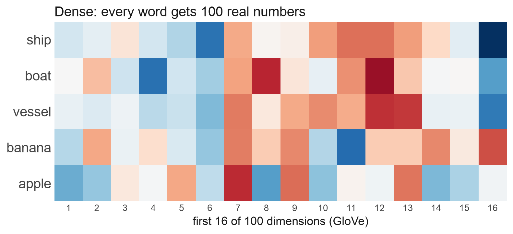
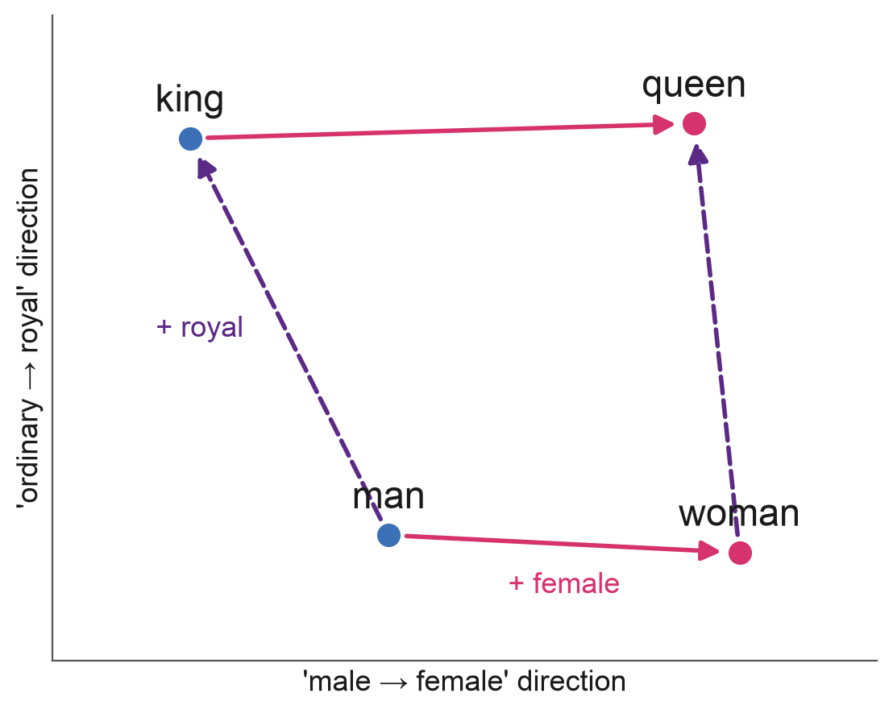

## {background-image="img/w09/embeddings_slide_002.jpg" background-size="contain" .fallback}
<!-- src: Week X - Embeddings.pptx slide 2 -->

::: notes
Slide text: The Data Science Process: · Collect raw data: text, images, tracks · Turn it into vectors a model can use · Search, cluster, classify · Validate the model · Ask a Question · Get the Data · Explore the Data · Model the Data · Visualize the Results
:::

## Ships That Go Dark
<!-- src: Week X - Embeddings.pptx slide 3 -->

- Large ships broadcast their identity and position by radio: the **Automatic Identification System (AIS)**
- But AIS can be **switched off, spoofed or never fitted**. A ship that isn't broadcasting is 'dark'
- Dark vessels are linked to illegal fishing, sanctions evasion and smuggling
- Global Fishing Watch estimates that about **75% of the world's industrial fishing vessels** are not publicly tracked (Paolo et al., Nature, 2024)
- Satellites can **see** dark ships. The question is: **which ship is it?**

::: notes
Hook: AIS is a legal requirement for large ships but it is self-reported. Paolo et al. (2024) combined Sentinel-1 radar with AIS.
:::

## One Idea Behind Modern AI

- Your phone recognises your face by turning each photo into a list of numbers: an **embedding**
- Photos of the **same face** get **similar** numbers; different faces get different numbers
- 'Who is this?' becomes 'which stored photos have the **closest numbers**?'
- The same trick works for words, documents, songs, places on Earth, and in principle ships seen from space
- **Turning things into vectors so that similar things are close** powers search engines, recommendation systems, ChatGPT and much of modern AI

## Outline

1. What Is an Embedding?
1. Measuring Similarity
1. Where Embeddings Come From
1. Visualising Embeddings
1. Using Embeddings Well

# 1. What Is an Embedding?
<!-- src: Week X - Embeddings.pptx slide 8 -->

## Computers Need Numbers
<!-- src: Week X - Embeddings.pptx slide 9 -->

- Every model we've built so far takes a table of numbers as input
- Some data is **already numeric**: income, age, air quality
- Much of the interesting data **isn't**: words, documents, photos, satellite images, songs, people
- In Week 4 we turned text into numbers by **counting words** and using spaCy's sentiment scores
- An **embedding** is a more powerful answer: a learned list of numbers (a **vector**) that captures what something **means**
    - **Similar meaning → nearby vectors**

## Attempt 1: One-Hot Encoding
<!-- src: Week X - Embeddings.pptx slide 10 -->

::: {.columns}
:::: {.column width="43%"}
- Give every word its own column
- A vocabulary of 50,000 words → vectors with **50,000 dimensions**, almost all zeros
- Every word is **equally different** from every other word
    - 'ship' is as far from 'boat' as it is from 'banana'
- This is what dummy variables do in a regression
::::
:::: {.column width="57%"}
{.pic style="max-height:700px"}
::::
:::

## Attempt 2: Dense Vectors
<!-- src: Week X - Embeddings.pptx slide 11 -->

::: {.columns}
:::: {.column width="37%"}
- Give each word a **short list of real numbers**, e.g. 100
- No single number means anything on its own. **Meaning is in the pattern**
- Now similarity is measurable (GloVe):
    - ship · boat: **0.83**
    - banana · apple: **0.51**
    - ship · banana: **0.18**
::::
:::: {.column width="63%"}
{.pic style="max-height:700px"}
::::
:::

::: notes
Values are cosine similarities from the pretrained GloVe model glove-wiki-gigaword-100 (Pennington et al. 2014), computed in src/figs.py. We define cosine similarity properly in Section 2.
:::

## Where Do the Numbers Come From?
<!-- src: Week X - Embeddings.pptx slide 12 -->

- **'You shall know a word by the company it keeps'** (J.R. Firth, 1957)
- Words that appear in **similar contexts** tend to have **similar meanings**
    - 'The ___ sailed into port': ship, boat, vessel, ferry…
- **word2vec** (Mikolov et al., Google, 2013) learns vectors by training a small neural network to **predict a word's neighbours** in billions of sentences
- Nobody tells it what words mean. The vectors are a **by-product** of getting good at the prediction task
- GloVe, the model in these slides, does something similar using word co-occurrence counts

## king − man + woman ≈ queen
<!-- src: Week X - Embeddings.pptx slide 13 -->

::: {.columns}
:::: {.column width="43%"}
- Directions in the space can carry meaning
- Take the vector for **king**, subtract **man**, add **woman**
- The nearest word to the result is **queen** (similarity 0.77), then monarch and throne
- Nobody programmed this in. It emerged from reading text
::::
:::: {.column width="57%"}
{.pic style="max-height:700px"}
::::
:::

::: notes
Real GloVe-100 vectors. The two axes are directions computed from the vectors themselves (average female-minus-male offset; average royal-minus-plain offset), not hand-placed points. Honest caveat: the analogy trick is famous but works less reliably than the headline suggests, and the query words themselves are excluded from the answer.
:::

## Embeddings Learn Our Biases Too
<!-- src: Week X - Embeddings.pptx slide 14 -->

- The same arithmetic finds patterns we'd rather it didn't
- Bolukbasi et al. (2016): in word2vec trained on news, **man : computer programmer :: woman : homemaker**
- An embedding is a compressed summary of its **training data**, including its stereotypes
- When embeddings feed into CV screening, search ranking or policing tools, **those biases become decisions**
- Always ask: **what was this trained on, and what did it learn to ignore?**

## Anything Can Be Embedded

| Input | Example models | What you can do with it |
|---|---|---|
| Words | GloVe, word2vec (100–300 numbers per word) | Find words with similar meanings |
| Sentences | Sentence transformers | Search by meaning, not keywords |
| Images | CLIP, DINO | Find similar photos; search images with words |
| Places | Satellite foundation models | A vector for every patch of the Earth |
| Songs and users | Recommender systems | 'People who liked this also liked…' |

# 2. Measuring Similarity
<!-- src: Week X - Embeddings.pptx slide 16 -->

## Cosine Similarity

Measure the **angle** between two vectors, ignoring their length:

$$\cos(a, b) = \frac{a \cdot b}{|a|\,|b|}$$

- $a \cdot b$: multiply matching elements and add them up; $|a|$, $|b|$: the length of each vector
- **1** = same direction, **0** = unrelated, **−1** = opposite

{fig-align="center" width="70%"}

::: {.columns}
:::: {.column width="33%"}
[similar: cos ≈ 0.97]{style="display:block;text-align:center"}
::::
:::: {.column width="33%"}
[unrelated: cos = 0]{style="display:block;text-align:center"}
::::
:::: {.column width="33%"}
[opposite: cos ≈ −1]{style="display:block;text-align:center"}
::::
:::

## {background-image="img/w09/embeddings_slide_018.jpg" background-size="contain" .fallback}
<!-- src: Week X - Embeddings.pptx slide 18 -->

::: notes
Slide text: Worked Example · Three made-up 3-dimensional embeddings: · a = [2, 1, 0]        b = [4, 2, 1]        c = [0, 1, 3] · a vs b · a · b = 2×4 + 1×2 + 0×1 = 10 · ‖a‖ = √5 = 2.24,  ‖b‖ = √21 = 4.58 · cos = 10 / (2.24 × 4.58) · 0.98 · a vs c · a · c = 2×0 + 1×1 + 0×3 = 1 · ‖a‖ = 2.24,  ‖c‖ = √10 = 3.16 · cos = 1 / (2.24 × 3.16) · 0.14 · b points almost the same way as a (it's roughly 2 × a), so it's the nearer neighbour even though it's longer
:::

## Nearest-Neighbour Search
<!-- src: Week X - Embeddings.pptx slide 19 -->

- To identify a query, compare its vector with **every stored vector** and return the top k
    - This is k-nearest neighbours (kNN), which we'll meet again for prediction in Week 10, used for **retrieval** instead of prediction
- If most of the neighbours share a label, that's probably the answer
- The same pattern powers:
    - Reverse image search, 'more like this' on Spotify and Netflix
    - **Retrieval-augmented generation (RAG)**: chatbots that look up relevant documents before answering

## Searching Millions of Vectors

- One query against a million stored vectors is quick
- Comparing **every** item with every other grows with the square of the data: 100 million items is ~10¹⁶ comparisons
- **Approximate nearest-neighbour** indexes group similar vectors in advance: a little less accurate, far faster
    - e.g. **FAISS** (Meta), or the vector search built into databases such as Google **BigQuery** and PostgreSQL (pgvector)
- A **vector database** is exactly this: the storage layer behind semantic search and RAG chatbots

## Where to Draw the Line?

- Nearest-neighbour search **always** returns something, even when nothing in the database is really similar
- So we need a **cut-off**: below this similarity, call it 'no match'
- Any cut-off trades **false matches** against **missed matches**: precision vs recall, which we'll meet in Week 10
- Similarity is **evidence, not proof**

# 3. Where Embeddings Come From
<!-- src: Week X - Embeddings.pptx slide 22 -->

## Learned, Not Designed
<!-- src: Week X - Embeddings.pptx slide 23 -->

- An embedding model is (almost always) a **neural network**
- Input goes in (a word, an image); the network's **last layer of numbers** comes out; that's the embedding
- Nobody chooses what each number means. The network learns whatever helps it with its **training task**
- So **the training task decides what 'similar' means**
    - Trained to predict neighbouring words → similar = used in similar contexts
    - Trained to tell faces apart → similar = the same person

## Three Ways to Train an Embedding

::: {.columns}
:::: {.column width="33%"}
**Predict the context**

word2vec, GloVe, language models

Learn vectors that are good at predicting nearby words
::::
:::: {.column width="33%"}
**Match pairs**

CLIP (OpenAI, 2021)

400 million images and their captions: pull each image towards its own caption and away from everyone else's
::::
:::: {.column width="33%"}
**Tell identities apart**

Face recognition

Pull photos of the same face together and push different faces apart
::::
:::

## Pretrained Models You Can Use Today
<!-- src: Week X - Embeddings.pptx slide 25 -->

Most are free to download from **Hugging Face** and run in Colab. You rarely need to train your own

| Model | Input | Vector length | Good for |
|---|---|---|---|
| GloVe | Words | 50–300 | Word similarity, simple text features |
| all-MiniLM-L6-v2 | Sentences | 384 | Semantic search, clustering documents |
| CLIP | Images and text | 512 (ViT-B/32) | Searching photos with words |
| DINOv3 (ViT-B/16) | Images | 768 | General-purpose image features |

## {background-image="img/w09/embeddings_slide_026.jpg" background-size="contain" .fallback}
<!-- src: Week X - Embeddings.pptx slide 26 -->

::: notes
Run for real on 2026-09-25 (src/st_demo.py, output in src/st_demo_out.txt). Newer versions also offer model.similarity(emb, emb); util.cos_sim works across versions.

Slide text: In Python · from sentence_transformers import SentenceTransformer, util ·  · model = SentenceTransformer("all-MiniLM-L6-v2") · sentences = [ ·     "A fishing boat switched off its transponder", ·     "The trawler stopped broadcasting its location", ·     "I had pasta for lunch", · ] ·  · emb = model.encode(sentences)     # shape (3, 384) · util.cos_sim(emb, emb)            # 3 x 3 similarity matrix · Output · boat vs trawler: 0.39 · boat vs pasta: 0.03 · trawler vs pasta: 0.08 ·  · The first two share only 'its', but the model knows they mean similar things · pip install sentence-transformers. Swap in your own documents to cluster or search them by meaning
:::

# 4. Visualising Embeddings
<!-- src: Week X - Embeddings.pptx slide 30 -->

## Squashing Hundreds of Dimensions into 2
<!-- src: Week X - Embeddings.pptx slide 31 -->

- We can't plot hundreds of dimensions, so we **project** them down to 2 for a picture
- **PCA** (principal component analysis): the best flat 'shadow' of the data. Fast, faithful to big distances, but often muddled
- **t-SNE** (2008) and **UMAP** (2018): try to keep each point's **nearest neighbours** nearby. Great at revealing clusters
- Next week's clustering methods (k-means, hierarchical) work on embeddings too, and should be run on the **full vectors**, not the 2D picture

## {background-image="img/w09/embeddings_slide_032.jpg" background-size="contain" .fallback}
<!-- src: Week X - Embeddings.pptx slide 32 -->

::: notes
Slide text: Same Data, Three Maps · 1,797 handwritten digits (8 × 8 pixels = 64 numbers each), projected three ways. Only the method and one setting change
:::

## Reading t-SNE and UMAP Plots Safely
<!-- src: Week X - Embeddings.pptx slide 33 -->

- **Cluster sizes mean nothing**: t-SNE expands dense clusters and shrinks sparse ones
- **Distances between clusters mean little**: two clusters far apart on the plot may be close in the real space
- **Settings change the picture**: perplexity (t-SNE) or number of neighbours (UMAP), and the random seed
- **Colour is doing the storytelling**: clusters look convincing once coloured by a label you already know
- Use them to **explore and explain**, not as evidence. Measure things (e.g. nearest-neighbour accuracy) in the original space

## Case Study: Finding Mines
<!-- src: Week X - Clustering.pptx slide 27 -->

::: {.columns}
:::: {.column width="46%"}
- Rare-earth mining in Myanmar: satellite image patches turned into **embeddings**
- Projected to 2D with **UMAP**, the known mines (red) sit in their **own region**
- Patches near that region are candidate unreported mines
::::
:::: {.column width="54%"}
{.pic style="max-height:700px"}
::::
:::

# 5. Using Embeddings Well

## When Embeddings Go Wrong

- **Shortcuts**: a model can match the **background** instead of the object: the same beach, the same sky, the same satellite scene
- **Look-alikes**: different things that really do look the same (twins, identical products, sister ships)
- **Out of domain**: a model trained on everyday photos may not capture what matters in satellite images or X-rays
- **Noisy labels**: if the 'truth' you test against is wrong, a correct match looks like a mistake
- An embedding encodes what its training **rewarded**. Check that's what **you** care about: look at the errors by eye, and check the labels as hard as the model

## Ethics and Limits

- **Bias**: embeddings inherit their training data's stereotypes and pass them on to every system built on top
- **Surveillance and dual use**: face recognition, and anything like it, can track people who never agreed to it. Who gets access?
- **A match is a probability, not a verdict**: a false match can wrongly implicate someone. Report a confidence score and have a human check
- **Hard to explain**: no single number means anything, so it's hard to say *why* two things were matched

## Recap

1. An **embedding** turns something (a word, an image, a place) into a vector so that **similar things are close**
1. **Cosine similarity** measures closeness by angle; **nearest-neighbour search** finds the closest items
1. Embeddings are **learned**: the training task decides what 'similar' means, and embeddings inherit their data's biases
1. **Pretrained models** get you started, but a general model may not capture what you care about
1. **t-SNE / UMAP** are for looking, not proving

## Any Questions?
<!-- src: Week X - Embeddings.pptx slide 45 -->

o.ballinger@ucl.ac.uk
Further reading: Jay Alammar, **The Illustrated Word2vec** (blog)  ·  Wattenberg et al. (2016), **How to Use t-SNE Effectively** (distill.pub)  ·  Paolo et al. (2024), **Satellite mapping reveals extensive industrial activity at sea**, Nature  ·  Bolukbasi et al. (2016), **Man is to Computer Programmer as Woman is to Homemaker?**
