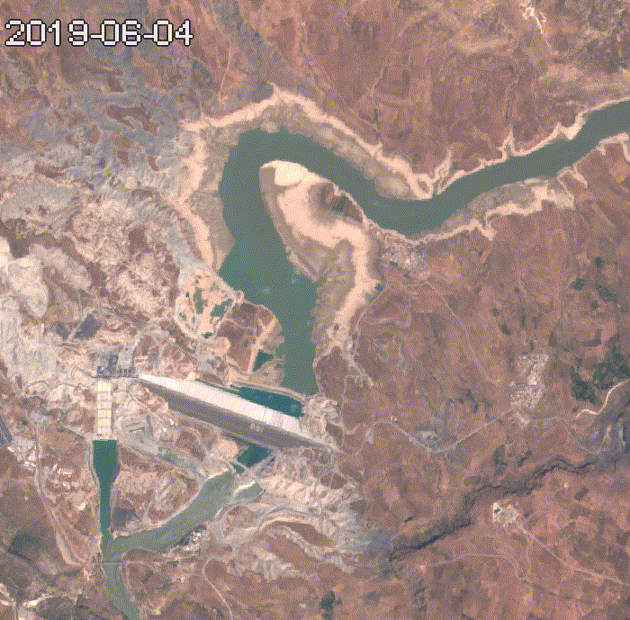
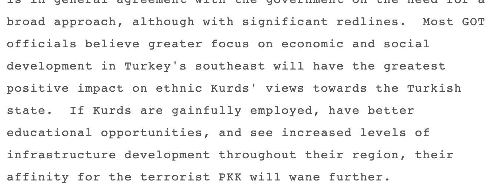
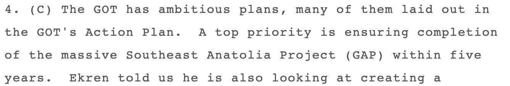
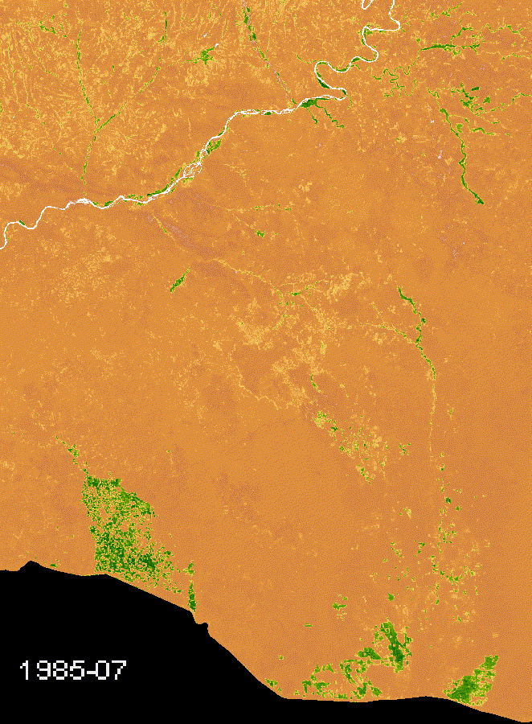
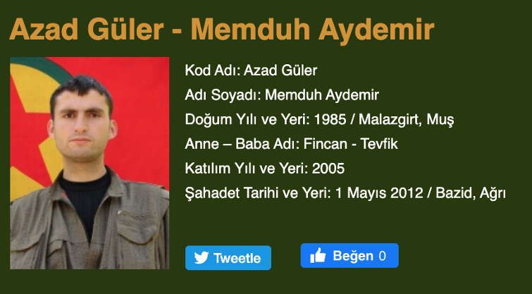
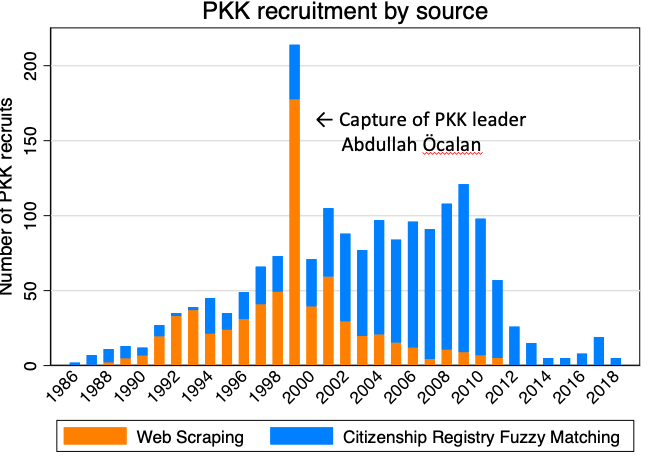
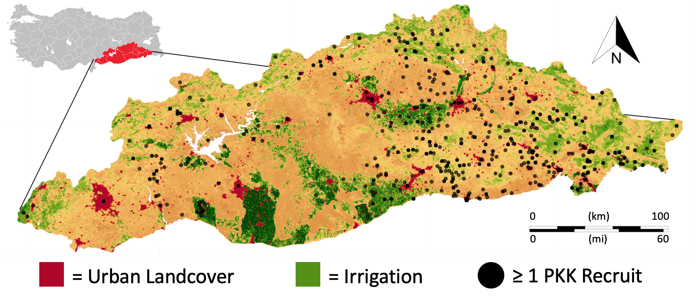
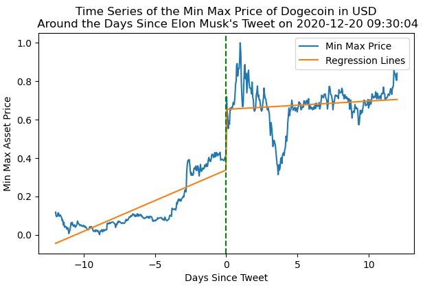
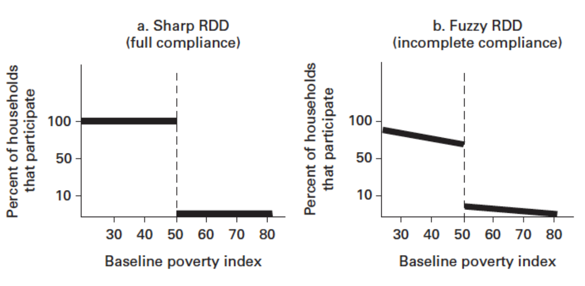

## Outline
<!-- src: Week 9 - Causal Inference II.pptx slide 2 -->

1. Worked Example
1. Regression Discontinuity
1. Fuzzy Regression Discontinuity

## Kurdish Insurgency
<!-- src: Week 9 - Causal Inference II.pptx slide 3 -->

::: {.columns}
:::: {.column width="41%"}
- 44% of the population in Southeast living on less than US$1.1/day
- “The Kurdish identity question was expressed in terms of regional economic inequalities and suggested a socialist solution” (Yavuz, 2001: 10)
- Originally a “peasant movement”, recruiting largely from farming communities (Yavuz, 2001: 10)

1. Intro
::::
:::: {.column width="59%"}

::::
:::

## Southeastern Anatolia Project(GAP)
<!-- src: Week 9 - Causal Inference II.pptx slide 4 -->

::: {.columns}
:::: {.column width="55%"}
- Infrastructural development project started in 1985
- Goals:
    - 19 dams
    - 22 hydropower plants
    - 1.8 million hectares of irrigation
- Income gains associated with switch to irrigated farming: 3-7x (Tokdemir et. al., 2016)
- Government hoped it would reduce appeal of PKK

1. Intro
::::
:::: {.column width="45%"}

::::
:::

## {.notitle}
<!-- src: Week 9 - Causal Inference II.pptx slide 5 -->

::: {.columns}
:::: {.column width="75%"}

::::
:::: {.column width="25%"}
- (Government
- Of
- Turkey)

1. Intro
::::
:::

## Interviews with Farmers
<!-- src: Week 9 - Causal Inference II.pptx slide 6 -->

::: {.columns}
:::: {.column width="59%"}
- Farmers who received GAP irrigation:
    - “**Our view of the state changed positively… we had hatred before, but now they started investing in the Southeast”**
    - “We did not trust the state before, but it brought electricity, water, phone, etc. to us and now we trust the state a lot”
    - “At last the state turned its face towards us”
    - “We did not see any accomplishments of governments in the past—we are a little bit happy to see some now.” (Harris, 2016)
- Farmer who did not receive irrigation:
    - “Why should I not support Öcalan?”

1. Intro
::::
:::: {.column width="41%"}

::::
:::

## Does irrigation reduce insurgent recruitment in Southeastern Turkey? {.center}
<!-- src: Week 9 - Causal Inference II.pptx slide 7 -->

## {background-image="img/w09/w09_slide_008.jpg" background-size="contain" .fallback}
<!-- src: Week 9 - Causal Inference II.pptx slide 8 -->

::: notes
Slide text: Irrigation · 2. Data Collection · Data Source: LANDSAT 8
:::

## {background-image="img/w09/w09_slide_009.jpg" background-size="contain" .fallback}
<!-- src: Week 9 - Causal Inference II.pptx slide 9 -->

::: notes
Slide text: Irrigation · Derived from satellite imagery analysis (NASA Landsat 5-8) · Several different measures:  · Percent of grid-cell under irrigation  · Binary pre/post irrigation · Years since irrigation was introduced · Comparative Development of Different Irrigation Schemes · 2. Data Collection
:::

## Recruitment
<!-- src: Week 9 - Causal Inference II.pptx slide 10 -->

::: {.columns}
:::: {.column width="50%"}

::::
:::: {.column width="50%"}

::::
:::

## {.notitle}
<!-- src: Week 9 - Causal Inference II.pptx slide 11 -->

::: {.columns}
:::: {.column width="75%"}

::::
:::: {.column width="25%"}
2. Data Collection
::::
:::

## RDD Framework
<!-- src: Week 9 - Causal Inference II.pptx slide 12 -->

- **Question**: Does irrigation reduce recruitment?
- **Endogenous variable**:
    - Irrigation– a village in the mountains is very different from a village in the lowlands, in ways that probably affect PKK recruitment
- **Exogenous cutoff**:
    - Dam elevation
- **Bandwidth**:
    - If we compare *just* above and *just* below the altitude of a dam, they’re probably going to be pretty similar in terms of demographics, politics, economy.
    - We could even make a plausible argument that the main difference between them is the ability to access irrigation

## {background-image="img/w09/w09_slide_013.jpg" background-size="contain" .fallback}
<!-- src: Week 9 - Causal Inference II.pptx slide 13 -->

::: notes
Slide text: Treatment Variable · 3. Empirical Strategy
:::

## {background-image="img/w09/w09_slide_014.jpg" background-size="contain" .fallback}
<!-- src: Week 9 - Causal Inference II.pptx slide 14 -->

::: notes
Slide text: Terrain and Irrigation · 5km x 5km cells · 3. Empirical Strategy
:::

## {.notitle}
<!-- src: Week 9 - Causal Inference II.pptx slide 15 -->

{.r-stretch fig-align="center"}

## {background-image="img/w09/w09_62284e0319.png" background-size="contain"}
<!-- src: Week 9 - Causal Inference II.pptx slide 16 -->

## Main Findings
<!-- src: Week 9 - Causal Inference II.pptx slide 17 -->

- Irrigation is negatively related to conflict incidence and recruitment.
- Panel models indicate that a **27km****2** **increase in irrigated area leads to a 49% drop in the probability of conflict.**
- Cross-sectional models suggest that **a fully irrigated 25km****2** **area is 58% less likely than the average cell to experience a conflict event** involving Kurdish rebels during the 2016-2019 period
1. Intro

# Regression Discontinuity
<!-- src: Week 9 - Causal Inference II.pptx slide 18 -->

## Regression Discontinuity Design
<!-- src: Week 9 - Causal Inference II.pptx slide 24 -->

- Regression Discontinuity Design (RDD) is a quasi-experimental evaluation option that measures the impact of an intervention, or treatment, by applying a treatment assignment mechanism based on a cutoff point in a continuous eligibility index.
- RDD estimates local average treatment effects around the cutoff point, where treatment and comparison units are most similar.
[Source: World Bank](https://dimewiki.worldbank.org/Regression_Discontinuity#:~:text=Regression%20Discontinuity%20Design%20(RDD)%20is,who%20is%20eligible%20to%20participate.)

## RDD Framework
<!-- src: Week 9 - Causal Inference II.pptx slide 25 -->

- **Question**: Do minimum wages increase unemployment?
- **Running variable**:
    - State– NJ and PA are hugely different beyond the fact that one implemented a minimum wage policy and the other didn’t
- **Exogenous cutoff**:
    - State border
- **Bandwidth**:
    - If we compare areas in PA and NJ within a small distance of the border between these states, they are probably going to be very similar in terms of demographics, economic structure, etc.

## Conditions
<!-- src: Week 9 - Causal Inference II.pptx slide 26 -->

1. A continuous eligibility index
    - A continuous measure on which the population of interest is ranked (i.e. test score, poverty score, age).
1. A clearly defined cutoff point
    - A point on the index above or below which the population is determined to be eligible for the program.
    - For example, students with a test score of at least 80 of 100 might be eligible for a scholarship, households with a poverty score less than 60 out of 100 might be eligible for food stamps, and individuals age 67 and older might be eligible for pension. The cutoff points in these examples are 80, 60, and 67, respectively. The cutoff point may also be referred to as the threshold.

## {background-image="img/w09/w09_slide_027.jpg" background-size="contain" .fallback}
<!-- src: Week 9 - Causal Inference II.pptx slide 27 -->

::: notes
Slide text: Assumption 1 · The eligibility index should be continuous around the cutoff point. There should be no jumps in the eligibility index at the cutoff point or any other sign of individuals manipulating their eligibility index in order to increase their chances of being included in or excluded from the program. · Heaping around the cutoff · Continuous distribution
:::

## Assumption 2
<!-- src: Week 9 - Causal Inference II.pptx slide 28 -->

- Individuals close to the cutoff point should be very similar, on average, in observed and unobserved characteristics.
    - In the RDD framework, this means that the distribution of the **observed and unobserved variables should be continuous around the threshold.**
    - Even though researchers can check similarity between observed covariates, the similarity between unobserved characteristics must be assumed. This is considered a plausible assumption to make for individuals very close to the cutoff point, that is, for a relatively narrow window.

## {background-image="img/w09/w09_slide_029.jpg" background-size="contain" .fallback}
<!-- src: Week 9 - Causal Inference II.pptx slide 29 -->

::: notes
Slide text: Original RDD paper · Source: Jonathan Mummolo
:::

## {background-image="img/w09/w09_slide_030.jpg" background-size="contain" .fallback}
<!-- src: Week 9 - Causal Inference II.pptx slide 30 -->

::: notes
Slide text: Original RDD Paper
:::

## {background-image="img/w09/w09_slide_031.jpg" background-size="contain" .fallback}
<!-- src: Week 9 - Causal Inference II.pptx slide 31 -->

::: notes
Slide text: Treatment Assignment
:::

## Observed Outcomes
<!-- src: Week 9 - Causal Inference II.pptx slide 32 -->

::: {.columns}
:::: {.column width="40%"}
There appears to be a jump in the observed values of the outcome variable (earnings) around the cutoff (scholarship eligibility)
::::
:::: {.column width="60%"}

::::
:::

## Potential Outcomes
<!-- src: Week 9 - Causal Inference II.pptx slide 33 -->

::: {.columns}
:::: {.column width="41%"}
We can use the discontinuity created by the treatment to estimate the effect of D on Y at the threshold
::::
:::: {.column width="59%"}

::::
:::

## {background-image="img/w09/w09_slide_034.jpg" background-size="contain" .fallback}
<!-- src: Week 9 - Causal Inference II.pptx slide 34 -->

::: notes
Slide text: Estimation
:::

## {background-image="img/w09/w09_slide_035.jpg" background-size="contain" .fallback}
<!-- src: Week 9 - Causal Inference II.pptx slide 35 -->

::: notes
Slide text: Linear, Same Slopes
:::

## {background-image="img/w09/w09_slide_036.jpg" background-size="contain" .fallback}
<!-- src: Week 9 - Causal Inference II.pptx slide 36 -->

::: notes
Slide text: Linear, Different Slopes
:::

## {background-image="img/w09/w09_slide_037.jpg" background-size="contain" .fallback}
<!-- src: Week 9 - Causal Inference II.pptx slide 37 -->

::: notes
Slide text: Non-Linear
:::

## {.notitle}
<!-- src: Week 9 - Causal Inference II.pptx slide 38 -->

::: {.columns}
:::: {.column width="50%"}

::::
:::: {.column width="50%"}

::::
:::

## {.notitle}
<!-- src: Week 9 - Causal Inference II.pptx slide 39 -->

{.r-stretch fig-align="center"}

## {background-image="img/w09/w09_56063654b8.jpg" background-size="contain"}
<!-- src: Week 9 - Causal Inference II.pptx slide 40 -->

## Example 1
<!-- src: Week 9 - Causal Inference II.pptx slide 41 -->

- **Question**: Does a test-based scholarship increase future earnings?
- **Running variable**:
    - Test score– those with really low test scores are different from those with high test scores in ways unrelated to the scholarship (e.g. wealth/ability to pay for tutoring, etc.)
- **Exogenous cutoff**:
    - Fuzzy, test score cutoff (e.g., need 90% to qualify for scholarship)
- **Bandwidth**:
    - 90%±5%
    - If we compare people who narrowly qualify for the scholarship to those who narrowly fail to qualify, the latter may be similar enough to the former to act as a counterfactual.

## Example 2
<!-- src: Week 9 - Causal Inference II.pptx slide 42 -->

- **Question**: Do members of Party A curtail women’s rights?
- **Running variable**:
    - Vote share– districts that are strongholds for Party A will be different in terms of their social, economic and cultural factors compared to strongholds of Party B.
- **Exogenous cutoff**:
    - Sharp, victory/loss (assuming a 2 party system, 50% vote share)
- **Bandwidth**:
    - 50%±4%
    - If we compare districts where candidates of that party narrowly won against those where they narrowly lost, those districts are very similar in terms of their **unobserved characteristics**

## Example 2
<!-- src: Week 9 - Causal Inference II.pptx slide 43 -->

- **Question**: Does an income-based cash transfer program decrease infant mortality?
- **Running variable**:
    - Income– those in extreme poverty face problems related to infant mortality that the rich do not (e.g. nutrition, access to healthcare)
- **Exogenous cutoff**:
    - Fuzzy, income-based assignment to treatment (e.g. need to make <£20k/yr)
- **Bandwidth**:
    - £20k±3k
    - If we compare people who narrowly qualify for a social program to those who narrowly fail to qualify, the latter may be similar enough to the former to act as a counterfactual.

# Fuzzy Regression Discontinuity
<!-- src: Week 9 - Causal Inference II.pptx slide 44 -->

## Fuzzy Regression Discontinuity
<!-- src: Week 9 - Causal Inference II.pptx slide 45 -->

- Threshold may not perfectly determine treatment exposure, but **it creates a discontinuity in the probability of treatment exposure**
- Incentives to participate in a program may change discontinuously at a threshold, but the incentives are not powerful enough to move all units from non-participation to participation
- We can use such discontinuities to produce instrumental variable estimators of the effect of the treatment (close to the discontinuity)

## Sharp vs. Fuzzy RDD
<!-- src: Week 9 - Causal Inference II.pptx slide 46 -->

{.r-stretch fig-align="center"}

## {background-image="img/w09/w09_slide_047.jpg" background-size="contain" .fallback}
<!-- src: Week 9 - Causal Inference II.pptx slide 47 -->

::: notes
Slide text: Assigned versus observed treatment
:::

## {background-image="img/w09/w09_slide_048.jpg" background-size="contain" .fallback}
<!-- src: Week 9 - Causal Inference II.pptx slide 48 -->

::: notes
Slide text: First stage · Estimating uptake based on assignment to treatment group:
:::

## {background-image="img/w09/w09_slide_049.jpg" background-size="contain" .fallback}
<!-- src: Week 9 - Causal Inference II.pptx slide 49 -->

::: notes
Slide text: Second stage
:::

## Any Questions?
<!-- src: Week 9 - Causal Inference II.pptx slide 50 -->

[o.ballinger@ucl.ac.uk](mailto:o.ballinger@ucl.ac.uk)
