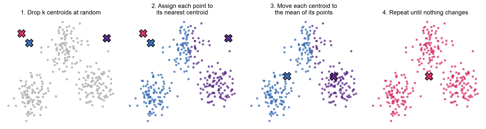
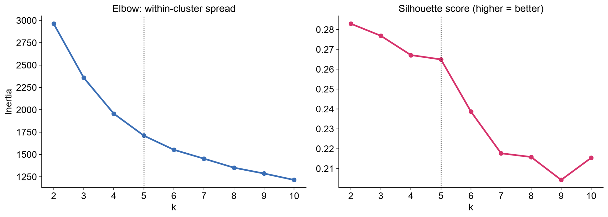
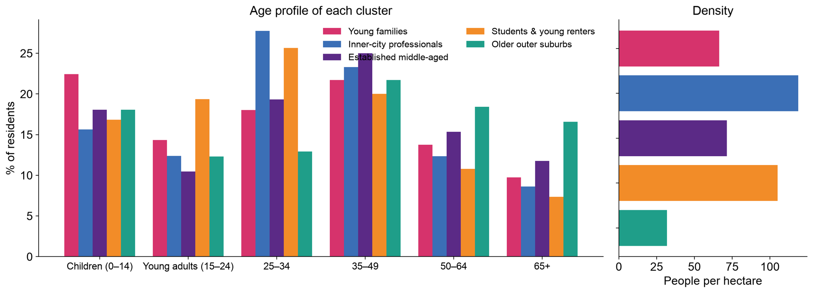
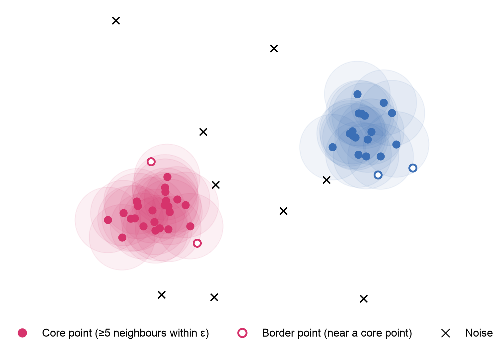
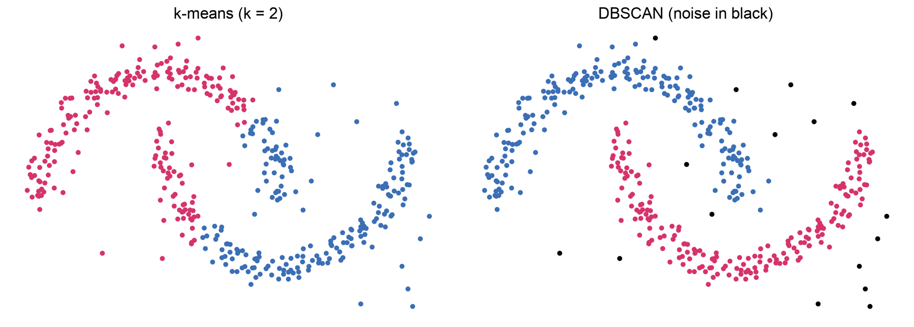
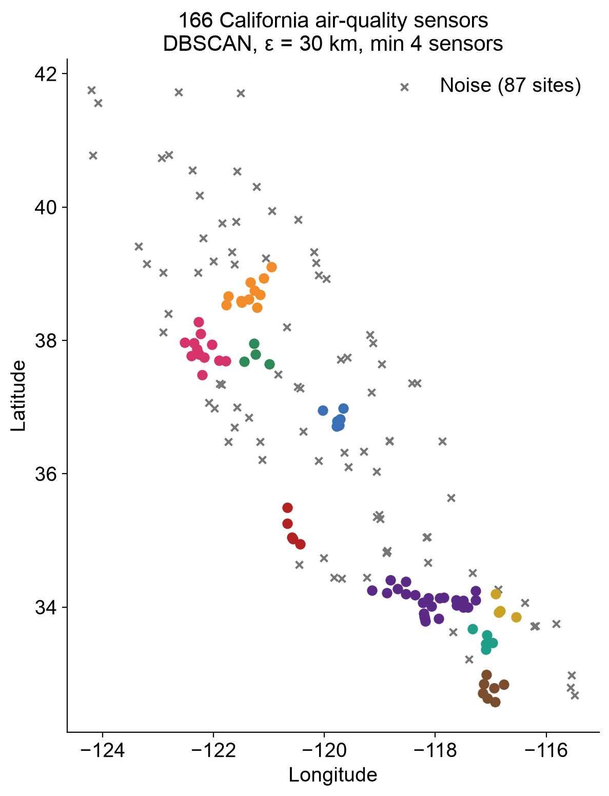
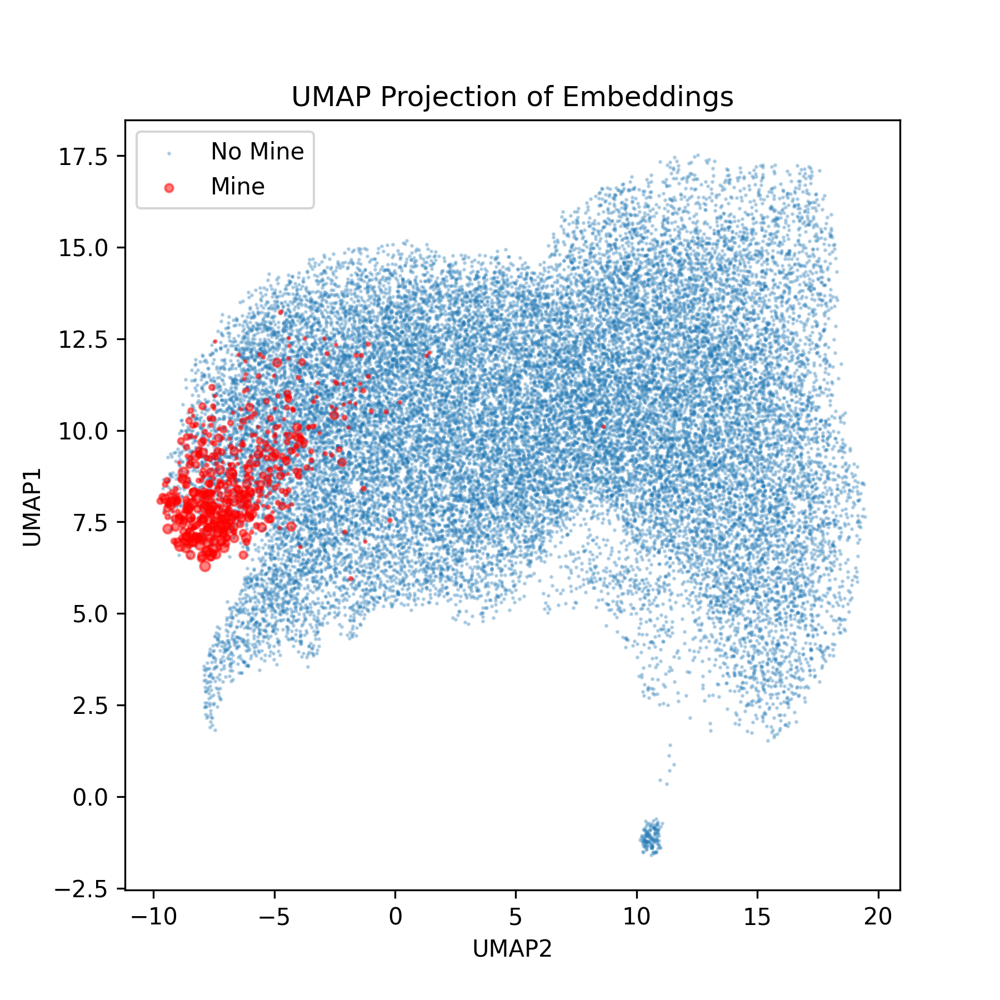
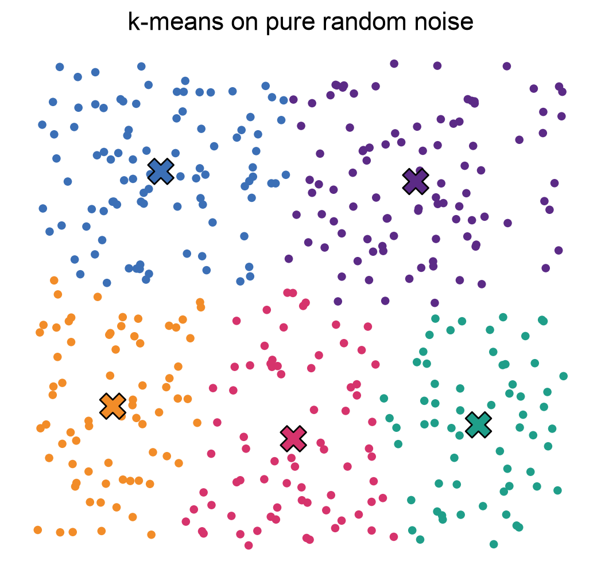

## {background-image="img/w10/clustering_slide_002.jpg" background-size="contain" .fallback}
<!-- src: Week X - Clustering.pptx slide 2 -->

::: notes
Slide text: The Data Science Process: · Generate summary statistics · Plot the data · Are there patterns? · Are there groups we didn't know to look for? · Ask a Question · Get the Data · Explore the Data · Model the Data · Visualize the Results
:::

## Finding Oil Rigs from Space
<!-- src: Week X - Clustering.pptx slide 3 -->

- Global Fishing Watch maps offshore oil platforms and wind turbines worldwide, using **radar (Sentinel-1)** and **optical (Sentinel-2)** satellite imagery
- Every image produces thousands of detections of bright objects at sea. Most are **ships**; a few are **fixed structures**
- Ships broadcast their position (AIS), so we can remove most of them. What's left is a noisy mix of structures, unmatched vessels and artefacts
- Key insight: **ships move, platforms don't**. A platform is detected at the same spot again and again
- So: find places where detections **pile up** over time. That's a clustering problem

::: notes
Source: GFW infrastructure-v2 dataset writeup (ce-ai-1: ~/users/ollie/GFW/infrastructure-v2/docs/dataset_writeup.md).
:::

## Detections Pile Up Where Structures Are
<!-- src: Week X - Clustering.pptx slide 4 -->

::: {.columns}
:::: {.column width="37%"}
- Take 6 months of detections with no AIS match
- A platform shows up as a **tight knot** of detections; moving ships leave scattered points
- **DBSCAN** groups points that have enough neighbours within **75 m**, and labels the rest as noise
- No need to say in advance how many platforms there are
::::
:::: {.column width="63%"}
{.pic style="max-height:700px"}
::::
:::

## {background-image="img/w10/clustering_slide_005.jpg" background-size="contain" .fallback}
<!-- src: Week X - Clustering.pptx slide 5 -->

::: notes
Numbers from dataset_writeup.md coverage comparison (window starting July 2025): 26,241 in both, 875 V1-only, ~20,060 V2-only. Chart: docs/v1_v2_regional.png (V1 oil/wind counts by region and V1-V2 agreement).

Slide text: Infrastructure V2: Results · ~97% · of structures in the previous version recovered · ~20,000 · new structures not in the previous version · 75 m · clustering radius, over sliding 6-month windows
:::

## Outline
<!-- src: Week X - Clustering.pptx slide 6 -->

- 1.  What Is Clustering?
- 2.  K-Means
- 3.  Hierarchical Clustering
- 4.  DBSCAN
- 5.  Using Clusters Responsibly

# 1. What Is Clustering?
<!-- src: Week X - Clustering.pptx slide 7 -->

## How Many Groups Do You See?
<!-- src: Week X - Clustering.pptx slide 8 -->

::: {.columns}
:::: {.column width="62%"}
{.pic style="max-height:700px"}
::::
:::: {.column width="38%"}
- You probably said **three**, instantly.
- Nobody told you what the groups were, or how many to look for.
- Clustering algorithms try to do this automatically, in many more dimensions than you can see.
::::
:::

## {background-image="img/w10/clustering_slide_009.jpg" background-size="contain" .fallback}
<!-- src: Week X - Clustering.pptx slide 9 -->

::: notes
Slide text: Supervised vs. Unsupervised Learning · Supervised · We have labels · Learn to predict a known outcome. ·  · e.g. Titanic: did this passenger survive? (Machine Learning lecture) ·  · Accuracy can be checked against the truth. · Unsupervised · No labels · Find structure hidden in the data. ·  · e.g. which London neighbourhoods are alike? Which detections belong together? ·  · There is no 'right answer' to check against.
:::

## {background-image="img/w10/clustering_slide_010.jpg" background-size="contain" .fallback}
<!-- src: Week X - Clustering.pptx slide 10 -->

::: notes
Slide text: Three Ingredients · Features · What describes each observation? e.g. a ward's age profile and population density · Distance · How far apart are two observations? Usually straight-line (Euclidean) distance in feature space · Scale · Standardise first! Otherwise density (0–300 people/ha) swamps age shares (0–0.3) · d(a, b) = √[ (a₁ − b₁)² + (a₂ − b₂)² + … ]
:::

# 2. K-Means
<!-- src: Week X - Clustering.pptx slide 11 -->

## The K-Means Algorithm
<!-- src: Week X - Clustering.pptx slide 12 -->

{.r-stretch fig-align="center"}

Goal: make each cluster as **tight** as possible (minimise the total squared distance from each point to its centroid)

## K-Means: The Fine Print
<!-- src: Week X - Clustering.pptx slide 13 -->

- **You must choose k** before you start
- **Random starts** can land in a bad solution. Run it many times and keep the best (n_init in scikit-learn)
- Assumes clusters are **round and similar in size**
- **Every point** gets assigned to a cluster, even outliers
- Fast and simple: scales to millions of points

## Case Study: Geodemographics
<!-- src: Week X - Clustering.pptx slide 14 -->

- **Geodemographics** classifies neighbourhoods by who lives there. It's used in retail, public health and policy
- The UK's **Output Area Classification**, developed at UCL with the ONS, groups every small area in the country using k-means on census variables
- Let's build a mini version for London:
    - **624 wards**, each described by 7 features
    - Share of residents in 6 age bands, plus log population density
    - Standardised, then k-means

## Choosing k
<!-- src: Week X - Clustering.pptx slide 15 -->

::: {.columns}
:::: {.column width="37%"}
- **Elbow:** look for where adding clusters stops helping much. Here there's no sharp elbow
- **Silhouette:** how much closer each point is to its own cluster than to the next one (−1 to 1)
- Silhouette is highest at k = 2, but k = 5 (0.265) is barely worse and far more **useful**
- Choosing k is a **judgement call**, not a calculation
::::
:::: {.column width="63%"}
{.pic style="max-height:700px"}
::::
:::

## {background-image="img/w10/clustering_slide_016.jpg" background-size="contain" .fallback}
<!-- src: Week X - Clustering.pptx slide 16 -->

::: notes
Slide text: London's Neighbourhood Types · Young families · 164 wards · e.g. Barking and Dagenham, Brent · Inner-city professionals · 131 wards · e.g. Wandsworth, Lambeth · Established middle-aged · 111 wards · e.g. Richmond upon Thames, Kensington and Chelsea · Students & young renters · 60 wards · e.g. Tower Hamlets, Newham · Older outer suburbs · 158 wards · e.g. Havering, Bromley
:::

## What Makes Each Cluster Different?
<!-- src: Week X - Clustering.pptx slide 17 -->

{.r-stretch fig-align="center"}

The algorithm outputs numbers 0–4. **The names are ours**: an interpretation of these profiles, not a fact about the data

# 3. Hierarchical Clustering
<!-- src: Week X - Clustering.pptx slide 18 -->

## Building a Family Tree
<!-- src: Week X - Clustering.pptx slide 19 -->

- **Agglomerative** clustering builds clusters from the bottom up:
    - Start with every observation as its own cluster
    - Merge the two closest clusters
    - Repeat until everything is one cluster
- **Linkage** decides what 'closest' means for groups: nearest members (single), furthest members (complete), average, or **Ward** (smallest increase in spread)
- No need to choose k up front. Cut the tree wherever you like
- Slow for big data: best for tens to thousands of observations

## London's Boroughs as a Family Tree
<!-- src: Week X - Clustering.pptx slide 20 -->

{.r-stretch fig-align="center"}

32 boroughs, same 7 features. The height of each join shows how different the merged groups are. The dotted line cuts the tree into 3 clusters

# 4. DBSCAN
<!-- src: Week X - Clustering.pptx slide 21 -->

## Density-Based Clustering
<!-- src: Week X - Clustering.pptx slide 22 -->

::: {.columns}
:::: {.column width="43%"}
- **DBSCAN**: Density-Based Spatial Clustering of Applications with Noise (1996)
- Two settings: a radius **ε** and a minimum number of points
- **Core** points have enough neighbours within ε; clusters grow outwards from them
- Points that aren't near any core point are **noise**
- The number of clusters is **discovered**, not chosen
::::
:::: {.column width="57%"}
{.pic style="max-height:700px"}
::::
:::

## When K-Means Fails
<!-- src: Week X - Clustering.pptx slide 23 -->

::: {.columns}
:::: {.column width="33%"}
- k-means draws **straight boundaries** between centroids, so it can't follow curved shapes
- DBSCAN follows the **density** of points, whatever the shape
- …and it flags stray points as noise rather than forcing them into a cluster
::::
:::: {.column width="67%"}
{.pic style="max-height:700px"}
::::
:::

## Air-Quality Sensors in California
<!-- src: Week X - Clustering.pptx slide 24 -->

::: {.columns}
:::: {.column width="56%"}
- Week 3's air-quality data: **166 sensor sites**
- DBSCAN with a real-world radius: **30 km**, using haversine (great-circle) distance on lat/lon
- **9 clusters** emerge: the Bay Area, Los Angeles, San Diego, the Central Valley…
- **87 sites** are noise: isolated rural sensors
- Nobody told it where the cities are
::::
:::: {.column width="44%"}
{.pic style="max-height:700px"}
::::
:::

## Back to the Oil Rigs
<!-- src: Week X - Clustering.pptx slide 25 -->

- Infrastructure V2 runs DBSCAN **twice**:
    - **Pass 1:** detections within each 6-month window, 75 m radius → one cluster per structure per window
    - **Pass 2:** the centres of those clusters across all windows, 150 m radius → one persistent structure
- Why DBSCAN?
    - Nobody knows how many structures there are, and new ones appear every month
    - Most detections are **noise**, and DBSCAN is designed to discard it
    - The radius has a **physical meaning** (metres) that we can reason about
- Each structure is then classified as **oil**, **wind** or **noise** with a supervised model. Clustering first, then classification

## Similar Things Land Together
<!-- src: Week X - Clustering.pptx slide 27 -->

::: {.columns}
:::: {.column width="46%"}
- Rare-earth mining in Myanmar: satellite image patches turned into **embeddings**
- Projected to 2D with **UMAP**, the known mines (red) sit in their **own region**
- Patches near that region are candidate unreported mines
- We met embeddings in Week 4
::::
:::: {.column width="54%"}
{.pic style="max-height:700px"}
::::
:::

# 5. Using Clusters Responsibly
<!-- src: Week X - Clustering.pptx slide 28 -->

## Clustering Always Finds Clusters
<!-- src: Week X - Clustering.pptx slide 29 -->

::: {.columns}
:::: {.column width="52%"}
{.pic style="max-height:700px"}
::::
:::: {.column width="48%"}
- 400 points drawn **completely at random**. Ask k-means for 5 clusters and you get 5 clusters.
- Silhouette score: **0.395**, higher than our real London wards (0.265)
- An algorithm will always return groups. Whether they **mean anything** is up to you to show
::::
:::

## Labels Stick to People
<!-- src: Week X - Clustering.pptx slide 30 -->

- Geodemographic labels ('struggling estates', 'affluent achievers') are used to set **insurance premiums**, target **advertising**, allocate **policing** and **public services**
- A cluster describes an **area average**, not the people in it. Assuming every resident fits the label is the **ecological fallacy**
- Names carry judgement. 'Young families' sounds neutral; 'deprived' or 'hard-pressed' shape how a place is treated
- Historical parallel: **redlining** in 1930s US cities graded neighbourhoods by 'risk', largely by race, and shaped lending for decades
- Ask: who chose the features, who named the clusters, and who is affected by the result?

## Which Method?
<!-- src: Week X - Clustering.pptx slide 31 -->

|  | K-means | Hierarchical | DBSCAN |
|---|---|---|---|
| Choose k in advance? | Yes | No (cut the tree) | No (choose ε and min points) |
| Cluster shapes | Round, similar size | Depends on linkage | Any shape |
| Handles noise? | No: every point assigned | No | Yes: labels outliers |
| Speed on big data | Fast | Slow | Fast with spatial indexing |
| Good for | Segmenting areas or customers | Small data; seeing structure | Spatial points; finding hotspots |

## {background-image="img/w10/clustering_slide_032.jpg" background-size="contain" .fallback}
<!-- src: Week X - Clustering.pptx slide 32 -->

::: notes
Slide text: In Python · from sklearn.preprocessing import StandardScaler · from sklearn.cluster import KMeans, DBSCAN · from sklearn.metrics import silhouette_score ·  · X = StandardScaler().fit_transform(wards[features])      # scale first! ·  · km = KMeans(n_clusters=5, n_init=20, random_state=0).fit(X) · wards["cluster"] = km.labels_ · print(silhouette_score(X, km.labels_)) ·  · db = DBSCAN(eps=30 / 6371, min_samples=4, metric="haversine") · sites["cluster"] = db.fit_predict(np.radians(sites[["lat", "lon"]]))  # -1 = noise · Haversine distance works in radians, so ε = 30 km ÷ Earth's radius (6,371 km)
:::

## Recap
<!-- src: Week X - Clustering.pptx slide 33 -->

- 1.  Clustering is **unsupervised**: finding groups without labels
- 2.  Choose features carefully and **standardise** them
- 3.  **K-means**: fast, needs k, assumes round clusters
- 4.  **Hierarchical**: builds a tree; cut it where it makes sense
- 5.  **DBSCAN**: finds dense regions of any shape and flags noise; ideal for spatial points
- 6.  Algorithms **always** find clusters. Validate them, and be careful how you name them

## Any Questions?
<!-- src: Week X - Clustering.pptx slide 34 -->

o.ballinger@ucl.ac.uk
